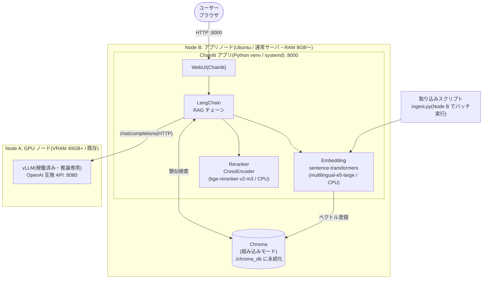

# 案1: シングルプロセス最小構成(PoC / 個人利用向け)

WebUI・RAG ロジック・ベクトル DB を **1 つの Python プロセス(Chainlit)に同居**させる最小構成。
vLLM が稼働する GPU ノード(Node A)とは分離し、**アプリノード(Node B)上の 1 プロセス**で完結させます。
Node B 側の標準デプロイは Docker Compose で、必要に応じて venv + systemd だけの代替構成も選べます。
コードを書かずに同等の最小構成を試す場合は [案1b](plan1b-openwebui.md)を選びます。

> **構築ファイル**: [03-deployment/plan1/](../03-deployment/plan1/)(Docker 版)/ 手順: [デプロイ手順書](../03-deployment/README.md)。本書後半の venv + systemd 手順はコンテナを使わない場合の代替。

## 構成図



## 特徴

| 観点 | 内容 |
|---|---|
| 長所 | Node B 側の構成要素が最少。依存はすべて pip。障害点が少なくデバッグ容易。GPU ノードには一切手を入れない |
| 短所 | プロセス再起動で会話履歴消失。同時アクセスに弱い。Embedding/Rerank が API プロセスの CPU/メモリを消費 |
| ベクトル DB | Chroma を**組み込みモード**(サーバ不要、ローカルディレクトリに永続化)で使用。データは Node B に閉じる |
| Embedding | Node B のプロセス内で sentence-transformers を **CPU 実行**(e5 / bge クラスは CPU で実用速度)。Node A の VRAM は LLM 専用のため使わない |
| 移行性 | LangChain の `VectorStore` 抽象のおかげで、案2 の Qdrant へはコード数行の変更で移行可能 |

## 認証・認可

Chainlit は認証 hook を提供しますが、ローカル password と OIDC はいずれも callback 実装が必要です。グループを共通 principal へ正規化し、すべての Chroma 検索へ metadata filter を強制します。詳細は [OIDC 認証・グループ認可 導入設計](auth-oidc.md)を参照してください。

## セットアップ手順(概要)

```bash
# Node B(アプリノード)上。リポジトリルートから実行
python3 -m venv ~/rag/.venv && source ~/rag/.venv/bin/activate
pip install "torch~=2.7.0" --index-url https://download.pytorch.org/whl/cpu
pip install -r 03-deployment/plan1/app/requirements.txt
```

## 実装例

### 取り込み(ingest.py)

```python
from langchain_community.document_loaders import DirectoryLoader, PyPDFLoader
from langchain_text_splitters import RecursiveCharacterTextSplitter
from common import build_embeddings
from langchain_chroma import Chroma

# 1. Document Loader
loader = DirectoryLoader("./documents", glob="**/*.pdf", loader_cls=PyPDFLoader)
docs = loader.load()

# 2. Document Transformer(日本語向けセパレータ)
splitter = RecursiveCharacterTextSplitter(
    chunk_size=800, chunk_overlap=100,
    separators=["\n\n", "\n", "。", "、", " ", ""],
)
chunks = splitter.split_documents(docs)

# 3. Embedding + 4. Vector DB
embeddings = build_embeddings()  # e5 系では query:/passage: prefix を自動付与
existing = Chroma(persist_directory="./chroma_db", embedding_function=embeddings)
existing.delete_collection()     # 全コーパスを投入する前に既存コレクションを削除
Chroma.from_documents(chunks, embeddings, persist_directory="./chroma_db")
```

### 問い合わせ(app.py — Chainlit)

```python
import chainlit as cl
from langchain_openai import ChatOpenAI
from common import build_embeddings
from langchain_chroma import Chroma
from langchain.retrievers import ContextualCompressionRetriever
from langchain.retrievers.document_compressors import CrossEncoderReranker
from langchain_community.cross_encoders import HuggingFaceCrossEncoder

llm = ChatOpenAI(  # Node A(GPU ノード)の vLLM を指定
    base_url="http://node-a.example.internal:8080/v1", api_key="dummy",
    model="your-hf-model-name",
)
embeddings = build_embeddings()  # e5 系では query:/passage: prefix を自動付与
vectorstore = Chroma(persist_directory="./chroma_db", embedding_function=embeddings)

# 5. Retriever(広めに 20 件)→ 6. Rerank(上位 4 件に圧縮)
reranker = CrossEncoderReranker(
    model=HuggingFaceCrossEncoder(model_name="BAAI/bge-reranker-v2-m3"), top_n=4)
retriever = ContextualCompressionRetriever(
    base_compressor=reranker,
    base_retriever=vectorstore.as_retriever(search_kwargs={"k": 20}),
)

@cl.on_message
async def main(msg: cl.Message):
    docs = await retriever.ainvoke(msg.content)
    context = "\n\n".join(d.page_content for d in docs)
    prompt = (f"以下のコンテキストに基づいて日本語で回答してください。\n"
              f"# コンテキスト\n{context}\n# 質問\n{msg.content}")
    res = await llm.ainvoke(prompt)
    await cl.Message(content=res.content).send()
```

### 常駐化(systemd)

```ini
# /etc/systemd/system/rag-app.service
[Unit]
Description=RAG Chainlit App
After=network.target

[Service]
User=rag
WorkingDirectory=/home/rag/rag
ExecStart=/home/rag/rag/.venv/bin/chainlit run app.py --host 0.0.0.0 --port 8000
Restart=always

[Install]
WantedBy=multi-user.target
```

## この案から次へ進む判断基準

- 同時利用者が増えて応答が遅くなった → **案2**(Embedding/Rerank をコンテナ分離)
- キーワード検索の取りこぼしが目立つ → まず **`BM25Retriever`(rank_bm25)+ `EnsembleRetriever` の追加**でハイブリッド化を試す(サーバ追加不要。[RAG 構成要素解説 §5](../06-tuning/README.md) 参照)。それでも規模的に足りなければ **案3**
