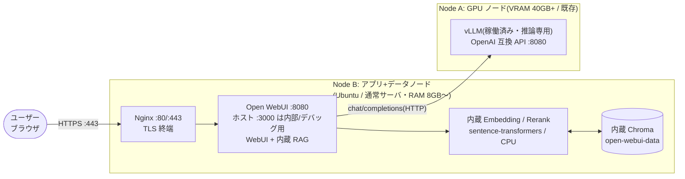

# 案1b: Open WebUI 内蔵 RAG 最小構成(PoC / 個人利用向け・コード不要)

[案1](plan1-minimal.md)と同じ最小構成の別形として、LangChain や Python コードを使わず、Open WebUI 自体に RAG のオーケストレーションを担わせます。
チャンク分割や検索処理を実装して学ぶ場合は [案1](plan1-minimal.md)、GUI 設定だけで試す場合は本案が適します。

> **構築ファイル**: [03-deployment/plan1b/](../03-deployment/plan1b/) / 手順: [デプロイ手順書](../03-deployment/README.md)

## 構成図



## 特徴

| 観点 | 内容 |
|---|---|
| 長所 | Node B はコンテナ 1 個・Python コード 0 行。GUI 設定と環境変数だけで最速に動かせる。ログイン認証・会話履歴も Open WebUI に内蔵 |
| 短所 | チャンク分割・Retriever 戦略・日本語前処理(neologdn / Sudachi 等)のカスタマイズ余地が小さい。クエリ変換や日本語処理の作り込みには向かない |
| ベクトル DB | Open WebUI 内蔵 Chroma(`VECTOR_DB=chroma`)。文書とインデックスは `open-webui-data` volume に閉じる |
| Embedding | Open WebUI 内蔵 sentence-transformers を Node B の CPU で実行。プレフィックス不要の `BAAI/bge-m3` を既定とする |
| 会話履歴 | Open WebUI 内蔵 SQLite に保存。履歴を保持しない案1との明確な差分 |
| 移行性 | 精度の作り込みが必要になったら案2へ移行する。Vector DB に互換性はないため文書を再取り込みする |

## 認証・認可

Open WebUI 標準のローカル認証と OIDC は併存でき、private Knowledge にグループ read 権限を付けることでコード変更なしに認可できます。移行と注意点は [OIDC 認証・グループ認可 導入設計](auth-oidc.md)を参照してください。

## セットアップ手順(概要)

```bash
# Node B(アプリ+データノード)上。リポジトリルートから実行
cd 03-deployment/plan1b
cp -v .env.example .env
vim .env
# TLS 証明書の生成手順は デプロイ手順書 §1b を参照
docker compose up -d
```

ブラウザで `https://${node_b}/` を開き(自己署名の場合は警告を承認)、初回管理者を登録し、vLLM のモデルが表示されることを確認します。`Workspace > Knowledge` から文書をアップロードし、チャットで Knowledge を参照して質問します。

## 設定のポイント

| 環境変数 | 役割 | 既定・設定例 |
|---|---|---|
| `OPENAI_API_BASE_URL` | Node A の vLLM OpenAI 互換 API。compose では `.env` の `VLLM_BASE_URL` を注入 | `http://node-a.example.internal:8080/v1` |
| `OPENAI_API_KEY` | Node A の `--api-key`。compose では `.env` の `VLLM_API_KEY` を注入 | 環境ごとに変更 |
| `ENABLE_OLLAMA_API` | Ollama 接続を無効化 | `false` |
| `VECTOR_DB` | Knowledge の Vector DB | `chroma` |
| `RAG_EMBEDDING_MODEL` | 内蔵 sentence-transformers のモデル | `BAAI/bge-m3` |
| `ENABLE_RAG_HYBRID_SEARCH` | 内蔵 BM25 + ベクトル検索 | `true` |
| `RAG_RERANKING_MODEL` | 内蔵 CrossEncoder rerank モデル | `BAAI/bge-reranker-v2-m3` |
| `RAG_TOP_K` | RAG で取得する上位件数 | `5` |
| `WEBUI_SECRET_KEY` | セッション署名用秘密鍵 | `openssl rand -hex 32` 等で生成 |

LLM 接続は管理者設定の OpenAI API 接続画面、文書の取り込みと参照設定は `Workspace > Knowledge` で確認できます。Knowledge は文書アップロードからチャンク分割、embedding、検索、プロンプト組み立てまでを Open WebUI 内で処理します。

> **環境変数の反映タイミング:** RAG 系の環境変数は初回起動時のみ既定値として取り込まれます(PersistentConfig)。起動後にモデル等を変更する場合は管理画面の設定から行います(環境変数の変更だけでは反映されません)。

> **e5 系モデルの注意:** 案1 の `common.py` のような `query:` / `passage:` プレフィックスの自動付与はありません。前処理をコードで補えないため、プレフィックス不要の bge-m3 系を推奨します。

## この案から次へ進む判断基準

- チャンク分割・Retriever・クエリ変換・日本語前処理を作り込みたい → **案2**(LangChain rag-api。文書は再取り込み)
- RAG の内部実装を小さなコードで理解したい → **案1**(Chainlit + LangChain)
