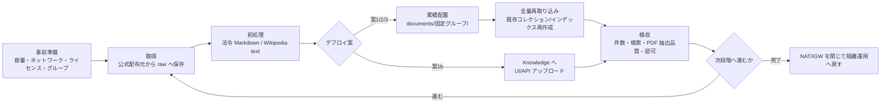

# コーパス取り込み手順

[テストデータ集](corpus-datasets.md) §1 の推奨コーパスを、動作確認・精度評価・負荷/規模試験の3段階で取得、前処理、配置、投入、検収するための手順書です。

コーパスの準備は Node B(Ubuntu 24.04)で行います。案1/2/3は `documents/` に段階ごとの文書を累積配置した後、既存コレクション/インデックスを削除して全量再取り込みします。案1bは Open WebUI の Knowledge へ UI/API でアップロードする別方式です。

## 段階 × デプロイ案マトリクス

| 段階 | 案1(Chroma) | 案1b(Open WebUI) | 案2(Qdrant + TEI) | 案3(OpenSearch) |
|---|---|---|---|---|
| 動作確認 | [段階1](ingest-plan1.md#段階1動作確認) | [段階1](ingest-plan1b.md#段階1動作確認) | [段階1](ingest-plan2.md#段階1動作確認) | [段階1](ingest-plan3.md#段階1動作確認) |
| 精度評価 | [段階2](ingest-plan1.md#段階2精度評価) | [段階2](ingest-plan1b.md#段階2精度評価) | [段階2](ingest-plan2.md#段階2精度評価) | [段階2](ingest-plan3.md#段階2精度評価) |
| 負荷・規模試験 | [段階3](ingest-plan1.md#段階3負荷規模試験) | [対象外](ingest-plan1b.md#段階3負荷規模試験) | [段階3](ingest-plan2.md#段階3負荷規模試験) | [段階3](ingest-plan3.md#段階3負荷規模試験) |

## 全体フロー

## 段階別の累積セット

| 段階 | 追加するグループ | その段階で再取り込みする全体 |
|---|---|---|
| 動作確認 | `laws`、`whitepaper` | 法令10本 + 情報通信白書1年度分 |
| 精度評価 | `ipa`、`livedoor` | 動作確認セット + IPA資料 + livedoor |
| 負荷・規模試験 | `wikipedia` | 精度評価セット + Wikipedia |

案1/2/3では差分だけを ingest しません。`prepare_stage.sh` は既存配置を削除せず、指定段階までの全グループを確認・配置します。その後の ingest は毎回 `documents/` 全体を読み直します。

## 手順書索引

1. [事前準備](prerequisites.md) — Node B容量、venv、NAT、ライセンス、グループ認可
2. [ダウンロードと前処理](download.md) — コーパス別の取得・代替手順・前処理・検収
3. [案1(Chroma)](ingest-plan1.md)
4. [案1b(Open WebUI)](ingest-plan1b.md)
5. [案2(Qdrant + TEI)](ingest-plan2.md)
6. [案3(OpenSearch)](ingest-plan3.md)

実行前に [Node B構築手順](../03-deployment/README.md) の対象案を完了し、初回のコンテナイメージ・モデル取得を済ませてください。
