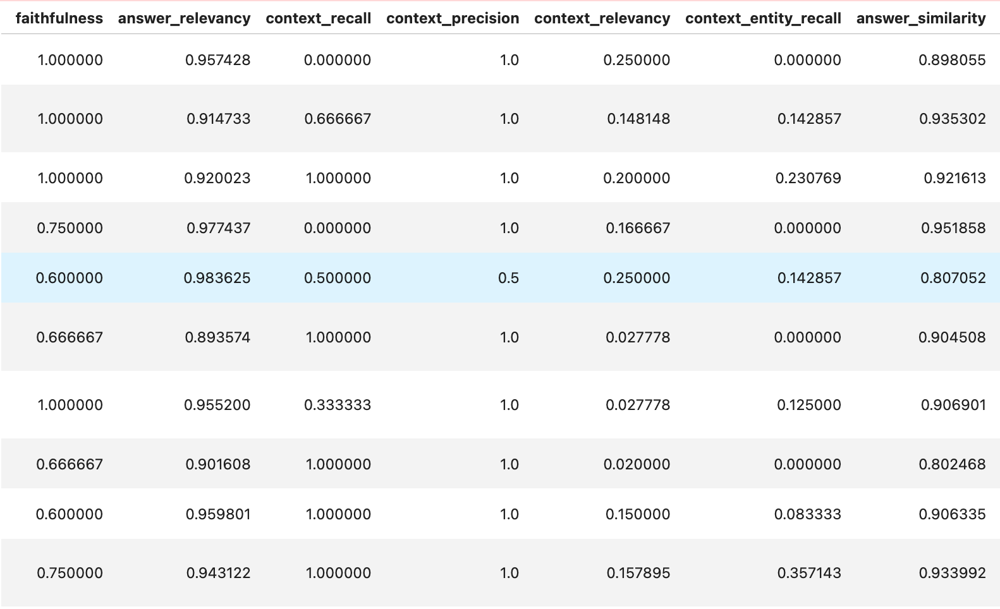
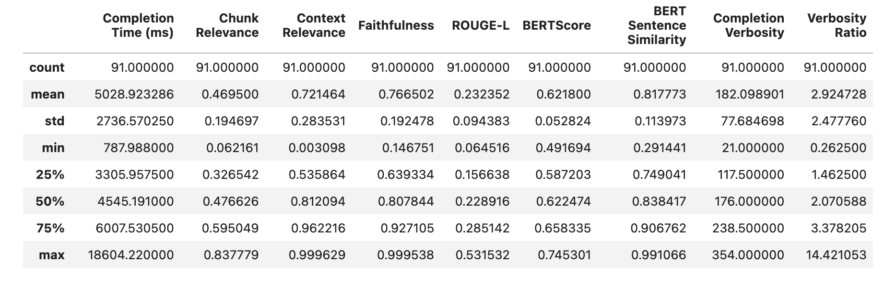
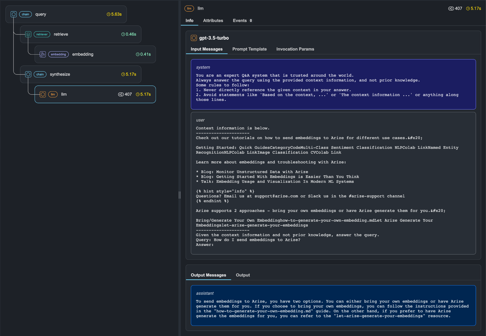
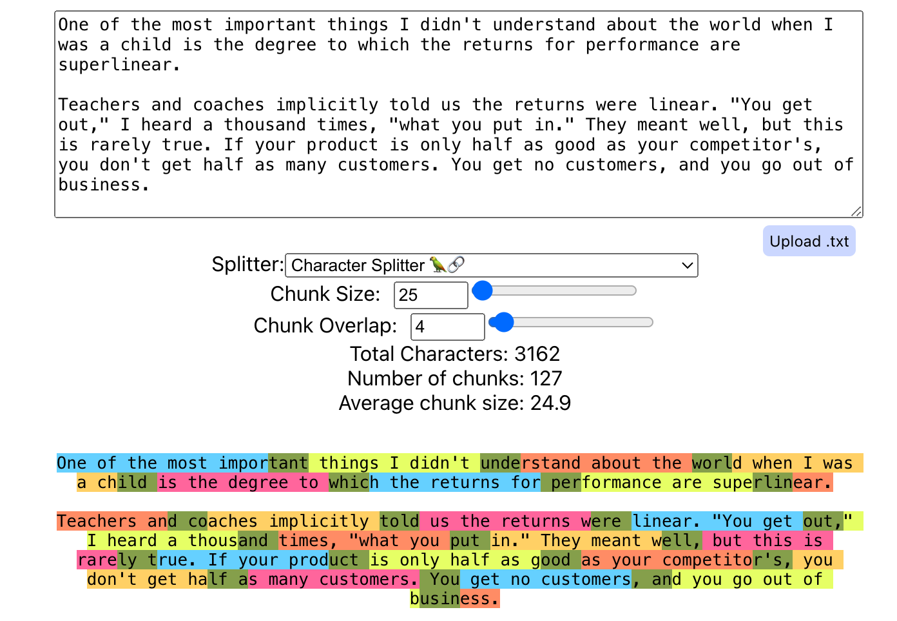
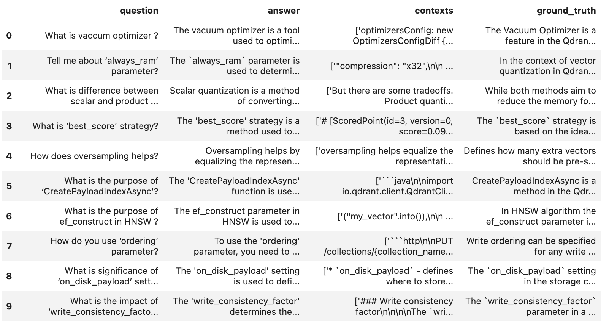

## 導入

このガイドでは、**精度** と **品質** の両方について RAG システムを評価する方法を説明します。検索 precision、recall、コンテキストの関連性、応答の精度をテストすることで、RAG のパフォーマンスを維持する方法を学びます。

**RAG アプリケーションの構築は始まりにすぎません。** エンドユーザーにとっての有用性をテストし、長期的な安定性を得るためにコンポーネントを調整することが重要です。

RAG システムでは、関連情報の取得、その情報の拡張、最終応答の生成という 3 つの重要な段階のいずれかでエラーが発生する可能性があります。各コンポーネントを体系的に評価して微調整することで、ユーザーのニーズを満たす、信頼性が高くコンテキストに関連した GenAI アプリケーションを維持できるようになります。

## RAG アプリケーションを評価する理由は何ですか?

### 幻覚や間違った答えを避けるために

生成段階では、LLM がコンテキストを見落とし、情報を捏造する幻覚が顕著な問題です。これにより、現実に基づかない反応が生じる可能性があります。

さらに、LLM によって生成される応答は有害、不適切、または不適切なトーンを含む場合があるため、偏った応答の生成が懸念されており、さまざまなアプリケーションやインタラクションにリスクが生じます。

### LLM に拡張されたコンテキストを強化するには

拡張プロセスは、応答に最新ではないデータが含まれる可能性がある、古い情報などの課題に直面しています。もう 1 つの問題は、コンテキスト ギャップの存在です。つまり、取得されたドキュメント間に関係コンテキストが欠如しています。

> これらのギャップにより、不完全または断片的な情報が表示され、拡張された応答の全体的な一貫性と関連性が低下する可能性があります。

### 検索と取得のプロセスを最大限に高めるには

検索に関して言えば、検索に関する重大な問題の 1 つは、precision がないことです。検索されたすべてのドキュメントがクエリに関連しているわけではありません。この問題は、貧弱な recall によってさらに悪化します。つまり、すべての関連ドキュメントが正常に取得されるわけではありません。

さらに、[「途中で失われる」](https://arxiv.org/abs/2307.03172) 問題は、一部の LLM が長いコンテキストに苦労する可能性があることを示しています。特に、重要な情報が文書の中央に配置されている場合に、不完全な結果や有用性の低い結果が生じる可能性があります。

## 推奨されるフレームワーク

評価プロセスを簡素化するために、いくつかの強力なフレームワークが利用可能です。以下では、**Ragas、Quotient AI、Arize Phoenix** の 3 つの人気のあるものについて説明します。

### Ragas: 質問と回答による RAG のテスト

[Ragas](https://docs.ragas.io/en/stable/) (または RAG 評価) は、質問、理想的な回答、および関連するコンテキストのデータセットを使用して、RAG システムが生成した回答をグランド トゥルースと比較します。忠実性、関連性、意味的類似性などの指標を提供して、検索と回答の品質を評価します。

**図 1:** *Ragas フレームワークの出力。忠実度、回答の関連性、コンテキスト recall、precision、関連性、エンティティ recall、回答の類似性などの指標を示します。これらは、RAG システム応答の品質を評価するために使用されます。*

### 商: カスタム データセットを使用した RAG パイプラインの評価

Quotient AI は、RAG システムの評価を合理化するために設計されたもう 1 つのプラットフォームです。開発者は、評価データセットをベンチマークとしてアップロードして、さまざまなプロンプトや LLM をテストできます。これらのテストは非同期ジョブとして実行されます。Quotient AI は、RAG パイプラインを自動的に実行し、応答を生成し、忠実性、関連性、セマンティック類似性に関する詳細なメトリクスを提供します。このプラットフォームの全機能には Python SDK 経由でアクセスできるため、商評価結果にアクセス、分析、視覚化して、改善の余地がある領域を見つけることができます。

**図 2:** *インデックス作成、チャンク化、検索、およびコンテキストの関連性など、RAG パイプラインのすべての段階を通じてデータセットが適切に操作されているかどうかを定義する統計を含む商フレームワークの出力。*

### Arize Phoenix: 視覚的に分解した応答生成

[Arize Phoenix](https://docs.arize.com/phoenix) は、応答がどのように構築されるかを段階的に追跡することで、RAG システムのパフォーマンスの向上に役立つオープンソース ツールです。 Phoenix ではこれらの手順を視覚的に確認できるため、速度の低下やエラーを特定するのに役立ちます。 LLM を使用して出力の品質を評価し、幻覚を検出し、回答精度をチェックする「 [評価者](https://arize.com/docs/phoenix/evaluation/concepts-evals/evaluators) 」を定義できます。また、Phoenix は、レイテンシ、トークン使用量、エラーなどの主要なメトリックも計算し、RAG システムがどの程度効率的に動作しているかを把握できます。

**図 3:** *Arize Phoenix ツールは直感的に使用でき、プロセス アーキテクチャ全体と、取得、コンテキスト、生成の内部で行われるステップを表示します。*

## RAG システムのパフォーマンスが低下する理由

### データをベクター データベースに不適切に取り込んだ

データの取り込みが不適切だと、正確で一貫した応答を生成するために重要な重要なコンテキスト情報が失われる可能性があります。また、一貫性のないデータ取り込みにより、システムが信頼性の低い一貫性のない応答を生成し、ユーザーの信頼と満足度が損なわれる可能性があります。

ベクトル データベースは、さまざまな [インデックス作成](https://qdrant.tech/documentation/manage-data/indexing/) 手法をサポートしています。データが適切に取り込まれているかどうかを確認するには、インデックス作成手法に関連する変数の変更がデータの取り込みにどのような影響を与えるかを常に確認する必要があります。

#### 解決策: データがどのようにチャンク化されているかに注意してください

**ドキュメントのチャンク サイズを調整する:** チャンク サイズはデータの粒度を決定し、precision、recall、および関連性に影響を与えます。これは、埋め込みモデルのトークン制限に合わせて調整する必要があります。

**適切なチャンクのオーバーラップを確保する:** これにより、チャンク間でデータ ポイントを共有することでコンテキストが保持されます。重複排除やコンテンツの正規化などの戦略を使用して管理する必要があります。

**適切なチャンキング/テキスト分割戦略を開発する**: チャンキング/テキスト分割戦略がデータ タイプ (HTML、マークダウン、コード、PDF など) およびユースケースのニュアンスに合わせて調整されていることを確認してください。たとえば、法律文書は見出しとサブセクションごとに分割され、医学文書は文の境界または主要な概念ごとに分割される場合があります。

**図 4:** *[ChunkViz](https://chunkviz.up.railway.app/) などのユーティリティを使用して、さまざまなチャンク分割戦略、チャンク サイズ、チャンクの重複を視覚化できます。

### データを間違って埋め込んでいる可能性があります

埋め込みモデルがデータを正確に理解して表現していることを確認したいと考えています。生成されたエンベディングが正確であれば、同様のデータ ポイントがベクトル空間内で密接に配置されます。埋め込みモデルの品質は通常、モデルの出力がグラウンドトゥルース データセットと比較される [Massive Text Embedding Benchmark (MTEB)](https://huggingface.co/spaces/mteb/leaderboard) などのベンチマークを使用して測定されます。

#### 解決策: 適切な埋め込みモデルを選択する

埋め込みモデルは、データ内の意味論的な関係を把握する上で重要な役割を果たします。

選択できる埋め込みモデルがいくつかあり、[Massive Text Embedding Benchmark (MTEB) Leaderboard](https://huggingface.co/spaces/mteb/leaderboard) は参照用の優れたリソースです。 [FastEmbed](https://github.com/qdrant/fastembed) のような軽量ライブラリは、[一般的なテキスト埋め込みモデル](https://qdrant.github.io/fastembed/examples/Supported_Models/#supported-text-embedding-models) を使用したベクトル埋め込みの生成をサポートしています。

埋め込みモデルを選択するときは、**検索パフォーマンス** と **ドメイン** **特異性**を考慮してください。モデルが意味論的なニュアンスを確実に捉えられるようにする必要があり、それが検索パフォーマンスに影響します。特殊なドメインの場合は、カスタム埋め込みモデルを選択またはトレーニングする必要がある場合があります。

### 取得手順が最適化されていません

セマンティック検索評価では、データ検索の有効性をテストします。選択できる指標がいくつかあります。

- **Precision@k**: 上位 k 位の検索結果内の関連ドキュメントの数を測定します。
- **平均逆順位 (MRR)**: 検索結果内の最初の関連ドキュメントの位置を考慮します。
- **割引累積ゲイン (DCG) および正規化 DCG (NDCG)**: ドキュメントの関連性スコアに基づきます。

これらの指標を使用して取得品質を評価することにより、取得ステップの有効性を評価できます。特に ANN アルゴリズムを評価する場合、Precision@k は、アルゴリズムが正確な検索結果にどの程度近似しているかを直接測定するため、最も適切なメトリクスです。

#### 解決策: 最適な取得アルゴリズムを選択する

より大きなコンテキスト ウィンドウを備えた新しい LLM はそれぞれ、RAG を廃止すると主張しています。ただし、「[Lost in the Middle](https://arxiv.org/abs/2307.03172)」のような研究では、ドキュメント全体を LLM にフィードすると、質問に効果的に答える能力が低下する可能性があることが実証されています。したがって、検索アルゴリズムは、RAG システムで最も関連性の高いデータを取得するために重要です。

**高密度ベクトル取得の構成:** 最高の取得品質を得るには、適切な [類似性メトリック](https://qdrant.tech/documentation/search/search/) を選択する必要があります。密ベクトル検索で使用されるメトリクスには、コサイン類似度、ドット積、ユークリッド距離、マンハッタン距離が含まれます。

**必要に応じてスパース ベクトルとハイブリッド検索を使用します**: スパース ベクトルの場合、BM-25、SPLADE、または BM-42 のアルゴリズムの選択は検索品質に影響します。ハイブリッド検索は、密ベクトル検索と疎ベクトルベースの検索を組み合わせます。

**単純なフィルタリングを活用する:** このアプローチでは、密ベクトル検索と属性フィルタリングを組み合わせて、検索結果を絞り込みます。

**正しいハイパーパラメータを設定します:** チャンク戦略、チャンク サイズ、オーバーラップ、および取得ウィンドウ サイズは取得ステップに大きな影響を与えるため、特定の要件に合わせて調整する必要があります。

**再ランキングの導入:** このような方法では、クロスエンコーダー モデルを使用して、ベクトル検索によって返された結果を再スコアリングする場合があります。再ランキングにより、検索が大幅に向上し、RAG システムのパフォーマンスが向上します。

### LLM 生成のパフォーマンスは最適ではありません

LLM は、取得したコンテキストに基づいて応答を生成します。 LLM の選択肢は、OpenAI の GPT モデルからオープンウェイト モデルまで多岐にわたります。選択した LLM は、RAG システムのパフォーマンスに大きく影響します。注意すべき点は次のとおりです。

- **応答品質**: LLM の選択は、生成される応答の流暢さ、一貫性、および事実の正確さに影響します。
- **システム パフォーマンス**: 推論速度は LLM によって異なります。推論速度が遅いと、応答時間に影響を与える可能性があります。
- **ドメインの知識**: ドメイン固有の RAG アプリケーションの場合、そのドメインでトレーニングされた LLM が必要な場合があります。 LLM の中には、他の LLM よりも微調整が簡単なものもあります。

#### 解決策: LLM 品質をテストして批判的に分析する

[Open LLM Leaderboard](https://huggingface.co/spaces/open-llm-leaderboard/open_llm_leaderboard) は、LLM の選択に役立ちます。このリーダーボードでは、LLM は、IFEval、GPQA、MMLU-PRO などのさまざまなベンチマークのスコアに基づいてランク付けされます。

LLM の評価には、いくつかの重要な指標と方法が含まれます。これらのメトリクスまたはフレームワークを使用して、LLM が高品質で関連性のある信頼性の高い応答を提供しているかどうかを評価できます。

**表 1:** LLM 応答品質の測定方法

| **列ヘッダー** | **列ヘッダー** |
| --- | --- |
| [困惑](https://huggingface.co/spaces/evaluate-metric/perplexity) |モデルがテキストをどの程度正確に予測するかを測定します。 |
|人間的評価 |関連性、一貫性、品質に基づいて回答を評価します。 |
| [ブルー](https://en.wikipedia.org/wiki/BLEU) |生成された出力を参照翻訳と比較するために翻訳タスクで使用されます。スコアが高いほど (0 ～ 1)、パフォーマンスが優れていることを示します。 |
| [ルージュ](https://en.wikipedia.org/wiki/ROUGE_%28metric%29) |生成されたサマリーを参照サマリーと比較し、precision、recall、および F1 スコアを計算することにより、サマリーの品質を評価します。 |
| [EleutherAI](https://github.com/EleutherAI/lm-evaluation-harness) |さまざまな評価タスクで LLM をテストするためのフレームワーク。 |
| [ヘルム](https://github.com/stanford-crfm/helm) |実際のモデルの展開において重要な 12 の異なる側面に焦点を当てた、LLM を評価するためのフレームワーク。 |
|多様性 |応答の多様性と独自性を評価し、スコアが高いほど出力が多様であることを示します。 |

多くの LLM 評価フレームワークは、ドメイン固有の評価またはカスタム評価に対応する柔軟性を提供し、ユースケースの主要な RAG メトリクスに対応します。これらのフレームワークは、LLM-as-a-Judge または [OpenAI Moderation API](https://platform.openai.com/docs/guides/moderation/overview) を利用して、AI アプリケーションからの応答のモデレーションを保証します。

## カスタム データセットの操作

まず、評価データセットのソース文書から質問とグラウンドトゥルースの回答のペアを作成します。グラウンドトゥルースの回答は、RAG システムから期待される正確な回答です。これらは複数の方法で作成できます。

- **データセットを手作りする:** 質問と回答を手動で作成します。
- **LLM を使用して合成データを作成する:** [T5](https://huggingface.co/docs/transformers/en/model_doc/t5) や OpenAI API などの LLM を活用します。
- **Ragas フレームワークを使用する**: [このメソッド](https://docs.ragas.io/en/stable/concepts/test_data_generation/) は、LLM を使用して、RAG システムを評価するためのさまざまな質問タイプを生成します。
- **FiddleCube を使用する**: [FiddleCube](https://www.fiddlecube.ai/) は、テスト プロセスのさまざまな側面を対象としたさまざまな種類の質問を生成するのに役立つシステムです。

データセットを作成したら、取得したコンテキストと、質問ごとに RAG パイプラインによって生成された最終的な回答を収集します。

**図 5:** *4 つの評価指標の例を次に示します:*

- **質問**: ソース文書に基づいた一連の質問。
- **ground\_truth**: クエリに対する予想される正確な回答。
- **context**: 各クエリの RAG パイプラインによって取得されるコンテキスト。
- **回答**: 各クエリに対して RAG パイプラインによって生成された回答。

## 結論: テストを実行するときに注意すべきこと

RAG システムが正常に機能しているかどうかを理解するには、次のことを確認する必要があります。

- **検索の有効性**: 取得された情報は意味的に関連しています。
- **応答の関連性:** 生成された応答は意味があります。
- **生成された応答の一貫性**: 応答は一貫性があり、論理的に接続されています。
- **最新の回答**: 回答は現在のデータに基づいています。

### エンドツーエンド (E2E) からの RAG アプリケーションの評価

エンドツーエンド (E2E) 評価では、検索拡張生成 (RAG) システム全体の全体的なパフォーマンスを評価します。測定できる主な要素のいくつかを次に示します。

- **有用性**: システムの応答がユーザーの目標達成にどの程度役立っているかを測定します。
- **根拠**: 応答が、取得されたコンテキストからの検証可能な情報に基づいていることを保証します。
- **遅延**: システムの応答時間を監視して、必要な速度と効率の基準を満たしていることを確認します。
- **簡潔さ**: 回答が簡潔でありながら包括的であるかどうかを評価します。
- **一貫性**: システムがさまざまなクエリやコンテキストにわたって一貫して高品質の応答を提供することを保証します。

たとえば、**回答の意味的類似性**や**正確性**などの指標を使用して、生成された応答の品質を測定できます。

意味的類似性を測定すると、生成された回答とグランド トゥルースの間の違いが 0 から 1 の範囲でわかります。このシステムのコサイン類似性は、ベクトル空間での位置合わせを評価します。

回答の正しさをチェックすると、事実の正しさ (F1 スコアで測定) と回答の類似性スコアを組み合わせて、生成された回答とグランド トゥルースの間の全体的な一致が評価されます。

### RAG の評価は始まりにすぎません

RAG の評価は始まりにすぎません。これは、システムの継続的な改善と長期的な成功の基礎を築きます。最初は、検索の精度、文脈上の関連性、応答品質に関連する差し迫った問題を特定して対処するのに役立ちます。ただし、RAG システムが進化し、新しいデータ、ユースケース、ユーザー インタラクションの影響を受けるため、テストと調整を継続する必要があります。

アプリケーションを継続的に評価することで、システムが変化する要件に適応し、長期にわたってパフォーマンスを維持できるようになります。埋め込みモデル、取得アルゴリズム、LLM 自体などのすべてのコンポーネントを定期的に調整する必要があります。この反復プロセスは、新たな問題を特定して修正し、システム パラメーターを最適化し、ユーザー フィードバックを組み込むのに役立ちます。

RAG 評価の実践は開発の初期段階にあります。このガイドを保管し、さらなる技術、モデル、評価フレームワークが開発されるまでお待ちください。それらを評価プロセスに組み込むことを強くお勧めします。

**このガイドの印刷用バージョンをダウンロードしたいですか? [このフォームに記入してください](https://qdrant.tech/rag/rag-evaluation-guide/#form) と、PDF を電子メールでお送りします。**

### 役立つリンク

- [Discord](https://discord.com/invite/qdrant) のコミュニティに参加してください
- [最新記事](https://qdrant.tech/articles/) をご覧ください。
- [無料の Qdrant クラスター](https://cloud.qdrant.io/login) を試してみる
- アプリケーションに適切な展開オプションを選択します。 [営業担当者に相談](https://qdrant.tech/contact-us/)