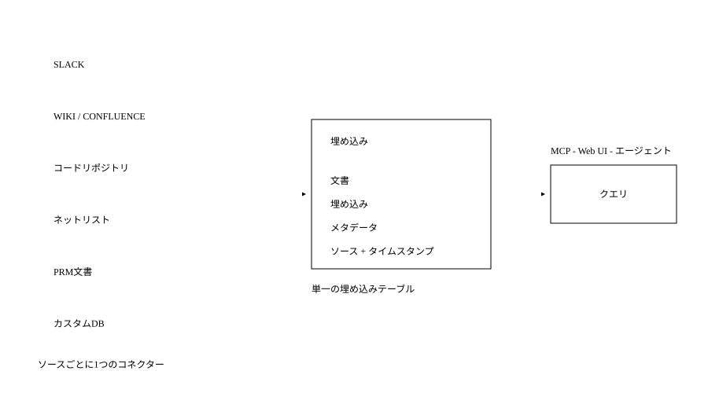
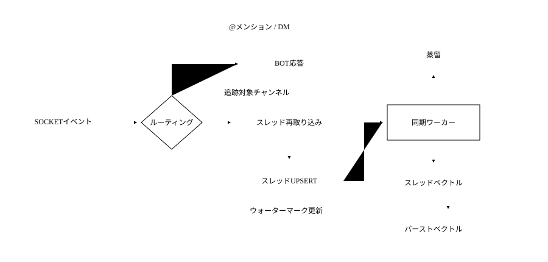
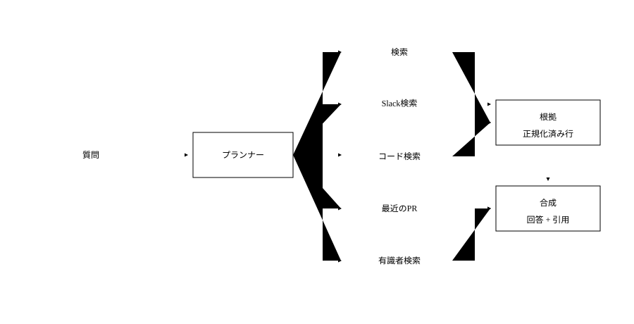
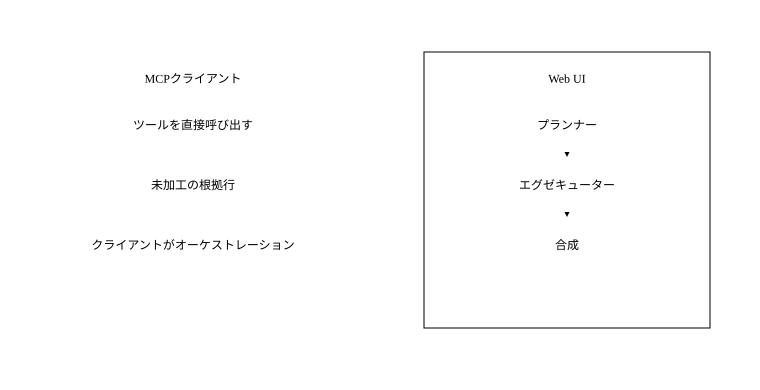
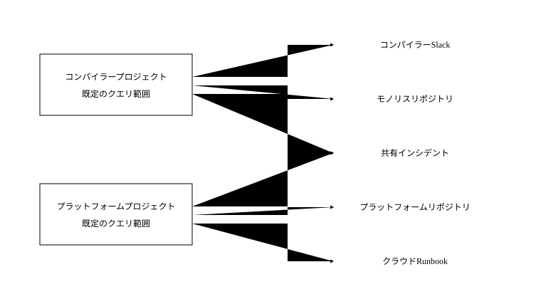

従業員は社内ナレッジベースへ毎日15,000件以上の質問をしています。3か月前の公開以来、社内で最も広く利用されるツールの一つになりました。人間だけでなく、自動化処理やエージェントからも利用されています。  

Cerebrasのチームは、データセンター運用、チップ設計、ハードウェア、学習、推論、クラウドプラットフォームなど、さまざまな領域で働いています。毎年数百人の新入社員を迎えるなか、コミュニケーションチャンネルは同じような質問で埋まりつつありました。

> *「Xはどこにありますか？」*  
> *「Yの専門家は誰ですか？」*  
> *「Zとは何ですか？」*

そこで、人やシステムを有用な情報へ結び付けるためにCerebras Knowledgeを構築しました。

### 既存のデータ保管先を生かす

組織内で情報を見つけるのは困難です。データは複数のツールに散在しており、四半期ごとに誰かが決まって同じ妙案を提案します。「すべてを一つのプラットフォームへ記録し、あらゆる情報を一か所に集めよう」というものです。しかし当然ながら、単一の信頼できる情報源という夢が実際に機能することはほとんどありません。

情報は、使いやすく作業に適した場所で生み出されます。文書内の修正提案、Slackのスレッド、GitHubのコード参照、Jiraのステータスメタデータなどです。これらのプラットフォームは、それぞれの領域に合わせて作られ、長年の製品開発と分析を通じて最適化されています。Google Docsでプルリクエストについて議論するのは、ひどい体験になるでしょう。

そこで、既存の行動をほとんど変えずに済むシステムの設計に着手しました。データ収集側では、各プラットフォームから直接データを抽出するということです。

### ナレッジベースの構造

このナレッジベースは、次の3つを提供します。

1. 社内データを収集・保存するプラットフォーム。
2. そのデータを検索するプラットフォーム。
3. 監査と分析を備え、認証と認可を強制するレイヤー。

中核にあるのは、多数のソースから得た埋め込み、未加工の要約、メタデータを保持する単一のPostgresテーブルです。システムは社内全体から継続的にデータを取り込み、いつでも検索できるデータストアを維持します。

シンプルでありながら、ほとんどの形式のデータを扱えるインターフェースを求めていました。また、Cerebrasのほかの開発者がカスタムコネクターを構築できるようにしたいとも考えました。その結果、意図的に単純な設計になりました。Slackスレッドからネットリストまで、すべてのソースを同じ埋め込みテーブルへ格納し、そのテーブル内のデータはすべて同じインターフェースから即座に検索できます。

各データソースは、データの内容、接続方法、取得頻度を定義します。生成される埋め込みの各行は、Slack、コードリポジトリ、文書システム、カスタムデータベースのいずれに由来するかを問わず、同じインターフェースに従います。

### Slack

Slackは、設計上最も重要なデータソースでした。社内で最新の技術的な議論が行われる場所だからです。

### 非構造化されたSlack会話の処理方法

当初は、未加工テキストの単純な埋め込みで十分な性能が得られるかを試しました。しかし、関連データを漏れなく検索するには、ベクトル検索だけでは不十分だとすぐに分かりました。

Slackメッセージには、いくつかの課題があります。

- 情報密度が大きく異なります。「ああ、いいよ、マイク」という発言も、カーネルの詳しい説明も、同じ1件のメッセージです。
- メッセージの長さはさまざまで、コサイン類似度では、短いメッセージがより長く詳細なメッセージを上回ることがよくあります。
- メッセージの意味は、周囲の会話に依存することが少なくありません。

そこで、ハイブリッドな手法が必要になりました。すべてのSlackスレッドを複数の検索手法で同時に取得でき、それぞれの手法がほかの弱点を補う取り込み処理を構築しました。

- **全文検索**は、埋め込みでは曖昧になる完全一致のトークンを捉えます。たとえば、エラー文字列、フラグ名、ホスト名です。エンジニアがエラーメッセージをそのまま貼り付けた場合、字句の完全一致がほぼ常に最良の根拠であり、意味的類似度がそれを上回るべきではありません。
- **埋め込み検索**は言い換えを捉えます。「マニフェストの読み込み後にリストアが停止する」と尋ねた人と、「NFSマウントでチェックポイントが止まる」と回答した人は、同じ語彙をまったく使っていない可能性があります。異なる言葉で書かれた質問と回答を結び付けるのがベクトル類似度です。(1)
- **逆文書頻度**は、有用な情報と価値の低い発言を区別します。あまり知られていない設定フラグなど、希少なトークンを中心とする短いメッセージは上位に位置すべきです。「よさそう、ありがとう！」は埋め込み空間では多くのクエリに近くなりますが、語の希少性を考慮するとスコアはほぼゼロになります。
- **経過時間による減衰**は、Slackの回答には有効期限があることを表現します。2つのスレッドが同じ質問へ答えていても、6か月前のものは、すでに存在しないインフラを説明しているかもしれません。それ以外の関連性が同じなら、新しいスレッドを優先します。

検索 / Slack候補 / 全文検索

クエリ

「マニフェストの読み込み後にリストアが停止する」

1. 2週間前
	**共通トークンなし** **言い換え一致** **CKPT\_PREFETCH：希少** **同点なら新しい方を優先**
	スレッド
	NFSマウントでチェックポイントが停止する — `CKPT_PREFETCH=4`を設定。
2. 1日前
	**トークン完全一致** **ERR\_MANIFEST\_TIMEOUT：希少**
	メッセージ
	`ERR_MANIFEST_TIMEOUT`：マニフェストの読み込み後にリストアが停止する。
3. 3時間前
	**誤った近傍** **希少トークンなし**
	メッセージ
	よさそう、ありがとう！試してみます
4. 8か月前
	**これも一致** **8か月：減衰済み**
	スレッド
	マニフェストの読み込み後にリストアが停止する → `LEGACY_FETCHER=1`を使用。

どのスコアラーも単独では信用しません。各手法が同じコーパスに対して独自のランキングを生成し、それらをクエリ時に統合します（[再ランキング](https://www.cerebras.ai/blog/how-we-built-our-knowledge-base#reranking)を参照）。

### Socket Mode

リアルタイムでデータを収集するため、ワークスペースへSlack Botをインストールし、Socket Modeで動作させました。Slackは永続的なWebSocketを通じてすべてのメッセージイベントをプッシュするため、Web APIをポーリングして利用上限を圧迫することなく、リアルタイムに更新を取得できます。

イベントを受信すると直ちに応答し、安定したイベントIDを使って重複を排除したうえで、取り込みコンシューマーの処理対象としてメッセージをマークします。

取り込みコンシューマーは、新しいメッセージを単独では保存しません。メッセージが属するスレッドを特定し、親メッセージとすべての返信を含む会話全体をSlack APIから再取得します。その後、スレッド全体を1行として書き戻します。そのため、既存スレッドへの返信があると、親メッセージと同じスレッド内のすべての返信が再取得されます。保存された内容、参加者一覧、最終アクティビティのタイムスタンプには、常に会話全体が反映されます。

システム内の各Slackチャンネルは、それぞれ独自のデータソースを持ちます。これにより、データの鮮度を細かく調整できます。たとえば、活発なインシデントチャンネルをより高い頻度で取り込むことができます。

### スレッドとメッセージ

未加工コンテンツにはPostgresの全文（GIN）インデックスを維持しているため、Slackの生テキストは取り込まれた時点からキーワード検索が可能です。ただし、有用なベクトル検索を実現するため、さらに処理を加えています。(8)

蒸留時には、LLMがスレッド全体から次の構造化データを抽出します。

- エンジニアが実際に検索しそうな1行の質問。
- 短い要約。
- 解決策。
- 言及されたシステムとコード参照。

\#CKPT-SUPPORT / THREAD\_8F42 スレッド全体の入力

1. 09:14
	**質問**
	Maya
	大規模クラスターでは、マニフェストの読み込み後にリストアが停止します。小規模な実行では問題ありません。
2. 09:17
	**要約**
	Owen
	128シャードで再現できます。ログはキャッシュのウォームアップ前に停止します。
3. 09:18
	**コンテキスト**
	Sam
	私のラップトップもMondayを検出すると停止します。
4. 09:21
	**解決策**
	Maya
	`CKPT_PREFETCH=4`を設定すると完了します。既定値はNFSマウントには大きすぎます。

{

"code\_refs" \["CKPT\_PREFETCH"\]

}

これらのデータポイントを埋め込み、共有の埋め込みテーブルへ書き込みます。元の会話記録は直接埋め込みません。実験では、スレッドを一貫した形式へ正規化すると精度が大幅に向上しました。(7,9) 追加のメタデータも、意味的な一致へより有用な信号を与えます。

### バースト化

この段階でSlack検索は良好になりましたが、長いスレッド内の重要なメッセージがスレッド単位の要約に必ずしも反映されないという問題が繰り返し発生しました。

個々のメッセージから得られる信号を強化するため、バースト化を使用します。バーストとは、同じ投稿者による連続した一連のメッセージです。文脈としてスレッドのトピックを先頭に付けて個々のバーストを埋め込みます。(2) 回答が、本筋から外れた1件のメッセージに含まれ、その語彙がスレッド要約にはまったく現れない場合があるためです。バースト埋め込みにより、そのメッセージを単独で見つけられるようになります。

有用性の低いデータを除外するため、複数の評価項目を重み付けして各バーストを採点します。スコアがしきい値を超えたバーストだけを埋め込みます。

- コーパス全体で比較的希少な、IDFが4.0以上のトークンを含む。
- 結合したバーストが200文字以上である。
- バースト内の1件以上のメッセージに、ほかの利用者からのリアクションがある。

蒸留後、条件を満たすバーストを埋め込み、スレッド単位のレコードとともに埋め込みテーブルへ保存します。

### コードリポジトリ

当初、コードリポジトリを埋め込む必要があるか議論しました。Claude Codeなどのコマンドラインツールが普及し、「grepだけで十分」と思えるなか、コードの埋め込みを作るのは直感に反するように感じられました。しかし、業界のほかの人々と話し、大規模コードベースにおける意味検索についてのCursorの知見を読んだ結果、試してみることにしました。

社内には多数のリポジトリがあり、40GBを超えるものもあります。最大の懸念は、それらを効率よく最新の状態に保つ方法でした。

### CocoIndexによるコード埋め込みの維持

いくつかの実験を経て、コードベースのベクトル化に特化したオープンソースの文書埋め込みフレームワークであるCocoIndexを採用しました。

各リポジトリでは、言語固有の正規表現による境界を粗いものから細かいものの順に使ってコードを分割します。スプリッターは、まずクラスなどの上位レベルの境界を試します。生成されたチャンクがまだ大きすぎる場合は、メソッド境界、さらに小さなブロックへとフォールバックします。生成したチャンクを埋め込み、ベクトルをPostgresへ書き込みます。1つのファイルから、ファイル単位や関数単位のレコードなど、粒度の異なる複数の埋め込みが生成される場合があります。

CocoIndexは同期メタデータをPostgresで追跡します。コミットのたびにリポジトリ全体を再計算するのではなく、変更されたコードチャンクだけを再埋め込み・再エクスポートします。同期状態と埋め込みストアが同じデータベースにあるため、この仕組みは特にうまく機能しました。

コードベースの数が増えるにつれ、リポジトリの登録を、各チームが自ら提出できる設定ファイルへ移しました。この設定には、ファイルパス単位の許可リストと拒否リストも含まれます。

### カスタムデータソース

一部のチームはすでに独自のデータベースを持っており、ナレッジベースへ参加するためだけにデータをSlackや文書システムへ移したくありませんでした。既存のテーブルに対して同じ検索インターフェースを使いたいと考えていました。

これを支援するため、カスタムソースをプラグインスクリプトとして扱います。チームは、自分たちのシステムから読み取り、埋め込みテーブルと同じ形式の行を出力する小さなPythonモジュールと、対応するデータソースエントリーをプルリクエストで提出します。

スクリプトがほかの埋め込み行と同じスキーマを使って共有データベースへ書き込む限り、スタックの残りの部分は変更なしで機能します。そのデータは、システムのほかの部分で特別な処理を加えることなく、Slack、コード、文書と並べて検索できるようになります。

### プランニングとツールのファンアウト

すべてのクエリに対し、まず短いプランニング処理を実行し、どのツールとデータソースが重要になりそうかをLLMに判断させます。主なツールは次のとおりです。

- subsystem\_index：ファイルごとのLLM要約。
- search：Slack、Wiki、コード、その他のインデックス済みソースを横断し、内部で統合・再ランキングする統一ベクトルパイプライン。
- search\_slack：Slackを直接検索。
- search\_code：ソースリポジトリに対するripgrep。
- recent\_prs：質問に関連する最近のプルリクエスト。
- who\_knows：そのトピックについて実績のある専門家。

プランナーは、インデックス済みの内容を簡潔に記述した情報を使用します。そこには、存在するプロジェクト、各プロジェクトで利用できるソース、各ソースが得意とする質問が含まれます。ユーザーのクエリと現在のスコープを受け取るとツール選択を出力し、エグゼキューターがそれらを並列にファンアウトします。結果を共通の根拠形式へ正規化し、最終的な合成を行うLLMへ渡します。(4)

### 再ランキング

文書が別の質問へ答えているにもかかわらず、クエリと語彙を共有しているだけで上位に現れることがあります。再ランキングの前に、互換性のない各検索器の結果一覧を、逆順位統合（Reciprocal Rank Fusion、RRF）で結合します。各文書について、出現する一覧ごとに「重み / (60 + 順位)」を加算します。既定の重みは1.0、平滑化定数は60です。

平滑化定数により、単独の強い評価よりも合意が重視されます。複数の検索器で上位に現れる文書は、1つの検索器だけで1位になった文書を上回ることがあります。次に、重複するチャンクを1つのソースへまとめ、各ファイルが結果へ提供できる件数に上限を設け、より多様な上位20件を得ます。

元のクエリと候補文書を小型の再ランキングモデルへ送り、各文書を0から10で採点させ、上位10件を残します。(6)

ランキングの確定後、上位文書に周辺情報を追加します。たとえばWikiのセクションが一致した場合は、前後の2セクションも取得します。これにより、チャンク分割で切り離された見出し、前提条件、注意事項を補い、必要な文脈を含む抜粋を提示できます。

したがって、検索の出力は豊富な根拠のまとまりになります。異なる検索器の結果を統合し、ソース単位で重複を排除し、実際の質問に照らして再ランキングしたうえで、最後に周囲のコンテキストを追加します。

### MCP

MCP統合では、検索の構成要素を単一の「この質問へ回答する」エンドポイントの背後へ隠すのではなく、直接利用できるツールとして公開します。クライアントが高速かつ低コストで問い合わせられるよう、これらのツールは意図的に単純化し、可能な限りLLMを使用しません。(5)

各MCPツールは、search\_slack、search\_code、search、who\_knowsなど、基盤となる1つの検索プリミティブに対応します。ツールの入出力は対象が絞られ、構造化され、安定しているため、ツール自体へ追加のオーケストレーションロジックを組み込むことなく、あらゆるクライアントやエージェントから容易に呼び出せます。

ほとんどのツールは、ベクトル検索、字句検索、ripgrepなど、1つのクエリパイプラインを実行し、軽量なスコアリングヒューリスティクスを適用して、未加工の根拠行を返します。

Claude CodeやほかのMCP互換エージェントが、オーケストレーションエンジンになります。どのツールをどの順序で呼び出し、結果を最終回答やコード編集へどうまとめるかを判断します。検索レイヤー自体は、リクエストを処理するうえで、そのようなLLMの判断に依存しません。

### Web UI

Web UIにも同じツールがありますが、ユーザーの質問ごとにエンドツーエンドで実行される完全なクエリパイプラインへ接続されています。UIエージェントがプランナーとエグゼキューターのステップを担います。

**プランナー：** 軽量なLLM処理がクエリと現在のプロジェクトを調べ、search、search\_slack、subsystem\_indexなど、呼び出す検索ツールを選択します。

**エグゼキューター：** ツール呼び出しを並列にファンアウトして結果を収集し、スコア、鮮度、ソースのヒントを含む共有の根拠スキーマへ正規化します。

**合成：** 最後のLLM処理が、共通スキーマで構造化した根拠一式と元の質問を受け取り、引用、注意事項、ソース横断の統合を含む、UIに表示する回答を生成します。

ユーザーから見れば、Web UIは単に「質問して回答を得る」ものです。内部では、MCPクライアントが明示的に再現できるものと同じ、プランナー → エグゼキューター → シンセサイザーのパターンを実行しています。

### プロジェクトによる情報整理

コーパスが増えるにつれて、「あらゆる場所のすべてを検索する」方法は急速に役に立たなくなりました。コンパイラーチームのエンジニアは結果にインフラのRunbookを求めておらず、その逆も同様です。プロジェクトを使うことで、既定の検索結果に関連性を持たせています。

### プロジェクトとスコープ付き検索

クエリの実行対象となるワークスペースを整理する主要な方法として、プロジェクトを導入しました。プロジェクトとは、特定のSlackチャンネル、コードリポジトリ、社内データベース、文書スペースなど、チームや取り組みに関連するデータソースへ名前を付けたまとまりです。

プロジェクトは意図的に軽量にしています。共有インシデントチャンネルや中央プラットフォームリポジトリなど、同じデータソースを複製せずに複数のプロジェクトから参照できます。

### オンボーディングと既定値

オンボーディングでは、ML学習インフラ、コンパイラー、データセンター運用など、各自の業務に合う既定のプロジェクトを選択または作成するよう促します。

既定のプロジェクトはユーザープロファイルへ保存され、クエリの範囲を自動的に限定します。新しいエンジニアは、どのSlackチャンネル、リポジトリ、文書スペースが重要かを先に学ばなくても、有用性の高い回答を得られます。

### おわりに

このナレッジベースが機能する理由は、情報を一つのシステムへ移すのではなく、既存の保管先から収集する設計にあります。複数の検索手法を組み合わせることで、必要な根拠を素早く提示できます。実際の社内データを扱える柔軟性と、組織の成長後も検索精度を保てる構造を両立しています。

参考文献

1. Malkov、Yashunin、[*階層型Navigable Small Worldグラフを用いた効率的で堅牢な近似最近傍探索*](https://arxiv.org/abs/1603.09320)、arXiv:1603.09320 / IEEE TPAMI 2018。
2. Anthropic、[*コンテキスト検索の紹介*](https://www.anthropic.com/news/contextual-retrieval)、2024年。
3. Cormack、Clarke、Büttcher、[*逆順位統合はCondorcet法および個別の順位学習手法を上回る*](https://dl.acm.org/doi/10.1145/1571941.1572114)、SIGIR 2009。
4. Liほか、[*Search-o1：エージェント型検索で強化した大規模推論モデル*](https://arxiv.org/abs/2501.05366)、arXiv:2501.05366、2025年。
5. Anthropic、[*MCPによるコード実行*](https://www.anthropic.com/engineering/code-execution-with-mcp)、2025年。
6. Liuほか、[*Lost in the Middle：言語モデルによる長いコンテキストの利用方法*](https://arxiv.org/abs/2307.03172)、arXiv:2307.03172、2023年。
7. Anthropic、[*XMLタグを使用する*](https://docs.anthropic.com/en/docs/build-with-claude/prompt-engineering/use-xml-tags)。
8. Salesforce/Slack Engineering、*Slack AIが数十億件のメッセージを処理する方法*。
9. Improving Agents、*最適な入れ子データ形式*。
10. Cursor、[*意味検索によるエージェントの改善*](https://cursor.com/blog/semsearch)、2025年。
