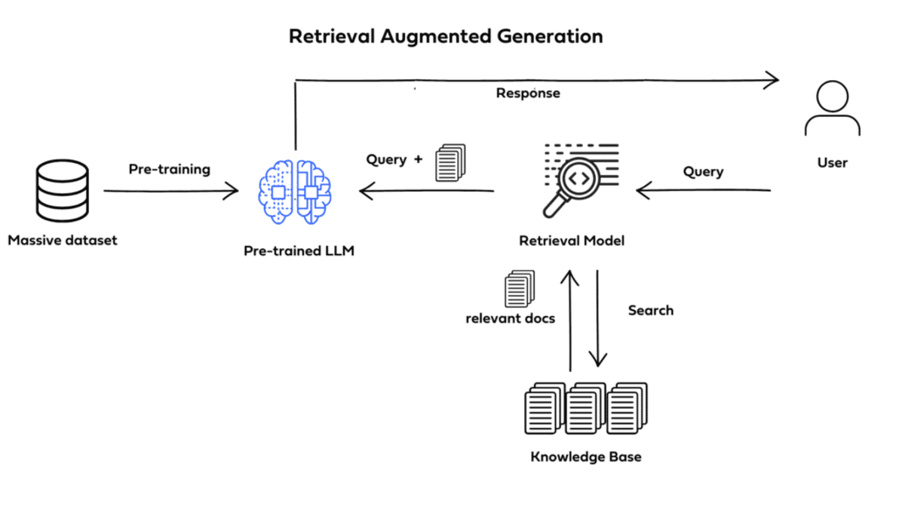
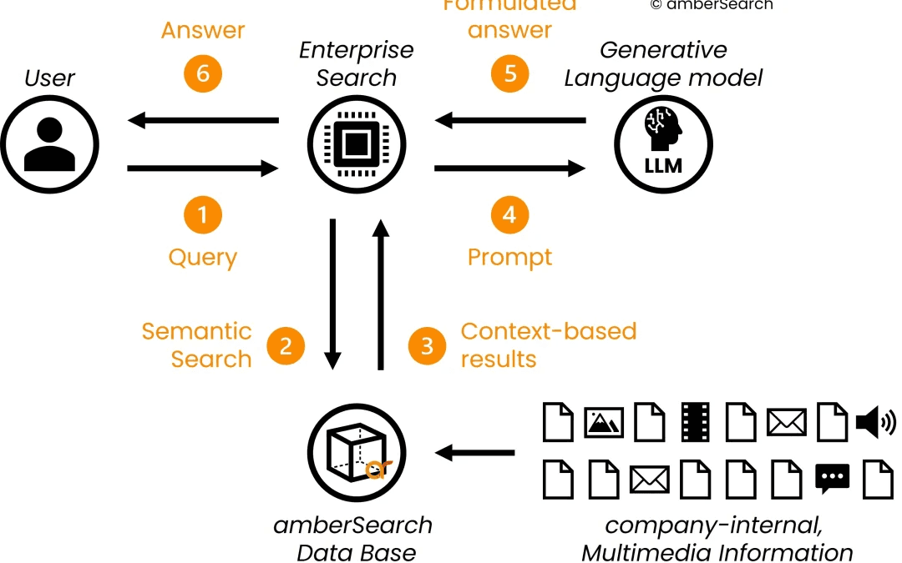
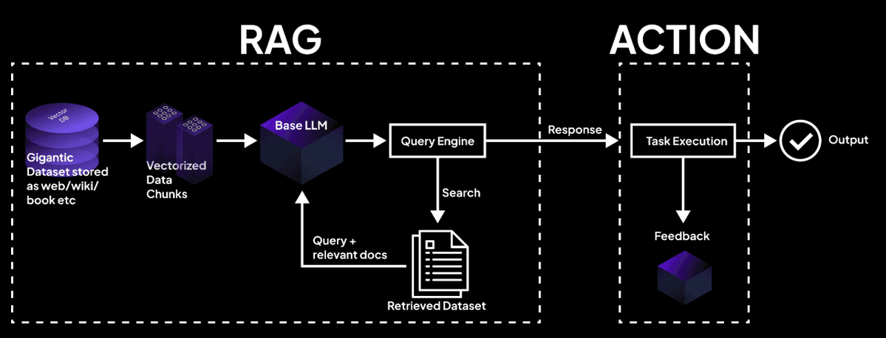
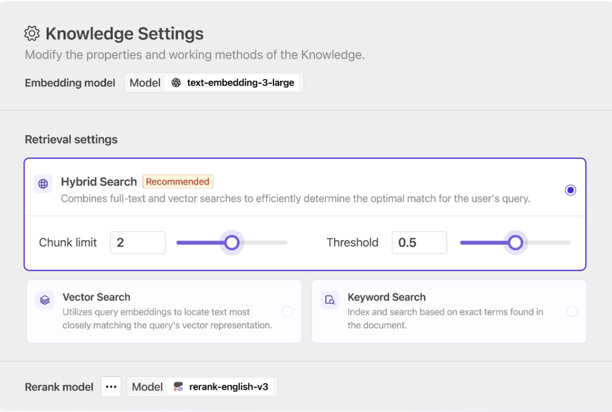

主要なメトリクス、ベスト プラクティスなどを理解することで、RAG (検索拡張生成) モデルを効果的に評価する方法を学びます。

## 重要なポイント

* RAG 評価は、検索拡張生成 (RAG) モデルのパフォーマンスを評価するための重要なプロセスであり、実際のアプリケーションで適切で一貫した応答を提供するために、検索の精度と生成の品質の両方が揃っていることを保証します。
* 効果的な RAG 評価では、precision@k、recall@k などの複数のメトリックと生成メトリックを組み合わせて取得とジェネレーターの両方のパフォーマンスを評価し、モデルが複雑なクエリを処理して信頼性の高い結果を提供できることを保証します。
* RAG パイプラインを最適化するには、AI システムが検索エンジン、チャットボット、情報検索システムなどのアプリケーションのニーズを確実に満たすように、継続的な評価と微調整、検索 precision と生成品質のバランスを取る必要があります。

より洗練された AI モデルへの需要が高まるにつれ、**RAG 評価**は、開発者、データ サイエンティスト、AI 実践者にとって重要な重点分野となっています。実際、[Grand View Research](https://www.grandviewresearch.com/industry-analysis/retrieval-augmented-generation-rag-market-report) は、RAG 市場の 2024 年から 2030 年の CAGR が 44.7% になると予想しています。

検索拡張生成 (RAG) モデルは、情報検索の能力と言語生成の柔軟性を組み合わせて、よりスマートでコンテキストを認識した出力を可能にします。しかし、大きな可能性には大きな複雑さが伴います。 RAG モデルの評価は決して簡単ではありません。生成されたテキストの品質を評価するだけでは不十分です。

**RAG パイプライン**では、情報の取得方法と、生成される出力に情報がどの程度正確に影響するかに関して、取得ステップが極めて重要な役割を果たします。これには、[出力が適切であるだけでなく一貫性がある](https://orq.ai/blog/why-is-controlling-the-output-of-generative-ai-systems-important)ことを保証するために、[取得プロセス](https://orq.ai/blog/rag-architecture)と生成モデル自体の両方を慎重に評価する必要があります。 2025 年に向けて、**rag llm** (大規模言語モデル) のパフォーマンスと現実世界のアプリケーションにおける AI ツールの有効性の両方を向上させるには、RAG 評価をマスターすることが鍵となります。

この記事では、基本的な概念から高度なテクニックまで、**RAG 評価**のベスト プラクティスについて詳しく説明します。包括的な評価に構造化された **RAG フレームワーク**を使用することの重要性を探り、人間による評価の統合に関する洞察を提供し、チームが RAG モデルを効率的に評価できるようにするツールとテクノロジーに焦点を当てます。 **ラグ評価**または**ラガス評価**のどちらを使用している場合でも、モデルのパフォーマンスを測定および改善する方法を理解することで、急速に進化するこの分野で差別化を図ることができます。

## RAG とは何ですか?

**検索拡張生成 (RAG)** は、検索ベースのモデルと生成ベースのモデルという 2 つの強力な技術を組み合わせた高度な [AI モデル アーキテクチャ](https://orq.ai/blog/ai-agent-architecture) です。 RAG の背後にある考え方は、データベースまたは検索エンジンから取得した外部情報を活用し、これを使用して応答の生成を強化することです。

*クレジット: Medium*

**RAG モデル**では、最初のステップには、**レトリバー** (**Pinecone** のような埋め込みモデルに基づくことが多い) を使用して、ナレッジ ベースまたはインデックス付きコーパスから関連するドキュメントまたはデータを**取得**することが含まれます。関連するコンテキストが取得されると、**ジェネレーター** (通常は LLM、または大規模言語モデル) がこの情報を処理して、意味のあるコンテキストに関連した応答を生成します。このアーキテクチャにより、モデルは、検索ベースの技術 (高品質で関連性のあるデータを保証する) と生成技術 (データが人間のような一貫した方法で表示されることを保証する) の長所を組み合わせることができます。

## RAG 評価と標準モデル評価の違い

**RAG (検索拡張生成)** モデルの評価は、採用されている独自のアーキテクチャにより、標準モデルの評価と比較してはるかに複雑なプロセスです。事前定義されたデータセットまたは静的知識ベースのみから出力が生成される従来のモデルとは異なり、RAG モデルは、**取得プロセス**と**生成プロセス**という 2 つの異なるコンポーネントを組み合わせています。この二重層アーキテクチャでは、パフォーマンスを評価する際に考慮する必要があるいくつかの追加要素が導入されます。

標準的なモデルの評価では、通常、テキスト生成品質や分類タスクの精度など、単一の出力品質メトリクスを中心に焦点が当てられます。ただし、**RAG 評価** では、プロセスはより微妙になります。 **llm 取得者** (大規模言語モデル取得者) は、取得したコンテンツに基づいてモデルが応答を生成する前に、まず大規模なコーパスまたはデータベースから関連文書を取得します。これは、**RAG 評価指標** が取得フェーズと生成された応答の品質の両方を考慮する必要があることを意味し、取得コンポーネントと生成コンポーネントがどの程度うまく連携しているかを測定することが重要になります。

*クレジット: Tensorloops*

たとえば、モデルは関連するドキュメントのセットを取得する可能性がありますが、出力生成には一貫性がなかったり、ユーザーのクエリに直接答えられなかったりするため、良好な検索結果があっても効果がなくなる可能性があります。ここで、**RAG パイプライン** の評価フレームワークが重要になります。適切な評価により、両方のコンポーネントが最適に実行され、取得精度と生成されたコンテンツの品質および関連性のバランスが保たれることが保証されます。

さらに、**RAG 評価**では、**NDCG スコア** (正規化割引累積ゲイン) や **DCG メトリック** (割引累積ゲイン) などの多層評価メトリックの必要性が導入されています。これらのメトリックは、取得された文書の関連性を測定するものであり、**ラグ スコア** や **ラガス スコア** などの、関連性と一貫性を提供する際のモデルの全体的な有効性を評価できるものです。出力。 BLEU や ROUGE などの従来の評価メトリクスは、入力データの関連性を考慮せずに生成品質のみを評価するため、これらのメトリクスはプロセスの二重性を考慮して調整されています。

## RAG 評価における検索の役割

**RAG パイプライン** では、取得プロセスは生成フェーズと同じくらい重要です。 RAG モデルは入力クエリに関連するドキュメントの取得に依存しているため、llm 取得ツールが関連するコンテンツをどの程度効果的に識別してランク付けするかを評価することが重要です。検索コンポーネントのパフォーマンスを測定するために、**RAG 評価**には、**NDCG スコア** や **DCG メトリック** などの評価メトリックが組み込まれることがよくあります。これらは、取得された結果のランキングを評価するために広く使用されており、最も関連性の高いドキュメントがリストの先頭に表示されるようになります。

*クレジット: LinkedIn*

たとえば、**Pinecone RAG** やその他のベクトル データベースは、高速で正確な検索機能を提供することで、この検索ステップで重要な役割を果たします。これらのツールは、取得コンポーネントがコンテキストに関連し、生成フェーズに役立つドキュメントを一貫して識別するのに役立ちます。したがって、**RAG パイプライン**での取得品質を評価する場合には、**Pinecone RAG** のようなツールが不可欠です。

取得パフォーマンスを評価するときの目標は、モデルによって取得されたドキュメントの関連性を測定することであり、これは生成される応答の品質に直接影響します。 **ラグ ツール**がクエリと文脈的に一致していないドキュメントを取得した場合、最新世代のモデルであっても意味のある出力を提供するのは困難になります。これが、RAG の評価において **ragas スコア** などの指標を使用して取得ステップに焦点を当てることが非常に重要である理由です。これにより、取得したドキュメントが意図した出力と一致することが保証され、モデルの全体的なパフォーマンスが向上します。

## RAG モデルの生成コンポーネントの評価

関連するドキュメントを取得したら、次の課題は、それらのドキュメントから生成されたコンテンツの品質を評価することです。このステップには、**RAG パイプライン**が取得した情報をどの程度うまく利用して、一貫性があり、関連性があり、正確な出力を生成するかを評価することが含まれます。従来の生成評価は、流暢性、一貫性、文法的正確さなどの側面に焦点を当てていますが、RAG 評価では、生成されたコンテンツが入力クエリと取得されたドキュメントをどの程度反映しているかも考慮することでこれを拡張します。

**ROUGE** や **BLEU** などの指標を適用して、生成テキストと参照テキストの類似性を測定することもできます。ただし、より包括的な **ラグ評価**には、生成されたテキストの関連性を評価する追加の指標が重要です。たとえば、**ラグ スコア** を使用して、生成されたテキストが取得されたコンテンツとどの程度相関しているかを測定し、モデルが流暢であるだけでなく、コンテキストを認識していることを確認できます。

人間による評価は、生成品質を評価するもう 1 つの重要な側面です。 **NDCG スコア** や **ragas スコア** などの自動化された指標は貴重な洞察を提供しますが、特にカスタマー サポートや会話型 AI など、より微妙な理解を必要とするタスクの場合、生成されたコンテンツの全体的な有用性と関連性を評価するには人間の判断が必要になることがよくあります。

## 総合的な評価のための検索と生成の統合

**RAG 評価**を真にマスターするには、実際のアプリケーションで取得コンポーネントと生成コンポーネントがどのように相互作用するかを理解することが重要です。この統合されたアプローチには、**ラグ トライアド** (検索、ランキング、生成) がどの程度うまく調整されて、ユーザーに可能な限り最高の出力が提供されるかを評価することが含まれます。モデルのパフォーマンスの全体像を把握するには、定量的な**ラグ評価メトリクス**と人間の評価による定性的な洞察の両方を使用することが不可欠です。

たとえば、RAG アプリケーションの意味では、取得されたドキュメントが関連しているだけでなく、生成された応答を強化することを保証することが、モデルに価値を付加するための鍵となります。強力な RAG ツールにより、関連ドキュメントが迅速かつ正確に取得され、生成モデルはこれらのドキュメントを効果的に使用して最終応答を作成します。

したがって、**評価プロセス**では、**llm リトリーバー**と言語生成の品質に重点を置き、**RAG パイプライン**の両方のステージが精度と関連性に関して最適化されていることを確認する必要があります。この包括的な評価戦略は、RAG モデルが関連情報を効率的に取得するだけでなく、その情報を効果的に使用して正確で役立つ出力を生成することを保証するのに役立ちます。

## RAG モデルを評価する方法: 重要な要素

**RAG (検索拡張生成)** モデルを評価する場合、考慮すべき重要な要素がいくつかあります。 RAG モデルは **取得プロセス** と **生成プロセス** の両方を組み合わせているため、両方のコンポーネントのパフォーマンスと、それらがどのように連携して機能するかを評価することが重要です。目標は、生成されたテキストの品質を測定することだけではなく、検索システムが効果的であり、モデルが文脈に応じた応答を生成していることを確認することです。 **RAG モデル**を評価する際の最も重要な考慮事項を詳しく説明します。

### 1. 取得精度と生成品質のバランスをとる

**RAG パイプライン**は関連ドキュメントの取得から始まり、システムが適切な情報をどれだけうまく取得できるかが、最終的な出力品質に重要な役割を果たします。 **NDCG スコア** や **DCG メトリクス** などの **RAG メトリクス**は、関連性に基づいて取得されたドキュメントのランキングを評価することで、検索システムの有効性を測定するのに役立ちます。これらのメトリクスは、システムがクエリに応答するために最も関連性の高いドキュメントをどの程度適切に取得するかを評価し、生成されるコンテンツの品質に直接影響します。

取得が完了したら、次のステップは、取得したドキュメントを一貫した応答に変換する **ジェネレーター** を評価することです。生成されたテキストの品質は、その流暢性、一貫性、および入力クエリとの整合性について評価する必要があり、**ジェネレーター** が主題から逸脱したり、無関係な詳細を導入したりしないようにする必要があります。 **BLEU** や **ROUGE** などの指標を使用できますが、**RAG 評価**の場合は、取得と生成の品質の両方を考慮することが重要です。

### 2. 検索メトリクスとコンテキスト関連性の役割の評価

正確な **RAG 評価**を行うには、**precision**、**recall**、**F1 スコア** などの取得指標を適用して、**llm 取得プログラム** によって取得されたドキュメントの関連性と完全性を測定できます。ただし、検索の正確性だけでなく、**コンテキストの関連性**も重要です。ドキュメントが正確に取得されたとしても、生成された応答に価値が付加されない場合、モデルのパフォーマンスが損なわれる可能性があります。取得された文書が意味のある正確な回答の生成にどの程度貢献しているかを評価するには、取得プロセスが生成フェーズとどのように相互作用するかに注意を払う必要があります。

たとえば、**ジェネレータ**が、取得した関連性のない文書や低品質の文書に基づいてテキストを生成した場合、出力には事実の正確さと関連性の両方が欠けてしまいます。このため、高品質の出力を維持するには、**埋め込みモデル**が適切に微調整され、**RAG パイプライン**に適切に統合されていることを確認することが重要です。

### 取得と生成の微調整

**RAG モデル**のパフォーマンスを向上させるには、微調整が重要な役割を果たします。取得コンポーネントと生成コンポーネントは両方とも、相互に補完できるように最適化する必要があります。 **取得プロセス**の場合、**埋め込みモデル**を微調整し、**ラグしきい値**を調整すると、取得されるドキュメントの品質を制御するのに役立ちます。適切な **ラグしきい値**を設定すると、最も関連性の高いドキュメントのみが確実に含まれるようになり、検索プロセスの効率が向上します。

**生成コンポーネント**の場合、取得したデータに適切に応答するように**ジェネレーター**を微調整することが重要です。このプロセスには、高品質のドメイン固有データでモデルをトレーニングして、生成された応答の **ラグ評価**を強化し、**ラグ値**が目的の出力基準と一致するようにすることが含まれます。さらに、**ラグしきい値パーセンテージ** を実装すると、取得プロセスと生成品質の許容可能な最小スコアを定義し、関連する応答のみが確立された基準を満たすことが保証されます。

### RAG 定格によるパフォーマンスの測定

**RAG 評価**は、モデルによって生成された出力の全体的な品質を評価するために使用されます。これらの評価は、**ラグ パイプライン**が関連性と一貫性の両方を備えた回答をどの程度適切に生成するかを評価します。これらの評価は通常、取得されたドキュメントの品質や**ジェネレーター**の有効性などの要素に基づいています。 **ラグ評価**が高いほど、モデルが関連ドキュメントを正常に取得し、正確で高品質な応答を生成していることを示します。

**RAG 評価**に加えて、**ragas スコア** や **rag スコア** などの他の **rag メトリクス**も、貴重な出力を生成する際の **RAG パイプライン**の成功を定量化するために使用されます。これらのスコアでは、取得精度と生成品質の両方が考慮され、モデルのパフォーマンスの包括的なビューが提供されます。

### RAG-as-a-Service に Orq.ai を活用:

RAG モデルがより複雑になり、AI アプリケーションに不可欠になるにつれ、開発プロセスの合理化を目指すチームにとって、RAG をサービスとして提供するプラットフォームが不可欠になりました。そのようなプラットフォームの 1 つが [**Orq.ai**](https://orq.ai/) です。これは、RAG ワークフローを管理および最適化するための包括的なツール セットをチームに提供する堅牢な LLMOps ソリューションです。

**Orq.ai** は、**RAG パイプライン** を構築および展開するためのユーザーフレンドリーなインターフェイスを提供することで、**Hugging Face** や **Pinecone** などのプラットフォームに代わる優れた代替手段として際立っています。 Orq.ai の **s** プラットフォームを通じて、開発者は**埋め込みモデル**の設計と微調整、スケーラブルな知識ベースの構築、**RAG 評価**の成功の鍵となる堅牢な検索戦略の実装を行うための完全なツール スイートにアクセスできます。

Orq.ai の主な機能は次のとおりです。

- **ナレッジ ベースの作成**: 外部データ ソースから [ナレッジ ベース](https://orq.ai/) を簡単に作成し、LLM が独自のデータで応答をコンテキスト化できるようにします。これにより、**コンテキストの関連性**が向上し、生成される応答の precision が向上します。
- **高度な検索機能**: Orq.ai の安全なすぐに使用できるベクトル データベースを利用して **RAG パイプライン**を処理し、高品質の検索に必要な速度と精度を提供します。必要な基準を満たすように **ラグしきい値**を調整し、**埋め込みモデル**を微調整することで、取得プロセスを微調整します。
- **効率的なモデル展開**: RAG ワークフローを合理化し、取得コンポーネントと生成コンポーネントの両方が最適化されるようにすることで、プロトタイプから実稼働環境に迅速に移行します。これにより、チームはモデルの **ラグ スコア**と**ラグ レーティング**を改善しながら、開発サイクルを加速することができます。

**Pinecone** や **Hugging Face** と比較すると、**Orq.ai** は、完全な RAG-as-a-service プラットフォームを提供することで優れており、エンジニアは **RAG パイプライン**をシームレスに統合、最適化、拡張できます。 Orq.ai は、取得機能と生成機能の両方の強化に重点を置くことで、**RAG 評価**の複雑さを簡素化し、チームがより信頼性の高い AI を活用したソリューションをより効率的に構築できるように支援します。

Orq.ai のプラットフォームが RAG ワークフローをサポートする方法について詳しく知るには、チーム メンバーの 1 人と一緒に [デモを予約](https://orq.ai/book-demo) してください。

## RAG 評価のベスト プラクティス

**RAG (取得拡張生成)** モデルを評価する場合は、取得フェーズと生成フェーズの両方を徹底的に評価するベスト プラクティスに従うことが重要です。以下は、徹底的な **RAG 評価**を実施し、ワークフローのあらゆる側面で精度と品質を確保するためのベスト プラクティスの内訳です。

### 1. 取得メトリクスと生成メトリクスの両方に優先順位を付ける

最初のベスト プラクティスは、**取得** コンポーネントと **生成** コンポーネントを個別に評価し、それらがどの程度相互作用しているかを測定することです。 **precision@k** や **recall@k** などの **検索メトリック** は、モデルが関連ドキュメントをどれだけ効果的に取得するかを判断するために不可欠です。これらの指標は、**llm リトリーバー** が上位 k 件の結果内で最も関連性の高いドキュメントを一貫して返すことができるかどうかを評価するのに役立ちます。再現率は、取得された関連ドキュメントの数を測定し、precision は、取得されたドキュメントのうちの関連性のあるドキュメントの数を評価します。どちらの指標も、取得パフォーマンスのベースラインを確立するために重要です。

ただし、検索精度だけでは十分ではありません。 **ジェネレーター** が取得したドキュメントを首尾一貫した文脈に関連した出力にどの程度変換できるかを評価することも同様に重要です。 **BLEU**、**ROUGE**、**コンテキスト recall** および **コンテキスト precision** などの **生成メトリクス**は、生成されたテキストと元のクエリの関連性およびそのコンテキスト アラインメントの品質を測定するのに役立ちます。

総合的な **RAG 評価**では、両方のコンポーネントが考慮されます。**recall@k** および **precision@k** を通じて高品質の取得が保証されると同時に、**生成メトリック**を通じて生成された出力が関連性があり一貫性があることも保証されます。重要なのは、取得した文書の正確さだけでなく、出力テキストの**回答の関連性**も測定することです。

### 2. コンテキスト評価指標の実装

**RAG モデル**では、**コンテキストの関連性**が最も重要です。取得したドキュメントが、正確なだけでなく、ユーザーのクエリのコンテキストに関連した回答の生成にどの程度貢献しているかを評価することが重要です。 **コンテキスト recall** と **コンテキスト precision** は、この側面を評価するために特別に設計された 2 つの指標です。 **コンテキスト recall** は、(取得したドキュメントからの) 関連するコンテキストが生成された出力に効果的に含まれているかどうかを測定し、**コンテキスト precision** は、関連性のある貴重なコンテキストのみが使用されているかどうかをチェックし、無関係な情報を除外します。これらのメトリクスを組み合わせると、モデルが検索結果をどの程度活用しているかについて、より深い洞察が得られます。

さらに、**ゼロショット LLM 評価**および**少数ショット LLM 評価**の場合、モデルが特定のタスクで明示的にトレーニングされていないシナリオでモデルのパフォーマンスをテストすることが重要です。 **ゼロショット LLM 評価**は、タスク固有のデータをまったく参照せずにモデルがタスクをどの程度うまく処理できるかを測定します。一方、**フューショット LLM 評価**は、非常に限定された例を使用してモデルのパフォーマンスをテストします。これらの評価手法は、新規またはまばらな入力を処理する際のモデルの汎化能力を強調し、堅牢なモデル評価に不可欠なものとなります。

### 3. 精度とリコールのために RAG パイプラインを最適化する

**RAG パイプライン**の最適化は継続的なプロセスです。 **RAG の評価**中、パフォーマンスを最大化するには、取得プロセスと生成プロセスの両方を改良することが不可欠です。目標は、情報損失を最小限に抑え、最終出力の精度を最大化することです。たとえば、**埋め込みモデル**を微調整することは、取得ステップで**コンテキストの関連性**を向上させる鍵となりますが、**ラグしきい値**を調整することで、最も関連性の高いドキュメントが確実に取得され、生成フェーズに渡されるようになります。これらのパラメータを調整すると、**precision@k** と **recall@k** の両方が大幅に改善され、**ラグ ツール** が一貫して高品質の結果を提供できるようになります。

取得コンポーネントと生成コンポーネントの両方に **ラグしきい値パーセンテージ** を設定することで、チームは precision と recall の間のバランスを調整し、モデルが無関係なドキュメントを取得しすぎず、高い recall を維持できるようにすることができます。

### 4. インデックス作成メトリクスを使用してパフォーマンスを監視する

大規模な RAG システムの場合、インデックス作成および検索システムは、複雑なデータとクエリを効率的に処理できるように最適化する必要があります。 **インデックス作成メトリクス**は、インデックス作成プロセスの有効性を測定する方法を提供し、ドキュメントが効率的に保存され、必要なときに取得されることを保証します。たとえば、**Pinecone RAG** は、高速な検索を容易にするために高性能のベクトル インデックスを活用しています。これらのインデックス作成メトリクスにより、モデルが関連ドキュメントを迅速に取得できるようになり、応答の速度と品質の両方が向上します。

**Pinecone** や **Orq.ai** などのツールを統合する場合は、**インデックス作成指標**を評価して、データ量が増加しても取得が高速かつ正確であることを確認することが重要です。効率的なインデックス作成はシステムの **precision** と **recall** の両方に直接影響し、高品質の **RAG パイプライン**を維持するための重要な要素となります。

### 5. さまざまなコンテキストとシナリオにわたるテスト

**RAG モデル**は、その堅牢性を評価するために、さまざまなコンテキストやシナリオでテストする必要があります。これには、モデルのトレーニング データ以外のタスクに対する [ゼロショット LLM 評価](https://orq.ai/blog/llm-evaluation) によるテストと、最小限の例を含むタスクに対する **少数ショット LLM 評価**が含まれます。これらの評価方法により、標準的なシナリオだけでなく、新規またはまばらな入力に直面した場合でもモデルが適切に機能することが保証されます。

**RAG モデル**を複数のシナリオでテストすることで、チームは**ラグ トライアド** (検索、ランキング、生成) がさまざまなコンテキスト間でどの程度うまく機能するかを評価でき、困難な環境や動的な環境でも一貫した**回答の関連性**と高品質な応答を確保できます。

### 6. RAG 評価プロセスの監視と調整

最後に、**RAG 評価**プロセスを継続的に監視することで、モデルが一貫して品質基準を満たしていることを確認します。 **ラグ評価**は、検索コンポーネントと生成コンポーネントがどの程度うまく連携して、正確で関連性のある一貫した結果を提供しているかを包括的に示します。 **ラグしきい値**を定期的に調整し、**ラグ メトリクス**を評価することで、データ品質の変化、ユーザー クエリ、ドメイン固有の要件にシステムが確実に対応できるようになります。

## RAG 評価: 重要なポイント

**RAG モデル**を効果的に評価するには、取得コンポーネントと生成コンポーネントの間の相互作用を理解し、**RAG メトリクス**と**評価手法**の適切なセットを使用してそれらを最適化することが重要です。 **recall@k** と **precision@k** に焦点を当て、**コンテキストの関連性**を評価し、**埋め込みモデル**を微調整し、高度なインデックス作成戦略を使用するなどのベスト プラクティスを実装することで、チームは **RAG パイプライン**のパフォーマンスを大幅に向上させることができます。 **Orq.ai** などのプラットフォームを使用して **RAG-as-a-service** を展開する場合でも、社内システムを最適化する場合でも、precision、recall、生成品質のバランスを維持することが成功の鍵です。

## よくある質問

* RAG 評価とは何ですか? なぜ重要ですか?
  * RAG（検索拡張生成）評価とは、モデルが検索ベースのコンポーネントと生成ベースのコンポーネントをどの程度うまく組み合わせ、正確で関連性と一貫性のある結果を生成できるかを評価するプロセスです。RAG モデルは、データの検索とテキストの生成という別々の 2 段階に依存しており、どちらも最適に機能する必要があるため、この評価は不可欠です。効果的な RAG 評価により、検索器が高品質な文書を提供し、生成器がそれらの文書を意味のある回答へ統合していることを確認できます。検索エンジン、チャットボット、AI を活用した質問応答システムなど、検索と生成の両方の品質がユーザー満足度と性能に直接影響するアプリケーションでは特に重要です。
* precision と recall は RAG 評価でどのように機能しますか?
  * precision@k と recall@k は、RAG 評価において検索段階を評価するための重要な指標です。precision@k は検索された上位 k 件の文書のうち関連文書がいくつあるかを測定し、recall@k は関連文書のうち上位 k 件の結果に含まれるものがいくつあるかを測定します。RAG モデルにおいて、precision は無関係な情報が回答に含まれないようにするための指標であり、recall は重要な関連文書を取りこぼさないようにするための指標です。どちらの指標からも検索器の性能を把握でき、生成器が利用できる高品質なコンテンツを確保するための基盤となります。
* パフォーマンスの測定に使用される一般的な RAG 評価指標にはどのようなものがありますか?
  * precision@k と recall@k に加え、生成テキストの品質を評価する BLEU、ROUGE、F1 スコアなどの生成指標も、主要な RAG 評価指標に含まれます。また、生成器が検索されたコンテキストをどの程度活用し、関連性と正確性のある回答を生成できているかを評価するには、context recall と context precision も重要です。さらに詳細な評価では、最終的な生成における重要度に基づいて、モデルが関連文書をどの程度適切に順位付けできているかを評価するために、NDCG（Normalized Discounted Cumulative Gain）と DCG（Discounted Cumulative Gain）が使用されます。
* パフォーマンスを向上させるために RAG パイプラインを最適化するにはどうすればよいですか?
  * RAG パイプラインを最適化するには、検索コンポーネントと生成コンポーネントの両方の微調整に重点を置きます。検索段階では、precision と recall の両方を最大化できるように、埋め込みモデルとベクトルデータベース（Pinecone や Orq.ai など）を調整します。RAG のしきい値を変更して検索する文書数を制御し、最も関連性の高いデータが生成器へ渡されるようにできます。生成側では、文脈に関連しているだけでなく、一貫性があり有益なテキストを生成できるようにモデルを微調整します。元データへの引用やハイパーリンクを組み込むことで、信頼性と透明性も向上できます。
* RAG 評価は、検索エンジンやチャットボットなどの実世界のアプリケーションでどのような役割を果たしますか?
  * 検索エンジンのような実世界のアプリケーションでは、RAG 評価により、システムが関連性のある結果を返すだけでなく、一貫性があり人間にとって読みやすい形で提示していることを確認できます。チャットボットでは、検索されたデータと生成された出力を効果的に組み合わせることで、正確で文脈を認識した回答を提供するために RAG 評価が役立ちます。効果的な RAG 評価によって、検索精度と生成品質のバランスをシステムがどの程度うまく取れているかを開発者が測定でき、ユーザーのニーズを満たす、関連性が高く明確で有用な情報を適時に提供できていることを確認できます。

レジナルド・マーターマーケティングマネージャーについて

Reginald Martyr は、フルファネル マーケティング イニシアチブを主導した 7 年の経験を持つ、経験豊富な B2B SaaS マーケターです。彼は、ビジネスのコミュニケーション、構築、拡張の方法を再構築する上で、大規模な言語モデルと AI の役割が進化することに特に興味を持っています。](https://orq.ai/blog/authors/reginald-martyr)
