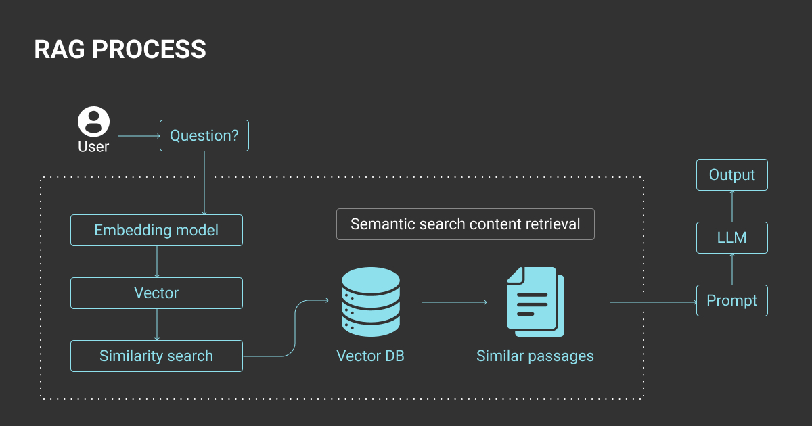
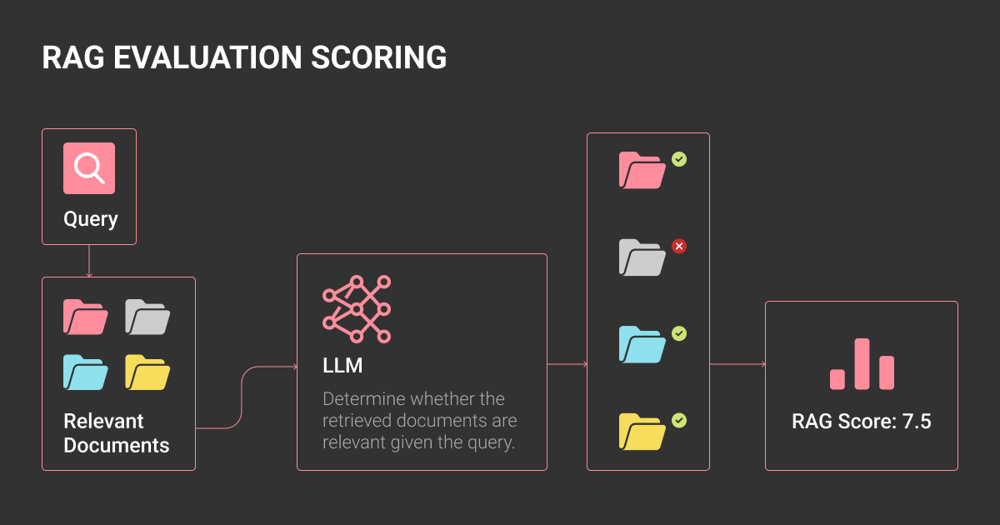
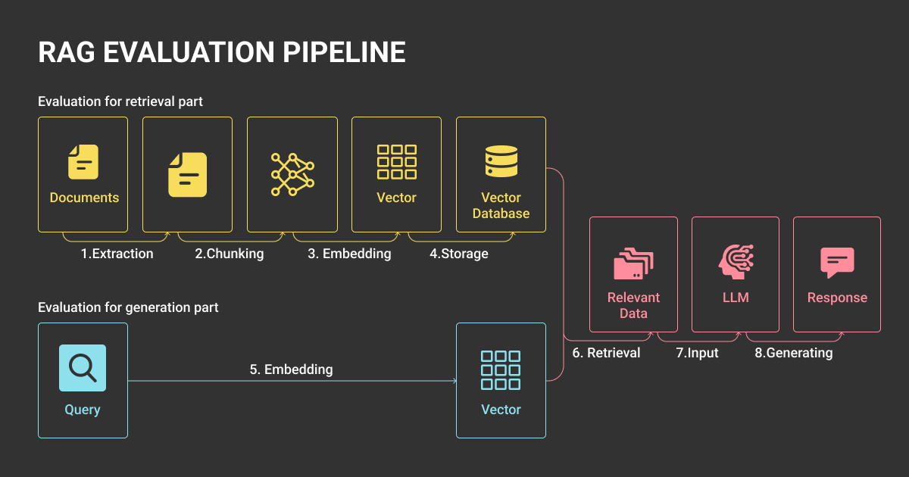
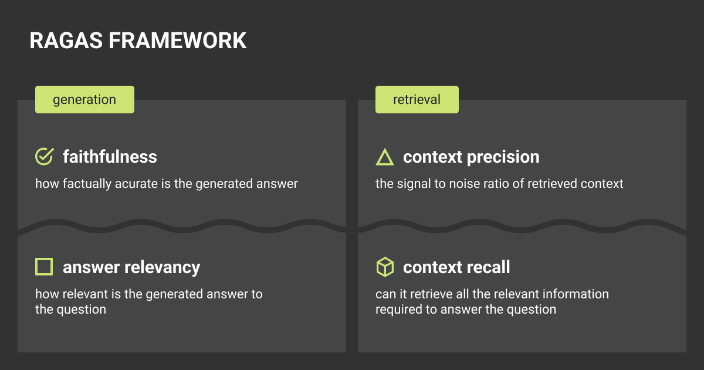

# RAG 評価: エンタープライズ AI システムのメトリクスとベンチマーク

## TL;DR

1. エンタープライズ RAG の評価では、正確さとともに、事実の根拠、検索の品質、コンプライアンスのリスクが優先されます。
2. 取得メトリクス: precision@k、recall@k、MRR、nDCG。世代: 忠実度、関連性、引用範囲、幻覚率。エンドツーエンド: 正確性、事実性、待ち時間、コスト、安​​全性。
3. テスト セットは、ゴールデン データ、合成クエリ (Ragas、ARES)、人間によるレビューを組み合わせたものです。バージョンを凍結すると、結果の比較が維持されます。
4. ベンチマークには、RAGBench、CRAG、LegalBench-RAG、WixQA、T²-RAGBench が含まれます。 Ragas、ARES、LangSmith、AWS Bedrock、Vertex AI などのツールは、応用評価をサポートします。
5. 運用環境では、バッチまたはオンラインの A/B テスト、モニタリング ダッシュボード、ガバナンスを通じて評価を継続的に行う必要があります。このようにして、精度、コスト、遅延、多言語のニーズのバランスをとります。

## RAG システムを評価する際のエンタープライズ優先事項

検索拡張生成 (RAG) プロセス

検索拡張生成、つまり [RAG LLM](https://labelyourdata.com/articles/llm-fine-tuning/rag-llm) システムの評価には、単純な精度チェック以上のものが必要です。企業にとって、取得または生成のエラーは、コンプライアンス違反、風評被害、さらには法的暴露を意味する可能性があります。そのため、事実の正確さと根拠が最優先され、検索の関連性はその後に続く必要があります。

RAG 評価フレームワークは、その 2 つのコンポーネントの異なる役割を理解することから始まります。

- **検索**: ナレッジ ベースから関連ドキュメントを取得します。
- **生成**: そのコンテキストを使用して応答を合成します

評価では両方を測定し、エンドツーエンドのエクスペリエンスも評価する必要があります。完璧なレトリーバーと幻覚発生器を組み合わせたり、その逆を行ったりしても、依然として使用できない出力が生成されるため、単純なサンドボックス テストでは不十分です。

ML チームにとって、中心的な質問は *「テストで機能するか?」* ではなく、*「規制や顧客の監視下で大規模に確実に耐えられるか?」* です。エンタープライズ グレードの RAG 評価は、事実に基づいた根拠、検索品質、エンドツーエンドの正確性をオプションのチェックではなく、運用上の KPI として扱うことを意味します。

## パイプライン全体にわたる主要な RAG 評価指標

RAG 評価スコア

RAG のパフォーマンスを測定するには、取得、生成、および結合されたエンドツーエンドのパイプラインの 3 つのレイヤーを追跡する必要があります。計算ベースのスコア (文字列一致、埋め込み) は再現可能ですが、制限があります。 [LLM-as-a-judge メソッド](https://arxiv.org/pdf/2412.05579) はニュアンスを捉えますが、コストと変動性が追加されます。ほとんどの ML チームは両方のアプローチを組み合わせています。

### 取得

主要な取得メトリクスには、precision@k (上位 k 個のドキュメントが関連していますか?)、recall@k (関連情報がどのくらい取得されたか?)、平均逆順位 (MRR) (正しいドキュメントは早期にランク付けされていますか?)、および正規化割引累積ゲイン (nDCG) (位置の重み付けによる段階的な関連性) が含まれます。企業の場合、レトリーバーが範囲の狭いコンテンツや冗長なコンテンツを繰り返し表示しないように、多様性メトリクスを追加すると便利なことがよくあります。

### 生成

生成段階では、焦点は忠実度 (出力は取得したドキュメントに基づいているか)、回答の関連性 (クエリに対応しているか)、引用範囲 (主張には出典が裏付けられているか)、幻覚率 (裏付けのないテキストまたは捏造されたテキスト) に移ります。一部のエンタープライズ フレームワークでは、回答の品質の要素として論理的な一貫性と完全性も追加されます。

### エンドツーエンド

最後に、正確性と事実性、負荷時のレイテンシーとコスト、安​​全性とコンプライアンス (拒否率、有害なコンテンツ、またはポリシー違反) など、ユーザーがパイプラインを体験するときにパイプラインを評価します。エンドツーエンドの評価では、実際のトレードオフが明らかになります (たとえば、*k* を上げると recall は改善されますが、レイテンシーと支出が増加します)。

## RAG 評価のための信頼できるテスト セットの構築

RAG 評価パイプライン

強力な評価は強力なテスト セットに依存します。アドホックなサンプルやライブトラフィックに依存することはできません。監査可能で再現可能な慎重に設計されたデータセットが必要です。

**ゴールデン データセットは基礎であり続けます。** これらはシステムの全範囲をカバーし、簡単なクエリと難しいクエリのバランスをとり、比較可能性を損なうことなく更新するためのガバナンス ルールを含む必要があります。評価サイクルごとにゴールデン セットを凍結することが重要です。そうしないと、RAG 評価指標は時間の経過とともに意味を失います。

急速に変化する情報に対してシステムを評価するチームの場合、Web スクレイピングまたは [代替スクレイピング サービス](https://scrapfly.io/compare/scrapingbee-alternative) は、外部ソースから新しいコンテンツを継続的に収集するのに役立ち、実稼働 RAG システムが処理する必要があるのと同じ動的環境をテスト データセットに確実に反映させることができます。

ゴールデン データセットは、[データ アノテーション会社](https://labelyourdata.com/) の厳選されたプロジェクトと同様の役割を果たします。バランスが取れ、文書化され、再現可能であるため、結果は監査に耐えられます。

**合成データセットは、ゴールデン データが限られている場合にカバレッジを拡張するのに役立ちます。** Ragas や ARES ベンチマーク RAG 評価などのツールを使用すると、合成クエリと回答、または敵対的な例を使用したスト​​レス テスト取得パイプラインを自動的に生成できます。研究では、[合成データ](https://labelyourdata.com/articles/llm-fine-tuning/synthetic-data) は価値があるが、モデルが合成アーティファクトを学習しないように企業は人間によるレビューで検証する必要があると指摘しています。

**人間参加型のチェックは、エッジ ケースでは交渉不可能なままです。** [アノテーター](https://labelyourdata.com/articles/data-labelers-experts-of-ai-development) は、自動化ツールが対応できない曖昧なクエリ、複数の目的を持つクエリ、または安全性が重要なクエリにフラグを立てることができます。人間によるレビューを省略したチームは、金融や医療など、コンプライアンスが重視されるユースケースにおけるシステム的な問題を見落とすことがよくあります。

実際には、信頼できるテスト セットは、*ゴールデン*、*合成*、および *人間がレビューしたデータ* のバランスをとり、評価実行全体での比較可能性を保証する厳密なバージョン管理を備えています。企業にとって、これはチームや監査全体で RAG システムに対する信頼を構築する方法です。

## RAG を評価するためのベンチマークとツール

Ragas 評価フレームワーク RAG

RAG 評価用のベンチマークとツールは急速に拡大していますが、企業はそれらを信頼するか、いつ使用するかを明確にする必要があります。学術的なベンチマークは一般的な機能をテストしますが、フレームワークとクラウド ツールは応用的な監視と評価に重点を置いています。

### ベンチマーク

ベンチマークは、[機械学習データセット](https://labelyourdata.com/articles/what-is-dataset-in-machine-learning)、ドメイン、[LLM の種類](https://labelyourdata.com/articles/types-of-llms)にわたって RAG システムを比較するための共通の基準を提供します。これらは、制御された条件下で検索と生成がどの程度うまく相互作用するかをテストすることで、基本的な精度チェックを超えています。

- **RAGBench:** 学術研究で広く使用されている汎用の検索 + 生成ベンチマーク
- **CRAG:** 文脈上の関連性と根拠を強調し、検索の多いドメインに役立ちます
- **LegalBench-RAG:** 幻覚や誤った引用がコンプライアンスに影響を与える法的 QA タスクに合わせて調整されています
- **WixQA:** Web スケールの QA ベンチマーク。異種ソースにわたる事実の根拠を測定するように設計されています。
- **T²-RAGBench:** マルチターンおよびタスク指向の RAG 評価に焦点を当てます

企業にとって、これらの評価は、標準化されたタスクでモデルがどのように実行されるかを示すことで、内部の [データ アノテーション](https://labelyourdata.com/articles/data-annotation) の取り組みを補完します。ベンチマークの選択は重要です。法的 QA ベンチマークはコンプライアンス リスクを強調しますが、Web スケールの QA セットはグラウンディングと大規模な recall を強調します。

### RAG 評価フレームワークとツール

企業には、[RAG パフォーマンス](https://arxiv.org/pdf/2411.03538) を測定するためのオプションがこれまで以上に増えています。評価フレームワークとクラウド ツールは、[LLM 評価](https://labelyourdata.com/articles/llm-fine-tuning/llm-evaluation) メソッド、合成データセット生成、およびモニタリング機能を組み合わせています。

- **Ragas:** 合成データ生成が組み込まれた、取得と生成を評価するためのオープンソース フレームワーク
- **ARES:** 敵対的な例を使用したストレス テスト検索システム
- **LangSmith:** LLM-as-a-judge エバリュエーターと取得メトリクス、さらに実験追跡を提供します
- **AWS Bedrock eval:** 管理されたワークフローに統合された、引用 precision や論理的一貫性などのエンタープライズ対応メトリクスを追加します
- **Vertex AI 評価 (Google Cloud):** 構造化されたフレームワークで人間による評価とモデルおよび計算ベースの指標を組み合わせます。

[合成データの生成](https://labelyourdata.com/articles/synthetic-data-generation) は、従来の ML ワークフローにおける慎重な範囲設定が [データ アノテーションの価格設定](https://labelyourdata.com/pricing) に影響を与えるのと同様に、評価のコストを制御するのに役立ちます。

[データ アノテーション サービス](https://labelyourdata.com/services/data-annotation-services) のアイデアに基づいて構築されているものもありますが、[エージェント RAG](https://labelyourdata.com/articles/agentic-rag) やパイプラインの可観測性などの高度な領域に拡張しているものもあります。正しい選択は、チームがモデルを比較するか、[機械学習アルゴリズム](https://labelyourdata.com/articles/how-to-choose-a-machine-learning-algorithm) のストレス テストを行うか、運用環境でライブ システムを監視するかによって異なります。

**企業向けのポイント:** ベンチマークは有用なベースラインですが、運用環境でシステムを安全に保つのはツールです。

ベンチマーク スコアは広範な制限を浮き彫りにする可能性がありますが、ガバナンスとモニタリングは、継続的な評価、再現性、エンタープライズ パイプラインとの統合をサポートする RAG 評価フレームワークに依存しています。

## 本番環境での RAG 評価の運用

企業にとって、1 回限りのテストを実行するだけでは十分ではありません。 RAG システムは、技術的な指標とビジネスへの影響の両方を把握するモニタリングを使用して、継続的に評価する必要があります。

**研究室から生産まで**。ラボ実験では実現可能性が検証されますが、生産では継続的なチェックが必要です。専用の ML インフラストラクチャや社内の RAG 専門知識が不足しているチームの場合、この運用上の負担がプロジェクトの行き詰まりの原因となることがよくあります。 [RAG as a service](https://www.aimprosoft.com/services/rag-as-a-service/) パートナーと連携することで、プラットフォームの選択、データ パイプラインのセットアップ、継続的な最適化を処理することで、この問題に直接対処できるため、企業は社内でフルスタックを構築することなく、より迅速に評価から本番環境に移行できます。

企業は、凍結されたデータセットのバッチ評価から、新しい取得または生成戦略を確立されたベースラインと比較するオンライン A/B テストに移行しています。

**可観測性とガバナンス。** 企業には、検索 precision、[LLM 幻覚](https://labelyourdata.com/articles/llm-fine-tuning/llm-hallucination) のレート、待ち時間、コストをリアルタイムで追跡するダッシュボードが必要です。モデル カードやデータ監査と同様のガバナンス フレームワークにより、結果が文書化され、再現可能で、チームや規制当局間で説明可能になります。

**大規模なトレードオフ。** *k* を上げると recall は改善されますが、応答時間が遅くなり、計算コストが増加します。リランカーを追加すると precision が向上しますが、レイテンシーが倍増する可能性があります。多言語パイプラインにより、さらに複雑さが加わります。テスト セットのバランスが取れていないと、システムは英語ではうまく動作する可能性がありますが、他の言語ではパフォーマンスが低下する可能性があります。企業はこれらのトレードオフを明示的に追跡し、SLA およびリスク許容度に合わせて調整する必要があります。

**企業の考え方** RAG 評価を運用化するということは、それを単なる ML 実験ではなく、運用ガバナンスの一部として扱うことを意味します。目標は、システムのライフサイクル全体にわたって、予測可能でコンプライアンスに準拠したコスト効率の高いパフォーマンスを実現することです。

企業は、システムを本番環境に移行するときに、[RAG と微調整](https://labelyourdata.com/articles/llm-fine-tuning/rag-vs-fine-tuning)を比較検討することがよくあります。微調整されたモデルは固定データセットで優れた性能を発揮しますが、RAG パイプラインは新しい知識に適応しますが、継続的な監視と評価が必要です。

## データのラベル付けについて

LLM 微調整を委任することを選択した場合は、Label Your Data を使用して無料のデータ パイロットを実行します。当社のアウトソーシング戦略は、多くの企業が ML プロジェクトを拡大するのに役立ちました。その理由は次のとおりです。

 **複雑な環境のデータ アノテーション**

複雑なデータセット、詳細な分類法、エッジケースについては、一貫した高品質の出力を利用できます。

 **パイロットから本番までの構造化された品質**

オンボーディング、進化するガイドライン、QA、継続的なフィードバックを通じて、あらゆる段階で品質エンジニアリングを実現します。

 **柔軟でスケーラブルな操作**

セットアップ料金や長期のロックインなしで、規模の拡大に応じてチームのキャパシティ、プロジェクトのサイズ、配信モデルを調整できます。

 **統合配信パートナー**

初日からプロセスに統合されるチームと目標、ワークフロー、期待について調整します。

 **アノテーションの専門家が主導するプロジェクト**

アノテーションの複雑さ、品質基準、大量の配信を理解している元アノテーターと協力します。

## よくある質問

### RAG 評価とは何ですか?

RAG 評価は、検索拡張生成 (RAG) システムのパフォーマンスを測定するプロセスです。取得者 (*適切な文書が表示されているか?*)、生成者 (*回答は忠実で、関連性があり、根拠があるか?*)、およびエンドツーエンドのパイプライン (*正しく、安全で、効率的であるか*) を評価します。企業は、RAG 評価を使用して、精度、コンプライアンス、遅延、コストを監視します。

### ChatGPT は RAG モデルですか?

いいえ。基本形式の ChatGPT は、検索のない大規模な言語モデル (LLM) です。 RAG モデルは、LLM と外部ナレッジ検索機能を組み合わせたもので、最新のデータまたはドメイン固有のデータに基づいて回答を得ることができます。ブラウジングやカスタム ナレッジ ベース接続などの一部の ChatGPT 機能では、検索コンポーネントが追加され、RAG のように動作します。

### RAG と LLM の違いは何ですか?

LLM は、トレーニング中に学習したパターンのみに基づいて回答を生成します。 RAG システムは、LLM と、クエリ時に関連ドキュメントをフェッチする取得機能を組み合わせます。これにより、幻覚が軽減され、出力が最新の状態に保たれ、再トレーニングすることなくモデルを企業データに適応させることが可能になります。

### RAG の目的は何ですか?

RAG システムの目的は、モデル出力を外部ソースに接地することで信頼性と精度を向上させることです。企業にとって、これは幻覚リスクの低下、コンプライアンスの強化、知識の変化に応じて回答を動的に更新できることを意味します。
