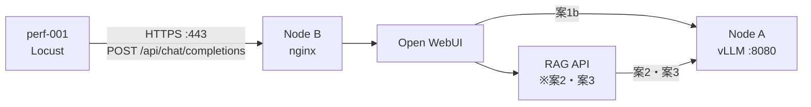

# 性能測定

Locust から nginx 経由で Open WebUI へ負荷を与え、ユーザー体感に近い応答時間、RPS、失敗率を測定します。

> コマンド中の `${...}` は環境に合わせて置換してください。

## ディレクトリ構成

| パス | 内容 |
|---|---|
| [setup.md](setup.md) | perf-001 のセットアップ手順 |
| [procedure.md](procedure.md) | 性能試験の準備、実行、判定、クリーンアップ手順 |
| [locustfile.py](locustfile.py) | Open WebUI 用 Locust シナリオ |

## 全体フロー

## 手順

1. [perf-001 をセットアップする](setup.md)。
2. [性能試験を実行し、結果を記録して会話履歴をクリーンアップする](procedure.md)。
