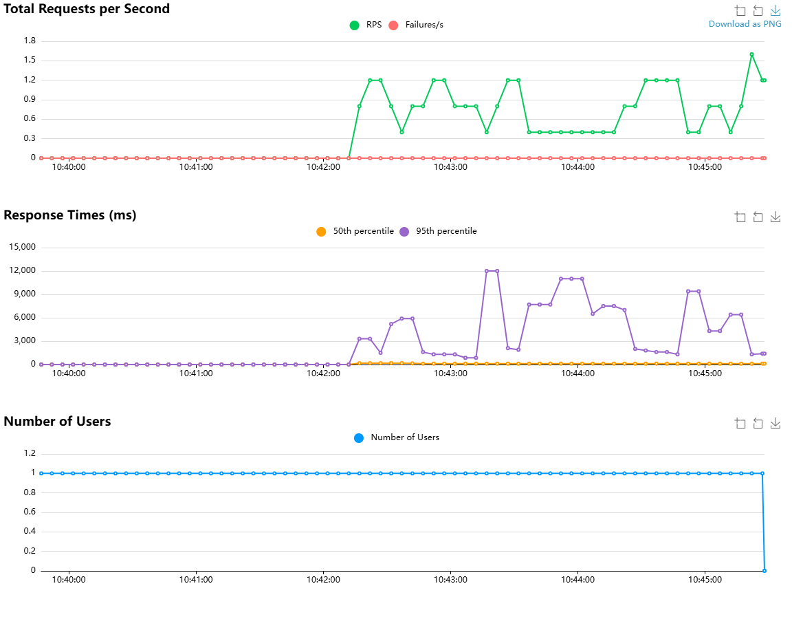

# Locust Test Report

[Download the Report](http://localhost:8089/stats/report?download=1&theme=light)

**During**: 2026/8/3 10:39:43 - 2026/8/3 10:45:28 (5 minutes and 45 seconds)
**Target Host**: https://192.168.0.24
**Script**: locustfile.py

## Request Statistics

| Type | Name                  | # Requests | # Fails | Average (ms) | Min (ms) | Max (ms) | Average size (bytes) | RPS  | Failures/s |
| :--- | :-------------------- | :--------- | :------ | :----------- | :------- | :------- | :------------------- | :--- | :--------- |
| POST | /api/chat/completions | 40         | 0       | 6765.01      | 811      | 144946   | 0                    | 0.12 | 0          |
| SSE  | tokens_per_s          | 40         | 0       | 38.99        | 1        | 43       | 0                    | 0.12 | 0          |
| SSE  | tpot                  | 40         | 0       | 23.59        | 23       | 25       | 0                    | 0.12 | 0          |
| SSE  | ttft                  | 40         | 0       | 3626.85      | 114      | 140143   | 0                    | 0.12 | 0          |
|      | Aggregated            | 160        | 0       | 2613.61      | 1        | 144946   | 0                    | 0.46 | 0          |

## Response Time Statistics

| Method | Name                  | 50%ile (ms) | 60%ile (ms) | 70%ile (ms) | 80%ile (ms) | 90%ile (ms) | 95%ile (ms) | 99%ile (ms) | 100%ile (ms) |
| :----- | :-------------------- | :---------- | :---------- | :---------- | :---------- | :---------- | :---------- | :---------- | :----------- |
| POST   | /api/chat/completions | 1600        | 2000        | 4300        | 6500        | 9400        | 12000       | 145000      | 145000       |
| SSE    | tokens_per_s          | 40          | 40          | 41          | 42          | 42          | 43          | 43          | 43           |
| SSE    | tpot                  | 24          | 24          | 24          | 24          | 24          | 24          | 25          | 25           |
| SSE    | ttft                  | 120         | 120         | 120         | 130         | 180         | 210         | 140000      | 140000       |
|        | Aggregated            | 110         | 120         | 130         | 1300        | 2100        | 7000        | 140000      | 145000       |

## Failures Statistics

| # Failures | Method | Name | Message | First Seen | Last Seen |
| :--------- | :----- | :--- | :------ | :--------- | :-------- |
|            |        |      |         |            |           |

## Charts

## Final ratio

### Ratio Per Class

* 100.0% OpenWebUiUser
  * 100.0% chatCompletion

### Total Ratio

* 100.0% OpenWebUiUser
  * 100.0% chatCompletion