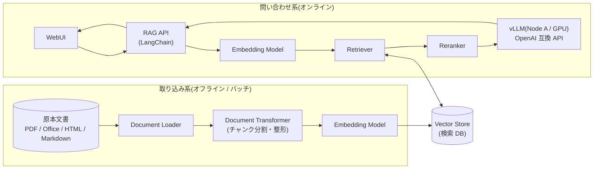
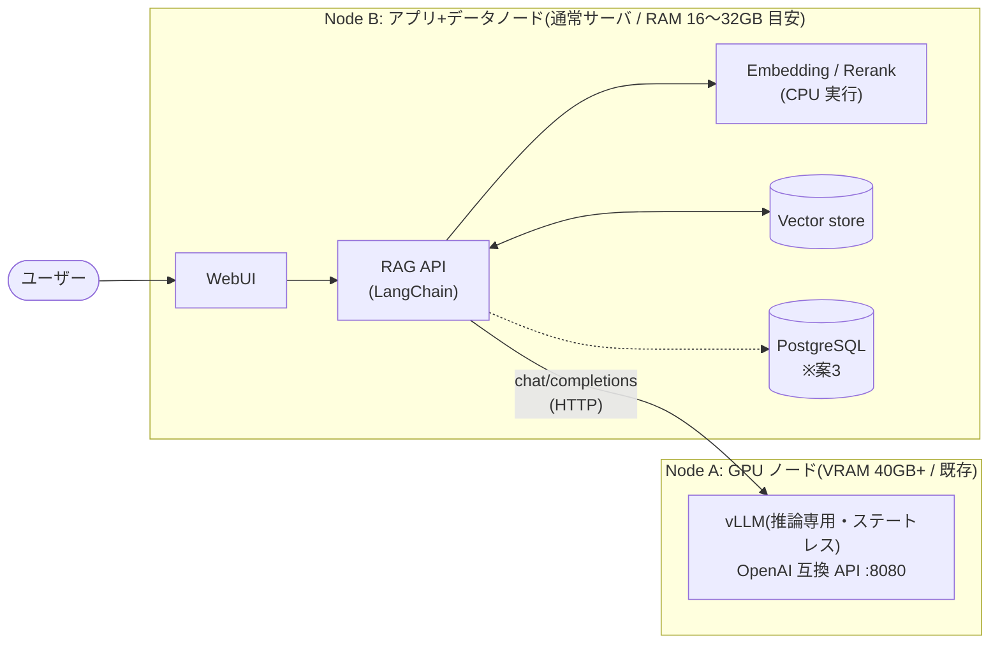

# vLLM + LangChain による RAG システム インフラ構成 設計資料

- 対象環境: Ubuntu Server(オンプレミス / 自宅サーバ / VPS 等)
- 前提: Hugging Face 形式のモデルを **vLLM** で稼働済み(OpenAI 互換 API)
  - vLLM の要求スペック(GPU): **Ampere 世代以降・VRAM 40GB 以上・CUDA 12.8 対応**
  - vLLM の要求スペック(ソフトウェア): **NVIDIA Driver(CUDA 12.8 対応版)+ NVIDIA Container Toolkit**
  - 上記要件を満たす推論専用の GPU ノード(Node A)として扱う
- 方針:
  - **無償利用可・ソース公開**のソフトウェアで構成する(ライセンス一覧は末尾参照)
  - **クラウド固有のマネージドサービスは使用しない**(全コンポーネントをセルフホスト)
  - オーケストレーションは **LangChain** を使用
  - 全案共通で **GPU ノード(Node A)とアプリ+データノード(Node B)の 2 ノード構成** を基本とする(§2 参照)

## ドキュメント構成

| ファイル | 内容 |
|---|---|
| [README.md](README.md) | 本資料(全体設計・実装案・精度向上の解説) |
| [docs/plan1-minimal.md](docs/plan1-minimal.md) | 案1: シングルプロセス最小構成 |
| [docs/plan2-standard.md](docs/plan2-standard.md) | 案2: Docker Compose 標準構成 |
| [docs/plan3-hybrid.md](docs/plan3-hybrid.md) | 案3: ハイブリッド検索・本格構成 |
| [docs/rag-components.md](docs/rag-components.md) | RAG 精度向上のための構成要素解説(Loader / Transformer / Embedding / Vector store / Retriever / Rerank) |
| [docs/evaluation-spec.md](docs/evaluation-spec.md) | RAG 精度評価のテスト仕様書(指標定義・テスト観点 TC01〜TC10・実行手順・合否基準) |
| [docs/test-data.md](docs/test-data.md) | テストデータ集(Vector store 投入用の公開コーパス・評価用 QA データセットへのリンク) |
| [eval/golden_dataset.sample.jsonl](eval/golden_dataset.sample.jsonl) | ゴールデンデータセットのサンプル(テスト観点別 10 ケース) |
| [test/](test/) | 評価の実行手順書(レベル1/レベル2 の手順 + 実行スクリプト、テスト観点別のケース手順書) |
| [docs/node-specs.md](docs/node-specs.md) | ノードスペック選定(AWS EC2 の Instance Type / AMI / EBS / セキュリティグループ / 月額試算) |
| [docs/aws-provisioning.md](docs/aws-provisioning.md) | AWS 構築手順(Bash/CLI で VPC・サブネット・SG・NAT Gateway・EICE・EC2 を作成/削除/AMI 化/AMI から再作成) |
| [docs/node-a-pre-install.md](docs/node-a-pre-install.md) | Node A 単体の構築・動作確認手順(DLAMI 確認 → deploy/node-a/ での vLLM 起動まで) |
| [docs/deployment-guide.md](docs/deployment-guide.md) | Node B 構築手順書(案1〜案3 の構築・確認・運用・トラブルシューティング) |
| [deploy/](deploy/) | 構築ファイル一式(Node A の vLLM サービス化 / 案毎の Dockerfile / docker-compose.yml / .env.example / nginx conf / OpenSearch マッピング / アプリコード) |

---

## 1. 全体像 — RAG に必要な構成要素

RAG(Retrieval-Augmented Generation)システムは、大きく **オフラインの取り込み系(Ingestion)** と **オンラインの問い合わせ系(Query)** の 2 系統で構成されます。

### 構成要素と役割

| 構成要素 | 役割 | 代表的な OSS 選択肢 |
|---|---|---|
| **WebUI** | ユーザーとの対話画面(チャット・出典表示) | Open WebUI / Chainlit / Streamlit / Gradio |
| **RAG API** | LangChain によるオーケストレーション層 | FastAPI + LangChain / LangGraph |
| **LLM 推論** | 回答生成(稼働済み) | vLLM(OpenAI 互換エンドポイント) |
| **Embedding** | テキストのベクトル化 | `multilingual-e5` / `BAAI/bge-m3` / `ruri` を sentence-transformers・TEI・Infinity・vLLM(`--runner pooling`)で配信 |
| **検索 DB(Vector store)** | ベクトル(+全文)インデックスの保存・検索 | Chroma / Qdrant / pgvector / Milvus / OpenSearch |
| **キーワード検索(Okapi BM25)** | 字面一致に強い全文検索。ハイブリッド検索の片翼 | rank_bm25(`BM25Retriever`・in-memory)/ OpenSearch(Lucene BM25 + kuromoji)/ Milvus 2.5+ 内蔵 BM25 |
| **Retriever** | クエリに対する関連文書の取得戦略 | LangChain Retriever(similarity / MMR / BM25 / Hybrid / Multi-Query 等) |
| **Reranker** | 取得結果の再順位付けによる精度向上 | `BAAI/bge-reranker-v2-m3`(CrossEncoder / TEI rerank) |
| **リバースプロキシ** | TLS 終端・ルーティング(案3) | Nginx / Caddy |
| **メタデータ DB** | 会話履歴・ユーザー管理(案3) | PostgreSQL |

> 各要素の詳細と精度向上のポイントは [docs/rag-components.md](docs/rag-components.md) を参照。

---

## 2. サーバ構成方針 — GPU ノードとアプリノードの分離

vLLM の要求スペック(GPU VRAM 40GB 以上)を踏まえ、全案共通で **2 ノード構成**を基本とします。
RDB を DB サーバに分離するのと同じ考え方で、高価な GPU ノードを推論専用に隔離し、データを持つコンポーネントを通常サーバ側に集約します。

### 分離の理由

| 観点 | 内容 |
|---|---|
| リソース競合の回避 | vLLM はデフォルトで VRAM の約 9 割を確保し、CPU も前処理で消費する。OpenSearch の JVM ヒープや embedding モデルを同居させると互いに OOM リスクを持ち込み合う |
| データとステートの分離 | vLLM は完全にステートレス。一方 Vector store・PostgreSQL・取り込み済みインデックスは「壊れたら困るデータ」。CUDA/ドライバ更新や再起動の頻度が高い GPU ノードにデータを置かない |
| ライフサイクルの独立 | GPU ノードの増強・交換・他用途との共用がデータ側に影響しない。バックアップ対象は Node B に集約される |

### 設計上の補足

- **Embedding / Rerank は Node B の CPU で実行する。** bge-m3 / bge-reranker クラス(2GB 前後)は CPU で実用速度が出る。Node A の VRAM は LLM が使い切る前提のため、GPU への同居(`--gpu-memory-utilization` を下げて空ける)は検証段階では避ける。取り込みバッチが遅い場合にのみ、Node B への小型 GPU 追加を検討する
- **検証段階で機能毎の完全分割(WebUI / API / DB を別ノードに)はやり過ぎ。** 全コンポーネントは HTTP API(OpenAI 互換・TEI・Qdrant 等)で疎結合なので、Node B 内は Docker Compose のコンテナ分離で責務を分けておけば、負荷が見えてきた段階で compose ファイルの分割と接続 URL の変更だけでノードを分割できる(案3 では DB を Node C に分離する拡張パスを記載)
- ノード間は HTTP のみ。LAN 内であればレイテンシへの影響は無視できる

---

## 3. 実装案の比較

3 案を用意しました。**案2 を推奨**とし、要件の変化に応じて案1(縮小)・案3(拡張)へスライドできる設計です。

| | 案1: 最小構成 | 案2: 標準構成(推奨) | 案3: 本格構成 |
|---|---|---|---|
| 詳細 | [plan1-minimal.md](docs/plan1-minimal.md) | [plan2-standard.md](docs/plan2-standard.md) | [plan3-hybrid.md](docs/plan3-hybrid.md) |
| ノード構成 | Node A + Node B | Node A + Node B | Node A + Node B(将来 DB を Node C に分離可) |
| WebUI | Chainlit(API 同居) | Open WebUI | Open WebUI + Nginx(TLS) |
| RAG API | Chainlit プロセス内 | FastAPI + LangChain | FastAPI + LangGraph |
| 検索 DB | Chroma(組み込み) | Qdrant | OpenSearch(Hybrid)or Milvus |
| Embedding | プロセス内(sentence-transformers) | TEI(専用コンテナ) | TEI(専用コンテナ) |
| Rerank | プロセス内 CrossEncoder | TEI rerank | TEI rerank |
| 検索方式 | ベクトルのみ | ベクトル + MMR | **ハイブリッド(BM25 + ベクトル)+ RRF** |
| 会話履歴 | なし(メモリ) | Open WebUI 内蔵(SQLite) | PostgreSQL |
| デプロイ(Node B) | Docker Compose(venv + systemd は代替) | Docker Compose | Docker Compose |
| 想定規模 | 個人・PoC(〜数千文書) | 部門(〜数十万チャンク) | 全社(数百万チャンク〜) |
| vLLM 以外の GPU | 不要(CPU で完結) | 不要(TEI は CPU 版。取り込み高速化に任意で追加) | 任意(取り込み・rerank 高速化に Node B へ小型 GPU 追加を検討) |
| Node B の RAM 目安 | 8GB〜 | 16GB〜 | 32GB〜(OpenSearch ヒープ含む) |

**選定の目安:**

- まず動くものを最速で → **案1**
- 複数ユーザーで常用・運用も見据える → **案2**
- 日本語の型番・固有名詞検索が多い、文書量が多い → **案3**(BM25 併用が効く)

---

## 4. 精度向上の要点(サマリ)

詳細は [docs/rag-components.md](docs/rag-components.md)。特に効果が大きい順に:

1. **Reranker の導入** — Retriever で広め(k=20〜50)に取り、CrossEncoder で上位 3〜5 件に絞る。最も費用対効果が高い。
2. **チャンク分割の見直し** — 文書構造(見出し)を保った分割 + 適切なチャンクサイズ。日本語はセパレータ調整が必須。
3. **ハイブリッド検索** — 型番・製品名・略語などキーワード一致が重要なドメインでは BM25 併用が有効(案3)。
4. **Embedding モデルの選定** — 日本語なら `multilingual-e5-large` / `bge-m3` / `ruri` 系。ベクトル DB より先にモデルを吟味する。
5. **クエリ変換** — Multi-Query / HyDE で「質問文と文書の表現の乖離」を吸収。
6. **日本語処理の作り込み** — NFKC + neologdn による表記ゆれ正規化、埋め込み・リランカーのトークン上限とチャンクサイズの整合(日本語は 1 文字 1〜2 トークン)、形態素解析(SudachiPy)ベースの BM25、同義語辞書。各構成要素の「日本語固有のポイント」参照。

---

## 5. 使用ソフトウェアとライセンス一覧

すべて無償で利用可能(セルフホスト)。

| ソフトウェア | 用途 | ライセンス |
|---|---|---|
| vLLM | LLM 推論 | Apache-2.0 |
| LangChain / LangGraph | オーケストレーション | MIT |
| FastAPI / Uvicorn | API サーバ | MIT / BSD-3 |
| Chainlit | WebUI(案1) | Apache-2.0 |
| Open WebUI | WebUI(案2/3) | BSD-3 ベース(ブランディング条項付き。無償利用可) |
| Chroma | Vector store(案1) | Apache-2.0 |
| Qdrant | Vector store(案2) | Apache-2.0 |
| Milvus | Vector store(案3 代替) | Apache-2.0 |
| OpenSearch | ハイブリッド検索(案3) | Apache-2.0 |
| pgvector / PostgreSQL | Vector store 代替 / メタデータ DB | PostgreSQL License |
| rank_bm25 | Okapi BM25 実装(in-memory、`BM25Retriever` のバックエンド) | Apache-2.0 |
| SudachiPy + SudachiDict(+同義語辞書) | 日本語形態素解析(BM25 のトークナイズ・同義語展開) | Apache-2.0 |
| neologdn | 日本語テキスト正規化(表記ゆれの吸収) | Apache-2.0 |
| bunkai | 日本語文境界解析(チャンク分割の前処理) | Apache-2.0 |
| PGroonga | PostgreSQL の日本語全文検索拡張(pgvector と併用でハイブリッド) | PostgreSQL License |
| Tesseract OCR | スキャン文書の OCR(`jpn` / `jpn_vert` モデル) | Apache-2.0 |
| Text Embeddings Inference (TEI) | Embedding / Rerank 配信 | Apache-2.0 |
| sentence-transformers | Embedding / CrossEncoder(プロセス内) | Apache-2.0 |
| Nginx | リバースプロキシ | BSD-2 |
| Docker / Docker Compose | コンテナ実行 | Apache-2.0(Engine。Ubuntu では docker.io / docker-compose-v2 パッケージ) |
| モデル: multilingual-e5, bge-m3, bge-reranker-v2-m3 | Embedding / Rerank | MIT 等(各モデルカードを確認) |

> **注意:** モデル本体のライセンスは Hugging Face の各モデルカードで要確認。上記代表例はいずれも商用利用可のものを挙げています。
