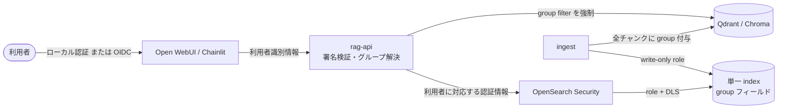
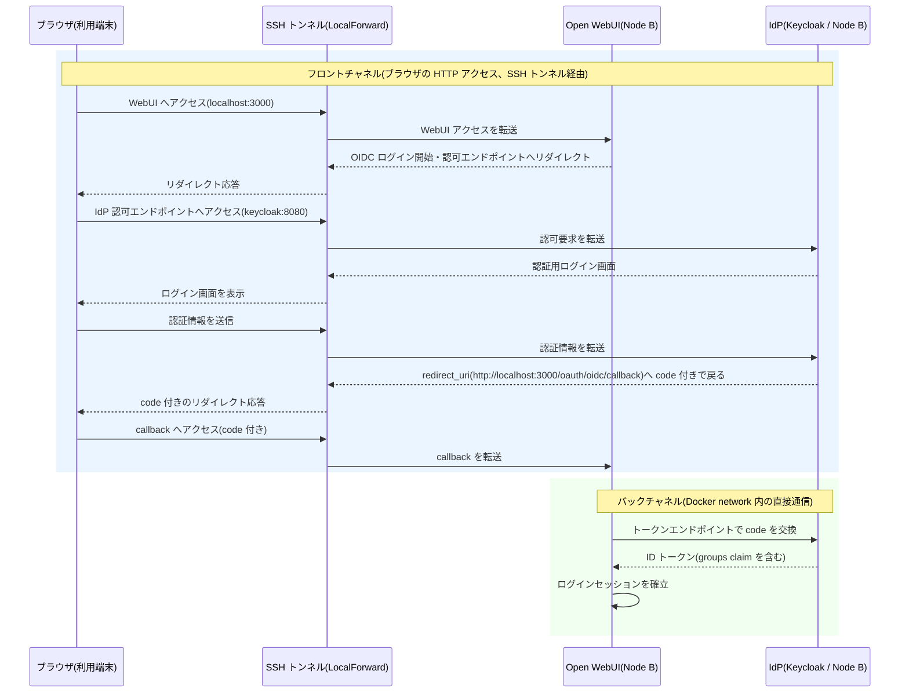
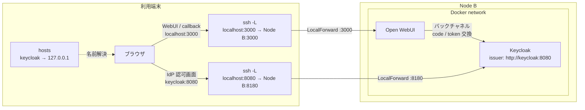

# OIDC 認証・グループ認可 導入設計

本書は Query 系利用者の OpenID Connect(OIDC)認証と、所属グループに応じた Vector store の検索制限を案1〜3へ導入する方針を定めます。デプロイコードの変更は次フェーズです。

## 1. 要件と現状

- OIDC プロバイダ申請中も email/password のローカル認証で検証でき、OIDC 開通後は段階移行できること
- 利用者の所属グループに許可されたチャンクだけを検索できること
- 認証(誰か)と認可(何を検索できるか)を分離し、WebUI のログインだけで完了とみなさないこと
- ingest は全チャンクへ認可用の `group` メタデータを付与すること

案1b は Open WebUI 内で認証と Knowledge ACL が閉じます。案2/3 は外部 rag-api を呼ぶため、利用者識別とグループを認可へ伝搬する追加実装が必要です。案2の rag-api が無認証であることは既知課題 N-03 です。

## 2. 標準機能の有無

| 案 | 標準の認証 | 標準のグループ認可 |
|---|---|---|
| 案1 Chainlit | なし。password/OAuth とも callback 実装が必要 | なし |
| 案1b Open WebUI | あり。email/password、初回ユーザーの admin 化、signup 制御 | あり。グループ管理 UI + private Knowledge のグループ read 権限 |
| 案2 標準 | Open WebUI は案1b と同じ。rag-api は無認証 | なし。Knowledge ACL は外部 rag-api の Qdrant 検索には効かない |
| 案3 ハイブリッド | Open WebUI は案1b と同じ。OpenSearch はサービス用 internal user のみ | role/DLS はあるが、エンドユーザーのグループと未連携 |

## 3. 認証・認可の適用点

- **案1b**: Open WebUI の Knowledge ACL が認可強制点
- **案2**: rag-api が署名付き利用者情報を検証し、グループを解決して、全 Qdrant 検索へ payload filter を強制
- **案3**: rag-api の filter と OpenSearch Security の role/DLS の二層
- **ingest**: 全チャンクの `group` を確定。既存データは全再取り込み

`ENABLE_FORWARD_USER_INFO_HEADERS=true` で転送される `X-OpenWebUI-User-*` 情報にグループは含まれません。新版の署名付き JWT 形式でも、rag-api は署名・期限等を検証し、user ID からグループを別途解決します。未署名ヘッダーを無条件に信頼してはいけません。

## 4. ローカル認証から OIDC への移行

### Open WebUI(案1b/2/3)

ローカル認証と OIDC は同一画面で併存できます。検証中は `ENABLE_LOGIN_FORM=true` と password 認証を維持します。

| 環境変数 | 用途 |
|---|---|
| `ENABLE_OAUTH_SIGNUP=true` | OIDC ユーザー登録 |
| `OAUTH_CLIENT_ID` / `OAUTH_CLIENT_SECRET` | OIDC client |
| `OPENID_PROVIDER_URL` | discovery endpoint |
| `OAUTH_MERGE_ACCOUNTS_BY_EMAIL=true` | 同一 email のローカルアカウントへ統合 |
| `ENABLE_OAUTH_GROUP_MANAGEMENT=true` | IdP group claim を同期 |
| `OAUTH_GROUP_CLAIM=groups` | 変数名は**単数形の `CLAIM`** |

email 統合は IdP が email 所有を確実に検証する場合だけ有効にします。検証時は管理 UI でグループを手動作成し、OIDC 開通後に IdP 同期へ切り替えます。同期後は IdP が正となり、ローカル編集は上書きされます。

### Chainlit(案1)

`@cl.password_auth_callback` と OIDC callback を実装し、共通の `principal(user_id, groups, auth_source)` へ正規化して Chroma metadata filter を強制します。二方式とも自前実装のため規模は中です。

### rag-api(案2/3)

- ローカル検証: Open WebUI の署名付き情報から user ID を得て、Open WebUI API または静的マッピングからグループを解決
- OIDC 開通後: Keycloak/本番 IdP の claim または照会 API に差し替え
- 短時間キャッシュを使い、署名不正・解決不能・空グループは fail closed

### OpenSearch(案3)

ローカル検証は internal user + backend role の basic 認証で DLS を確認し、本番では OIDC auth domain(`roles_key: groups`)を追加します。basic/internal と OIDC は異なる `order` で併存できます。rag-api からは IdP Token Exchange で OpenSearch 向け token を中継するか、固定的な少数グループを検索専用ユーザーへ写像します。共有 `rag_api` ユーザーではエンドユーザー別 DLS を適用できません。

## 5. 検証用 Keycloak と本番 IdP

Keycloak は Apache-2.0 で要件に適合します。compose に追加し、realm、Open WebUI/OpenSearch client、`groups` mapper、許可・拒否・複数所属ユーザーを用意します。本番では client、discovery URL、issuer/audience、group claim の写像を差し替えます。

OIDC issuer はブラウザ、Open WebUI、OpenSearch から同じ URL に見える必要があります。SSH LocalForward 利用時も token の `iss` と discovery URL が一致するよう `KC_HOSTNAME` を明示します。コンテナ内部だけの別名は使わず、本番は同一 Nginx 配下の安定した HTTPS 名を使います。

## 6. 各案の可否と規模感

| 案 | 可否 | 認証の適用先 | Vector store 認可の適用先 | 規模感 |
|---|---|---|---|---|
| 案1 Chainlit | 条件付き可 | Chainlit callback | Chroma metadata filter | **中**。全層自前 |
| 案1b Open WebUI | **可** | Open WebUI | Knowledge ACL | **小**。設定と運用のみ |
| 案2 標準 | 条件付き可 | Open WebUI | rag-api + Qdrant filter | **中**。rag-api/ingest 改修 + 全再取り込み |
| 案3 ハイブリッド | **可(最も堅牢)** | Open WebUI(Nginx TLS 背後) | rag-api + OpenSearch DLS | **大**。案2 + role/token 中継/検証 |

案1b は標準機能だけで満たす最小案です。外部 rag-api が必要なら案2を先に実装し、データストア層の防御が必要なら案3へ進みます。

## 7. Vector store とサービス権限の分離

| 方式 | 長所 | 短所 | 方針 |
|---|---|---|---|
| 単一 collection/index + `group` | 管理と複数所属検索を一元化 | 全経路で filter/DLS 強制が必要 | **推奨**。Qdrant filter / OpenSearch DLS |
| グループ別 collection/index | 検索先を物理分離 | 対象数と横断検索が複雑 | 保持期限・削除等を別管理する場合のみ |

`group` には安定した ID を使い、複数公開先は配列で保持します。値のない文書は拒否します。PostgreSQL は `openwebui_app` / `keycloak_app` の role と DB/schema GRANT を分けます。OpenSearch ingest は write-only role、利用者は read-only role とし、監査ログを有効化します。DLS は read だけを制限します。

## 8. リスク

| リスク | 対策 |
|---|---|
| 転送情報にグループがない | rag-api で user ID から解決。失敗時は拒否 |
| `OAUTH_GROUP_CLAIM` の誤記 | 変数名は単数形、値は `groups` |
| PersistentConfig が env 変更を優先しない | 初回起動前に確定、または Admin UI/DB 保存値を確認 |
| OIDC 同期がローカル所属を上書き | 切替前に照合し、同期後は IdP を正とする |
| admin が ACL を迂回 | `BYPASS_ADMIN_ACCESS_CONTROL=false` を検討。ただし UI 上のアクセス抑制であり、root 相当の admin 自身に対するセキュリティ境界とはみなさない |
| email 統合による乗っ取り | verified email を保証する IdP だけで統合 |
| filter 付け忘れ | repository 層で強制し、空/不明は fail closed |
| DLS が write も制限すると誤認 | ingest と利用者の role を分離 |

## 9. 導入順序

1. `group` ID、文書割当、複数所属、admin を確定
2. ローカル認証 + 手動グループで案1b ACL を先行検証
3. 案2 rag-api の署名検証、グループ解決、Qdrant filter を実装
4. ingest に `group` を付与して全再取り込み。eval 用グループ/token で越境試験
5. 案3の internal user/backend role で DLS と監査ログを検証
6. Keycloak で OIDC/group claim/token 中継を結合試験
7. 本番 IdP へ差し替え、ローカル login との並行期間後に SSO 主体へ移行

## 9.1 サンプル実装の採用方式

デプロイサンプルでは、Open WebUI v0.9.6 以降の署名付き `X-OpenWebUI-User-Jwt` を必須とし、平文転送ヘッダーを信頼しません。ローカル期の所属は案2/3 の `auth/groups.json` から解決します。案1bは Open WebUI 内のグループ管理を使用します。

案2/3の文書配置は `documents/<group>/...` とし、第1階層をチャンクの `group` に保存します。直下ファイルは fail closed で取り込みを中止します。案3は暫定方式としてグループ別 OpenSearch internal user + DLS を採用し、rag-api の明示 filter と二層で制限します。Token Exchange による利用者 token 中継は本番 IdP 統合時の将来パスです。

案3の eval principal は全グループをグループ別クライアントで検索するため、同じ文書が複数経路で取得されると RRF スコアが加算され、本番の単一/少数グループ利用者と評価順位がわずかに異なる場合があります。これは暫定 internal user 方式の既知特性です。

## 9.2 SSH トンネル環境での OIDC 通信と redirect_uri 制約

OIDC の Authorization Code フローは、SSH LocalForward を使う閉域環境でも成立します。通信は次の2系統に分かれます。

- **フロントチャネル**: ブラウザと IdP / Open WebUI の間で、ログイン開始、認可エンドポイントへのリダイレクト、ログイン画面の表示、`redirect_uri` への復帰を行います。すべてブラウザの HTTP アクセスであるため LocalForward を通過でき、IdP のインターネット公開は不要です。
- **バックチャネル**: Open WebUI コンテナから IdP のトークンエンドポイントへ接続し、認可 code をトークンへ交換します。Node B の Docker network 内を直接通信するため、SSH トンネルとは無関係です。

唯一の制約は、同じ IdP がブラウザとコンテナで異なる URL に見える場合です。トークンの `iss` は1つであるため、両者から見た issuer URL を一致させます。検証用 Keycloak は §5 のとおり `KC_HOSTNAME=http://keycloak:8080` に固定し、利用端末の hosts に `127.0.0.1 keycloak` を追加したうえで、ローカルの 8080 から Node B の 8180 へ LocalForward して issuer を統一します。

上の2図は、検証用 Keycloak とデバッグ用の `http://localhost:3000` を使う経路です。案1b/2/3 で HTTPS 公開名を使う標準経路では、Nginx の 443 へ LocalForward し、`https://${node_b_hostname}/oauth/oidc/callback` を Keycloak の `redirectUris` へ明示追加します。詳細は [Node B 構築手順](deployment-guide.md) §3.2 を参照してください。

issuer と `redirect_uri` はポートを含む URL の完全一致が必要です。各 LocalForward のローカルポートを変更する場合は、ブラウザから見える URL、`KC_HOSTNAME`、IdP に登録する `redirect_uri` の対応するポートも揃えて変更します。

### 本番 IdP が localhost を許可しない場合

検証用 Keycloak には `http://localhost:3000/oauth/oidc/callback` を登録しています。一方、組織の本番 IdP はセキュリティポリシーにより、`localhost` または `http` スキームの redirect URI を拒否する場合があります。申請時に登録可否を確認し、許可されない場合は次の順で対応します。

1. **案1b/2/3 の全案共通の Nginx と安定したホスト名を使用します。** これは本番 IdP 接続時の標準経路です。`https://<公開ホスト名>/oauth/oidc/callback` を IdP へ具体値で登録します。公開ホスト名へのアクセスは SSH トンネルと利用端末の hosts(`公開ホスト名 → 127.0.0.1`)で維持でき、インターネット公開は不要です。ブラウザから見た URL、IdP に登録した `redirect_uri`、Nginx の server 名を一致させ、そのホスト名に対する TLS 証明書を社内 CA 等で発行します。
2. **検証用の例外を申請します。** IdP 管理者へ localhost redirect の登録を依頼します。RFC 8252 ではネイティブアプリ向けに loopback redirect が認められていますが、Open WebUI のような Web アプリで許可されるかは組織ポリシーに従います。
3. **検証段階を分離します。** どちらも許可されない場合、OIDC の機能検証は Keycloak で完結させ、本番 IdP との接続は公開ホスト名と TLS 証明書の整備後に行います。

Keycloak の redirect URI wildcard は URI 末尾でだけ使用でき、ホスト部の wildcard(`https://*/...`)は無効です。本番の redirect URI には具体的なホスト名を登録します。

## 10. 公式資料

- [Open WebUI: Environment Variable Configuration](https://docs.openwebui.com/reference/env-configuration/)
- [Open WebUI: Groups](https://docs.openwebui.com/features/authentication-access/rbac/groups/)
- [Open WebUI: Knowledge](https://docs.openwebui.com/features/workspace/knowledge/)
- [Chainlit: Authentication](https://docs.chainlit.io/authentication/overview)
- [Chainlit: OAuth](https://docs.chainlit.io/authentication/oauth)
- [OpenSearch: OpenID Connect](https://docs.opensearch.org/latest/security/authentication-backends/openid-connect/)
- [OpenSearch: Document-level security](https://docs.opensearch.org/latest/security/access-control/document-level-security/)
- [OpenSearch: Audit logs](https://docs.opensearch.org/latest/security/audit-logs/index/)
- [Keycloak: Running Keycloak in a container](https://www.keycloak.org/server/containers)
- [Keycloak: Configuring the hostname](https://www.keycloak.org/server/hostname)
- [RFC 8252: OAuth 2.0 for Native Apps](https://www.rfc-editor.org/rfc/rfc8252)
