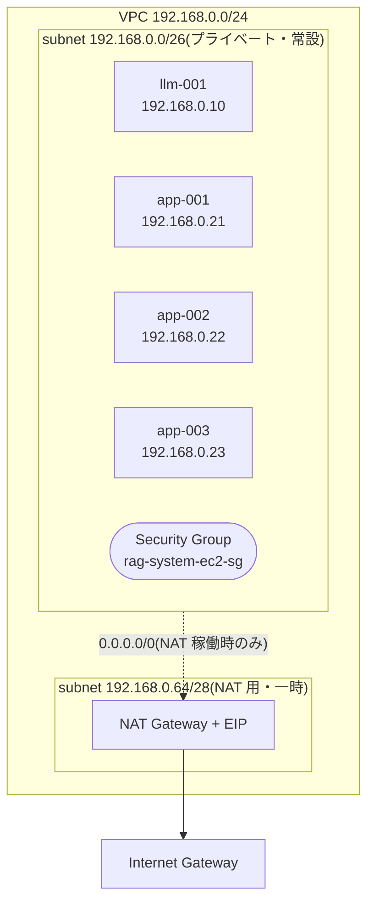
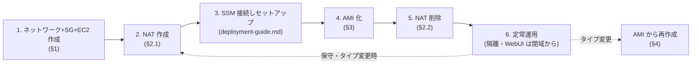

# AWS 構築手順(EC2 ノード群)

AWS CLI(Bash)で本 RAG システムのノードを構築・削除・AMI 化する手順書です。
パラメータ(Instance Type 等)は先頭の変数ブロックで指定し、各手順は変数を参照します。

- スペック・AMI・料金の根拠: [node-specs.md](node-specs.md)
- OS 内のセットアップ(Docker・vLLM・各案の構築): [deployment-guide.md](deployment-guide.md) / [deploy/](../deploy/)

## 対象ノード

| ノード | 説明 | ホスト名 | 既定 Instance Type | ルート EBS |
|---|---|---|---|---|
| Node A | 最小構成(vLLM) | llm-001 | g6e.xlarge | 200GB |
| Node B | 案1 最小構成 | app-001 | t3.large | 100GB |
| Node B | 案2 最小構成 | app-002 | m7i.xlarge | 100GB |
| Node B | 案3 最小構成 | app-003 | r7i.xlarge | 200GB |

## 方針・設計

- **単一サブネット**: 4 ノードすべてを 1 つのプライベートサブネット(192.168.0.0/26)に収容する
- **NAT Gateway は必要時のみ**: 定常運用ではインターネット不要(モデル・イメージは AMI/EBS に取得済み、利用者は VPN 等の閉域から WebUI へ)。パッケージ取得やモデルダウンロードが必要なセットアップ時だけ NAT を作成し、AMI 化後に削除する
  - NAT Gateway は IGW へ抜ける**専用のパブリックサブネット**に置く必要があり、ワークロード用サブネットには同居できない。そのため NAT 用の一時サブネット(192.168.0.64/28)を NAT と同じライフサイクルで作成・削除する(ワークロードは常に単一サブネットのまま)
- **シェルアクセスは SSM Session Manager**: プライベート運用のためインバウンド SSH を開けず、AWS Systems Manager 経由で接続する(NAT 稼働中に到達可能。§0.4)
- すべてのリソースに `Project` タグを付け、削除時はタグで特定する

### ネットワーク構成図



> 以降のコマンド中の変数は §0.2 で定義する。`${admin_cidr}` 等の環境依存値は自分の環境に合わせて編集すること。

---

## 0. 前提・共通変数

### 0.1 AWS CLI / 権限

```bash
aws --version                 # aws-cli/2.x
aws sts get-caller-identity   # 認証確認(EC2/VPC/IAM 操作権限が必要)
# SSM 接続にはローカルへ Session Manager plugin の導入も必要
```

### 0.2 共通変数(コピーして値を編集)

```bash
# --- リージョン / 共通 ---
export AWS_DEFAULT_REGION=ap-northeast-1
project=rag-system
az=ap-northeast-1a

# --- アクセス許可元(必ず自環境に合わせる)---
admin_cidr=203.0.113.10/32     # 管理端末のグローバル IP(将来の踏み台/SSH 用。SSM のみなら未使用)
user_cidr=192.168.0.0/24       # WebUI 利用者ネットワーク(VPN/閉域の CIDR)

# --- ネットワーク ---
vpc_cidr=192.168.0.0/24
subnet_cidr=192.168.0.0/26      # ワークロード(常設・プライベート)
nat_subnet_cidr=192.168.0.64/28 # NAT 用(一時・パブリック)

# --- ノード別 Instance Type ---
instance_type_llm=g6e.xlarge
instance_type_app1=t3.large
instance_type_app2=m7i.xlarge
instance_type_app3=r7i.xlarge

# --- ノード別 ルート EBS(GB, gp3)---
root_size_llm=200
root_size_app1=100
root_size_app2=100
root_size_app3=200
root_device=/dev/sda1           # Ubuntu/DLAMI のルートデバイス

# --- ノード別 固定プライベート IP ---
ip_llm=192.168.0.10
ip_app1=192.168.0.21
ip_app2=192.168.0.22
ip_app3=192.168.0.23

# --- ベース AMI 検索条件 ---
canonical_owner=099720109477    # Canonical(Ubuntu)公式アカウント
ubuntu_name='ubuntu/images/hvm-ssd*/ubuntu-noble-24.04-amd64-server-*'
dlami_owner=amazon
dlami_name='Deep Learning Base OSS Nvidia Driver GPU AMI (Ubuntu 24.04)*'

# --- キーペア(SSM 主体だが SSH 併用に備え作成)---
key_name=${project}-key
```

ベース AMI の ID をリージョンから解決する:

```bash
ubuntu_ami=$(aws ec2 describe-images --owners $canonical_owner \
  --filters "Name=name,Values=$ubuntu_name" "Name=state,Values=available" \
  --query 'sort_by(Images,&CreationDate)[-1].ImageId' --output text)

dlami=$(aws ec2 describe-images --owners $dlami_owner \
  --filters "Name=name,Values=$dlami_name" "Name=state,Values=available" \
  --query 'sort_by(Images,&CreationDate)[-1].ImageId' --output text)

echo "ubuntu_ami=$ubuntu_ami / dlami=$dlami"
# dlami が None の場合は所有者/名称を AMI カタログで確認して dlami_owner/dlami_name を調整する
```

### 0.3 キーペア(初回のみ)

```bash
aws ec2 create-key-pair --key-name $key_name \
  --query 'KeyMaterial' --output text > ${key_name}.pem
chmod 400 ${key_name}.pem
```

### 0.4 SSM 用 IAM ロール(初回のみ)

プライベートインスタンスへは SSM Session Manager で接続する。そのための最小ロールを作成する。

```bash
cat > ssm-trust.json <<'EOF'
{
  "Version": "2012-10-17",
  "Statement": [
    { "Effect": "Allow",
      "Principal": { "Service": "ec2.amazonaws.com" },
      "Action": "sts:AssumeRole" }
  ]
}
EOF

aws iam create-role --role-name ${project}-ssm \
  --assume-role-policy-document file://ssm-trust.json
aws iam attach-role-policy --role-name ${project}-ssm \
  --policy-arn arn:aws:iam::aws:policy/AmazonSSMManagedInstanceCore
aws iam create-instance-profile --instance-profile-name ${project}-ssm
aws iam add-role-to-instance-profile \
  --instance-profile-name ${project}-ssm --role-name ${project}-ssm

rm -v ssm-trust.json
```

> SSM は NAT 稼働中(§3)にインスタンスから SSM エンドポイントへ到達できるときに接続可能。NAT 削除後も恒久的にシェル接続したい場合は、VPC インターフェイスエンドポイント(ssm / ssmmessages / ec2messages)を追加するか、保守時に NAT を再作成する。

---

## 1. 作成 — ネットワーク / SG / EC2

### 1.1 VPC・サブネット・IGW・ルートテーブル

```bash
vpc_id=$(aws ec2 create-vpc --cidr-block $vpc_cidr \
  --tag-specifications "ResourceType=vpc,Tags=[{Key=Project,Value=$project},{Key=Name,Value=$project-vpc}]" \
  --query 'Vpc.VpcId' --output text)
aws ec2 modify-vpc-attribute --vpc-id $vpc_id --enable-dns-hostnames

subnet_id=$(aws ec2 create-subnet --vpc-id $vpc_id --cidr-block $subnet_cidr \
  --availability-zone $az \
  --tag-specifications "ResourceType=subnet,Tags=[{Key=Project,Value=$project},{Key=Name,Value=$project-subnet}]" \
  --query 'Subnet.SubnetId' --output text)

# IGW は VPC にアタッチのみ(課金なし)。EC2 サブネットには既定ルートを張らない=隔離
igw_id=$(aws ec2 create-internet-gateway \
  --tag-specifications "ResourceType=internet-gateway,Tags=[{Key=Project,Value=$project},{Key=Name,Value=$project-igw}]" \
  --query 'InternetGateway.InternetGatewayId' --output text)
aws ec2 attach-internet-gateway --internet-gateway-id $igw_id --vpc-id $vpc_id

rtb_id=$(aws ec2 create-route-table --vpc-id $vpc_id \
  --tag-specifications "ResourceType=route-table,Tags=[{Key=Project,Value=$project},{Key=Name,Value=$project-rtb}]" \
  --query 'RouteTable.RouteTableId' --output text)
aws ec2 associate-route-table --route-table-id $rtb_id --subnet-id $subnet_id
```

### 1.2 Security Group(EC2 インスタンス向け・単一)

内部通信は同一 SG 内を全許可(Node B → Node A:8080 等を包含)、外部からは SSH と WebUI のみ許可する。

```bash
sg_id=$(aws ec2 create-security-group --group-name ${project}-ec2 \
  --description "RAG EC2 instances" --vpc-id $vpc_id \
  --tag-specifications "ResourceType=security-group,Tags=[{Key=Project,Value=$project},{Key=Name,Value=$project-ec2-sg}]" \
  --query 'GroupId' --output text)

# ノード間通信(同一 SG からの全通信を許可)
aws ec2 authorize-security-group-ingress --group-id $sg_id \
  --protocol -1 --source-group $sg_id

# SSH(管理元のみ。踏み台/SSH を使う場合に有効。SSM のみなら不要)
aws ec2 authorize-security-group-ingress --group-id $sg_id \
  --protocol tcp --port 22 --cidr $admin_cidr

# WebUI(利用者ネットワークのみ): 案1=8000 / 案2=3000 / 案3=443
aws ec2 authorize-security-group-ingress --group-id $sg_id --protocol tcp --port 8000 --cidr $user_cidr
aws ec2 authorize-security-group-ingress --group-id $sg_id --protocol tcp --port 3000 --cidr $user_cidr
aws ec2 authorize-security-group-ingress --group-id $sg_id --protocol tcp --port 443  --cidr $user_cidr
```

### 1.3 EC2 インスタンス(ノード別)

ホスト名設定を含む起動関数を定義し、各ノードを起動する。

```bash
launch_node () {
  local hostname=$1 itype=$2 ami=$3 root=$4 private_ip=$5
  cat > user-data-${hostname}.sh <<EOF
#!/bin/bash
hostnamectl set-hostname ${hostname}
EOF
  aws ec2 run-instances \
    --image-id "$ami" \
    --instance-type "$itype" \
    --key-name "$key_name" \
    --iam-instance-profile "Name=${project}-ssm" \
    --subnet-id "$subnet_id" \
    --security-group-ids "$sg_id" \
    --private-ip-address "$private_ip" \
    --no-associate-public-ip-address \
    --block-device-mappings "DeviceName=${root_device},Ebs={VolumeSize=${root},VolumeType=gp3}" \
    --metadata-options "HttpTokens=required" \
    --user-data "file://user-data-${hostname}.sh" \
    --tag-specifications "ResourceType=instance,Tags=[{Key=Project,Value=$project},{Key=Name,Value=$hostname}]" \
    --query 'Instances[0].InstanceId' --output text
}

llm_id=$(launch_node  llm-001 $instance_type_llm  $dlami      $root_size_llm  $ip_llm)
app1_id=$(launch_node app-001 $instance_type_app1 $ubuntu_ami $root_size_app1 $ip_app1)
app2_id=$(launch_node app-002 $instance_type_app2 $ubuntu_ami $root_size_app2 $ip_app2)
app3_id=$(launch_node app-003 $instance_type_app3 $ubuntu_ami $root_size_app3 $ip_app3)

aws ec2 wait instance-running --instance-ids $llm_id $app1_id $app2_id $app3_id
rm -v user-data-*.sh
echo "llm-001=$llm_id app-001=$app1_id app-002=$app2_id app-003=$app3_id"
```

この時点ではインターネット未接続(隔離)。パッケージ取得・モデル DL のため §3 で NAT を作成してからセットアップ([deployment-guide.md](deployment-guide.md))を行う。

接続(SSM):

```bash
aws ssm start-session --target $llm_id
```

---

## 2. NAT Gateway — 必要時のみ(作成 → 使用後削除)

### 2.1 作成

```bash
# NAT 専用の一時パブリックサブネット + ルートテーブル(0.0.0.0/0 -> IGW)
nat_subnet_id=$(aws ec2 create-subnet --vpc-id $vpc_id --cidr-block $nat_subnet_cidr \
  --availability-zone $az \
  --tag-specifications "ResourceType=subnet,Tags=[{Key=Project,Value=$project},{Key=Name,Value=$project-nat-subnet}]" \
  --query 'Subnet.SubnetId' --output text)

nat_rtb_id=$(aws ec2 create-route-table --vpc-id $vpc_id \
  --tag-specifications "ResourceType=route-table,Tags=[{Key=Project,Value=$project},{Key=Name,Value=$project-nat-rtb}]" \
  --query 'RouteTable.RouteTableId' --output text)
aws ec2 create-route --route-table-id $nat_rtb_id \
  --destination-cidr-block 0.0.0.0/0 --gateway-id $igw_id
nat_assoc_id=$(aws ec2 associate-route-table --route-table-id $nat_rtb_id \
  --subnet-id $nat_subnet_id --query 'AssociationId' --output text)

# EIP + NAT Gateway
eip_alloc=$(aws ec2 allocate-address --domain vpc \
  --tag-specifications "ResourceType=elastic-ip,Tags=[{Key=Project,Value=$project},{Key=Name,Value=$project-nat-eip}]" \
  --query 'AllocationId' --output text)
nat_id=$(aws ec2 create-nat-gateway --subnet-id $nat_subnet_id --allocation-id $eip_alloc \
  --tag-specifications "ResourceType=natgateway,Tags=[{Key=Project,Value=$project},{Key=Name,Value=$project-nat}]" \
  --query 'NatGateway.NatGatewayId' --output text)
aws ec2 wait nat-gateway-available --nat-gateway-ids $nat_id

# ワークロードサブネットの既定ルートを NAT へ向ける(これで外向き通信が開通)
aws ec2 create-route --route-table-id $rtb_id \
  --destination-cidr-block 0.0.0.0/0 --nat-gateway-id $nat_id
```

### 2.2 削除(セットアップ / AMI 化が済んだら)

```bash
# ワークロードを隔離に戻す(既定ルート削除)
aws ec2 delete-route --route-table-id $rtb_id --destination-cidr-block 0.0.0.0/0

# NAT Gateway と EIP を削除(課金停止)
aws ec2 delete-nat-gateway --nat-gateway-id $nat_id
aws ec2 wait nat-gateway-deleted --nat-gateway-ids $nat_id
aws ec2 release-address --allocation-id $eip_alloc

# 一時サブネットとルートテーブルを削除
aws ec2 disassociate-route-table --association-id $nat_assoc_id
aws ec2 delete-route-table --route-table-id $nat_rtb_id
aws ec2 delete-subnet --subnet-id $nat_subnet_id
```

> NAT Gateway は稼働時間と処理データ量で課金される。使わない間は必ず削除する。ID を保持していない新しいシェルで削除する場合は §5.1 のタグ検索で `nat_id` 等を再取得する。

---

## 3. AMI 化(構築後)

セットアップ完了後、ノードのゴールデンイメージを作成する。ファイル整合のため一旦停止してから作成する。

```bash
src_id=$app2_id                       # AMI 化する対象(例: app-002)
ami_name=${project}-app-002-$(date +%Y%m%d)

aws ec2 stop-instances --instance-ids $src_id
aws ec2 wait instance-stopped --instance-ids $src_id

image_id=$(aws ec2 create-image --instance-id $src_id --name "$ami_name" \
  --description "RAG app-002 golden image" \
  --tag-specifications "ResourceType=image,Tags=[{Key=Project,Value=$project},{Key=Name,Value=$ami_name}]" \
  --query 'ImageId' --output text)
aws ec2 wait image-available --image-ids $image_id
echo "created AMI: $image_id"

# 元インスタンスを使い続ける場合は再起動。破棄する場合は §5 で terminate
aws ec2 start-instances --instance-ids $src_id
```

> 停止を避けたい場合は `create-image` に `--no-reboot` を付ける(再起動しない代わりにファイル整合は保証されない)。

---

## 4. AMI からノード作成(Instance Type 変更)

作成した AMI から**別の Instance Type**でノードを起動し直す手順。既存ノードのタイプ変更に使う。

```bash
# 変更後のパラメータ
new_instance_type=m7i.2xlarge         # 変えたい Instance Type
target_hostname=app-002
target_ip=$ip_app2
target_root=$root_size_app2

# 同一プライベート IP を再利用するため、旧インスタンスを先に削除
old_id=$(aws ec2 describe-instances \
  --filters "Name=tag:Name,Values=$target_hostname" "Name=tag:Project,Values=$project" \
            "Name=instance-state-name,Values=pending,running,stopped,stopping" \
  --query 'Reservations[].Instances[].InstanceId' --output text)
aws ec2 terminate-instances --instance-ids $old_id
aws ec2 wait instance-terminated --instance-ids $old_id

# AMI から新タイプで起動(launch_node を再利用)
new_id=$(launch_node $target_hostname $new_instance_type $image_id $target_root $target_ip)
aws ec2 wait instance-running --instance-ids $new_id
rm -v user-data-*.sh
echo "relaunched $target_hostname as $new_instance_type: $new_id"
```

> **より軽量な代替**: 同一インスタンスのままタイプだけ変えるなら AMI は不要で、`stop → modify-instance-attribute --instance-type <type> → start` が最短。AMI 経由は「ゴールデンイメージを保持したい」「別 AZ へ展開したい」「ロールバック可能にしたい」場合に有効。

---

## 5. 削除 — 全体クリーンアップ

### 5.1 ID をタグから再取得(新しいシェルの場合)

```bash
vpc_id=$(aws ec2 describe-vpcs --filters "Name=tag:Project,Values=$project" \
  --query 'Vpcs[0].VpcId' --output text)
subnet_id=$(aws ec2 describe-subnets --filters "Name=tag:Project,Values=$project" \
  "Name=tag:Name,Values=$project-subnet" --query 'Subnets[0].SubnetId' --output text)
sg_id=$(aws ec2 describe-security-groups --filters "Name=tag:Project,Values=$project" \
  --query 'SecurityGroups[0].GroupId' --output text)
igw_id=$(aws ec2 describe-internet-gateways \
  --filters "Name=tag:Project,Values=$project" \
  --query 'InternetGateways[0].InternetGatewayId' --output text)
rtb_id=$(aws ec2 describe-route-tables --filters "Name=tag:Project,Values=$project" \
  "Name=tag:Name,Values=$project-rtb" --query 'RouteTables[0].RouteTableId' --output text)
instance_ids=$(aws ec2 describe-instances --filters "Name=tag:Project,Values=$project" \
  "Name=instance-state-name,Values=pending,running,stopped,stopping" \
  --query 'Reservations[].Instances[].InstanceId' --output text)
```

### 5.2 削除順序

依存関係のため、インスタンス → (NAT) → SG → サブネット → ルートテーブル → IGW → VPC の順で削除する。

```bash
# 1) インスタンス(ENI 解放まで待つ)
aws ec2 terminate-instances --instance-ids $instance_ids
aws ec2 wait instance-terminated --instance-ids $instance_ids

# 2) NAT が残っていれば §2.2 を先に実施

# 3) Security Group(既定 SG は VPC 削除時に自動消滅)
aws ec2 delete-security-group --group-id $sg_id

# 4) サブネット(関連付けも解除される)
aws ec2 delete-subnet --subnet-id $subnet_id

# 5) ルートテーブル(メインは不可。カスタムのみ)
aws ec2 delete-route-table --route-table-id $rtb_id

# 6) IGW(デタッチ後に削除)
aws ec2 detach-internet-gateway --internet-gateway-id $igw_id --vpc-id $vpc_id
aws ec2 delete-internet-gateway --internet-gateway-id $igw_id

# 7) VPC
aws ec2 delete-vpc --vpc-id $vpc_id
```

### 5.3 付随リソース(任意)

```bash
# AMI とスナップショットの削除(不要な世代のみ)
aws ec2 deregister-image --image-id $image_id
snap_id=$(aws ec2 describe-images --image-ids $image_id \
  --query 'Images[0].BlockDeviceMappings[0].Ebs.SnapshotId' --output text 2>/dev/null)
# ↑ deregister 後は取得不可のため、必要なら deregister 前に snap_id を控えてから削除する
# aws ec2 delete-snapshot --snapshot-id $snap_id

# キーペア
aws ec2 delete-key-pair --key-name $key_name
rm -v ${key_name}.pem

# IAM(他で使っていなければ)
aws iam remove-role-from-instance-profile --instance-profile-name ${project}-ssm --role-name ${project}-ssm
aws iam delete-instance-profile --instance-profile-name ${project}-ssm
aws iam detach-role-policy --role-name ${project}-ssm \
  --policy-arn arn:aws:iam::aws:policy/AmazonSSMManagedInstanceCore
aws iam delete-role --role-name ${project}-ssm
```

---

## 6. 典型ワークフロー



1. **§1** ネットワーク・SG・EC2 を作成(この時点は隔離)
2. **§2.1** NAT を作成して外向き通信を開通
3. SSM で各ノードへ接続し、[deployment-guide.md](deployment-guide.md) に従いセットアップ(Docker/イメージ/モデル取得)
4. **§3** 各ノードを AMI 化(復旧・複製用のゴールデンイメージ)
5. **§2.2** NAT を削除(課金停止・隔離へ)
6. 定常運用。**タイプ変更や保守が必要になったら §2.1 で NAT を一時復活**、タイプ変更は **§4**(AMI から別タイプで再作成)

## 付録: コスト注意

- **NAT Gateway**: 稼働時間 + 処理データ課金。使い終えたら §2.2 で必ず削除する(EIP も解放)
- **停止 ≠ 無料**: EC2 停止中も EBS は課金される(料金試算は [node-specs.md](node-specs.md) §5〜6)
- **AMI/スナップショット**: 世代を貯めると EBS スナップショット課金が積み上がる。不要世代は §5.3 で削除
- インスタンスタイプの単価・月額は [node-specs.md](node-specs.md) を参照
