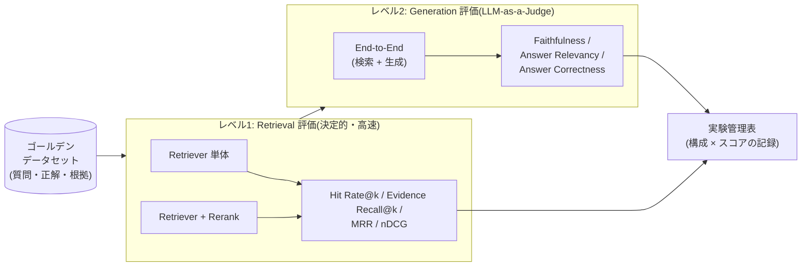

# RAG 精度評価 テスト仕様書

- 対象: 本リポジトリで設計した RAG システム(全案共通)
- 目的: 検索・生成の品質を**定量的・再現可能**に測定し、構成変更(チャンクサイズ・モデル・ハイブリッド化等)の効果を判定する
- 方針: 業界で標準的に用いられる 2 段階評価(**Retrieval 評価 + Generation 評価**)と、OSS 評価フレームワーク **Ragas** を採用する

## 1. 標準的な RAG 評価の全体像

RAG の評価は「検索(Retrieval)」と「生成(Generation)」を**分けて**測るのが標準です。生成品質は検索品質の上限に縛られるため、まず Retrieval を単体で評価し、その後 End-to-End を評価します。

| レベル | 対象 | 判定方法 | 実行コスト |
|---|---|---|---|
| レベル1 | Retriever(+Rerank) | 正解チャンク ID / 根拠文字列との照合(決定的) | 低(LLM 不要・毎回実行) |
| レベル2 | パイプライン全体 | LLM-as-a-Judge(Ragas) | 中(vLLM を judge に利用可) |

## 2. 評価指標の定義

### 2.1 Retrieval 指標(レベル1)

| 指標 | 定義 | 意味 |
|---|---|---|
| **Hit Rate@k** | 上位 k 件に正解根拠が 1 つでも含まれる質問の割合 | 「少なくとも 1 件探せているか」 |
| **Evidence Recall@k** | 質問ごとの正解根拠数に対する、上位 k 件で取得できた一意な根拠数の割合 | multi-hop に必要な根拠を網羅できているか |
| **MRR@k** | 最初に正解が現れた順位の逆数(1/rank)の平均 | 「上位に出せているか」 |
| **nDCG@k** | 一意な正解根拠の順位に応じた減衰付きゲインの正規化和。IDCG は取得結果ではなく `min(evidence 数, k)` 件を理想順位に置いて計算 | 複数根拠の順位品質 |

- k は **LLM に渡す件数(`RERANK_TOP_N`、案2の既定 k=4 / 案3の既定 k=5)** と **Rerank 前の候補数(`RETRIEVE_K`、案2/3の既定 k=20)** の 2 点で測る。評価スクリプトは対象 rag-api が返す実設定値を使用する
- 同じ evidence に一致するチャンクを複数取得しても、Evidence Recall と nDCG では最初の 1 件だけを加点する
- 案2の既定では「Rerank 前の Hit Rate@20」と「Rerank 後の Hit Rate@4」を比べると、ボトルネックが Retriever と Reranker のどちらにあるか切り分けられる

### 2.2 Generation 指標(レベル2 / Ragas)

| 指標 | 定義 | 検出できる問題 |
|---|---|---|
| **Faithfulness** | 回答中の主張のうち、検索コンテキストから裏付けられる割合 | ハルシネーション(捏造) |
| **Answer Relevancy** | 回答が質問に正面から答えているか | 論点ずれ・冗長回答 |
| **Answer Correctness** | 正解(ground truth)との事実一致度 | 総合的な正答性 |
| **Context Precision / Recall** | 検索コンテキストの中で正解に必要な情報の精度/網羅性 | 検索と生成の接続不良 |
| **該当なし正答率(Abstention)** | 回答不能な質問に対し「資料に見つからない」と答えられた割合 | 無理な回答による捏造 |

### 2.3 非機能指標(参考記録)

- レイテンシ(p50 / p95、Retrieval 部と Generation 部を分けて記録)
- 取り込みスループット(チャンク/秒)

## 3. ゴールデンデータセット仕様

### 3.1 形式(JSONL)

1 行 1 テストケース。サンプルは [eval/golden_dataset.sample.jsonl](../eval/golden_dataset.sample.jsonl) を参照。

| フィールド | 型 | 必須 | 内容 |
|---|---|---|---|
| `id` | string | ○ | テストケース ID(例: `TC01-001`) |
| `category` | string | ○ | §4 のテスト観点 ID |
| `question` | string | ○ | ユーザー質問(実際の言い回しで書く) |
| `ground_truth` | string | ○ | 模範回答(採点基準になる事実を含める) |
| `evidence` | array | ○ | 正解根拠。監査用の `doc_id`(文書識別子)と、採点に使う `quote`(根拠となる文字列の一部)の配列。answerable ケースでは `quote` 必須 |
| `answerable` | bool | ○ | コーパスから回答可能か(`false` = 該当なしケース) |
| `history` | array | - | 会話文脈依存ケースの直前のやりとり |
| `notes` | string | - | 作成意図・注意点 |

- 正解判定は「チャンク本文への `quote` 部分一致」だけで行う。`doc_id` は根拠文書の追跡・監査には使うが、同一文書内の無関係チャンクを正解にしないため採点には使わない
- チャンク分割を変えても評価データを作り直さなくて済むよう、**quote は分割境界に依存しない短い文字列**にする

### 3.2 件数と作成方法

| 方法 | 件数目安 | 説明 |
|---|---|---|
| **人手作成**(推奨・必須) | 30〜50 件〜 | 実利用者へのヒアリング・過去の問い合わせログから作る。品質が最も高い |
| **合成生成**(Ragas TestsetGenerator) | +50〜200 件 | コーパスから LLM(vLLM)で質問・正解を自動生成。量を稼ぐ用途。**人手レビューで不良ケースを除去してから使う** |
| **公開データセット流用** | 別トラック | JSQuAD 等「コーパスと QA が対で揃っている」データセットでパイプライン自体を検証([test-data.md](test-data.md) 参照) |

- カテゴリごとに最低 5 件は確保する(1 件だけだと合否がノイズで揺れる)
- データセットはコーパスのスナップショットとセットで git 管理し、バージョンを固定する

## 4. テスト観点(カテゴリ)

標準的な RAG の失敗モードを網羅する 10 観点。

| ID | 観点 | 質問の例(形) | 主な検証対象 |
|---|---|---|---|
| TC01 | 単純事実(single-hop) | 「X の定義は?」「X はいつから施行?」 | 基本の検索・生成 |
| TC02 | 複数根拠の統合(multi-hop) | 「X と Y の違いは?」(根拠が別文書/別章) | Retriever の網羅性、生成の統合力 |
| TC03 | 固有名詞・型番・略語 | 「XR-2040 の設定手順は?」 | キーワード検索(BM25)、表記ゆれ |
| TC04 | 言い換え・表現の乖離 | 文書の用語と違う言葉で聞く(「クビになる条件」→解雇事由) | Embedding、Multi-Query |
| TC05 | 表・数値の参照 | 「〜の上限額はいくら?」(根拠が表内) | Loader の表抽出、チャンク分割 |
| TC06 | 時点・版の指定 | 「2023 年度版では?」「改正前は?」 | メタデータフィルタ、鮮度 |
| TC07 | **該当なし(unanswerable)** | コーパスに存在しない事柄を聞く | 「見つからない」と言える能力(捏造抑制) |
| TC08 | 曖昧・多義クエリ | 主語や対象が曖昧な短い質問 | 聞き返し/複数解釈の提示 |
| TC09 | 会話文脈依存 | 「その 3 番目の手順は?」(直前の会話が前提) | クエリ書き換え(history-aware) |
| TC10 | 長文・要約型 | 「X 章の要点をまとめて」 | 広い検索、生成の要約品質 |

- **TC07(該当なし)は必ず全体の 1〜2 割入れる。** これを入れないと「何にでも答える=ハルシネーションする」システムが高得点になってしまう
- 日本語固有の観点(表記ゆれ・漢語/和語言い換え)は TC03/TC04 に含めて作る([rag-components.md](rag-components.md) の各節参照)

## 5. 実行手順

> 本節は手順の設計を示す。**実際に手を動かす際の手順書とスクリプトは [test/](../test/) を参照**(レベル1: [test/level1/procedure.md](../test/level1/procedure.md)、レベル2: [test/level2/procedure.md](../test/level2/procedure.md)、観点別: [test/cases/](../test/cases/))。

### 5.1 環境の固定(再現性の確保)

評価前に以下を記録・固定する。1 つでも変えたら「別の実験」として記録する。

- コーパスのスナップショット(文書一覧とハッシュ)
- チャンク分割パラメータ / Embedding モデルと版 / Vector store のインデックスパラメータ
- Retriever 設定(k、search_type、ハイブリッド重み)/ Reranker モデルと top_n
- LLM(vLLM のモデル・temperature=0)/ プロンプトテンプレート
- 評価用 judge LLM の設定(Ragas に vLLM を指定、temperature=0)

### 5.2 手順

1. コーパスを取り込み、インデックスを構築する(取り込みログを保存)
2. **レベル1**: ゴールデンデータセットの全質問で rag-api と同じ Retriever(+Rerank)経路を実行し、Hit Rate@k / Evidence Recall@k / MRR@k / nDCG@k を算出
3. レベル1 が目標未達の場合はここで止め、検索側(チャンク・Embedding・ハイブリッド・Rerank)を改善する(生成評価はスキップ — 検索が悪いと生成評価は無意味)
4. **レベル2**: End-to-End で回答を生成し、Ragas で Faithfulness / Answer Relevancy / Answer Correctness / Context Precision・Recall を算出。TC07 は該当なし正答率を別途集計
5. カテゴリ別(TC01〜TC10)にスコアを分解し、弱点カテゴリを特定する
6. 実験管理表(§7)に構成とスコアを 1 行追記する

### 5.3 使用ツール

| ツール | 用途 | ライセンス |
|---|---|---|
| **Ragas** | 生成評価(LLM-as-a-Judge)・テストセット合成 | Apache-2.0 |
| 自作スクリプト | rag-api の評価用検索エンドポイントを利用した Hit Rate / Evidence Recall / MRR / nDCG(quote 部分一致) | - |
| DeepEval / promptfoo | Ragas の代替・CI 組み込み(任意) | Apache-2.0 / MIT |

Ragas の judge には vLLM(OpenAI 互換)をそのまま指定できるため、**評価もクラウド不要・無償**で完結する。

## 6. 合否基準(初期目標値)

絶対的な業界標準値は存在しないため、以下を**初期目標**とし、自コーパスでのベースライン計測後に見直す。

| 指標 | 初期目標 | 備考 |
|---|---|---|
| Hit Rate@20(Rerank 前) | ≥ 0.90 | 未達なら Retriever 側を改善 |
| Hit Rate@4(Rerank 後) | ≥ 0.85 | 未達(かつ @20 達成)なら Reranker を改善 |
| Evidence Recall@4 | 記録のみ | multi-hop ケースのベースライン取得後に目標を設定 |
| MRR@4 | ≥ 0.70 | |
| Faithfulness | ≥ 0.90 | 最重要。未達は捏造が起きている |
| Answer Correctness | ≥ 0.75 | |
| 該当なし正答率(TC07) | ≥ 0.90 | 「見つからない」と言えること |
| レイテンシ p95(E2E) | 記録のみ | 目標値は利用形態に応じて設定 |

## 7. 回帰テスト運用

構成変更のたびに同一データセットで再計測し、以下の形式で記録する(`eval/experiments.md` 等)。

| # | 日付 | 構成の変更点 | HR@4 | EvRecall@4 | MRR@4 | Faith. | Correct. | TC07 | 備考 |
|---|---|---|---|---|---|---|---|---|---|
| 1 | 2026-07-09 | ベースライン(案1 相当) | - | - | - | - | - | - | |
| 2 | | chunk 800→400 + bge-m3 | - | - | - | - | - | - | |

- **1 回の実験で変えるのは 1 要素だけ**(チャンクサイズとモデルを同時に変えると原因が分からなくなる)
- スコアが下がった変更は棄却し、記録は残す(同じ試行の繰り返しを防ぐ)
- 運用開始後は、実ユーザーの「回答が不十分だった質問」を毎月ゴールデンデータセットに還流させる
