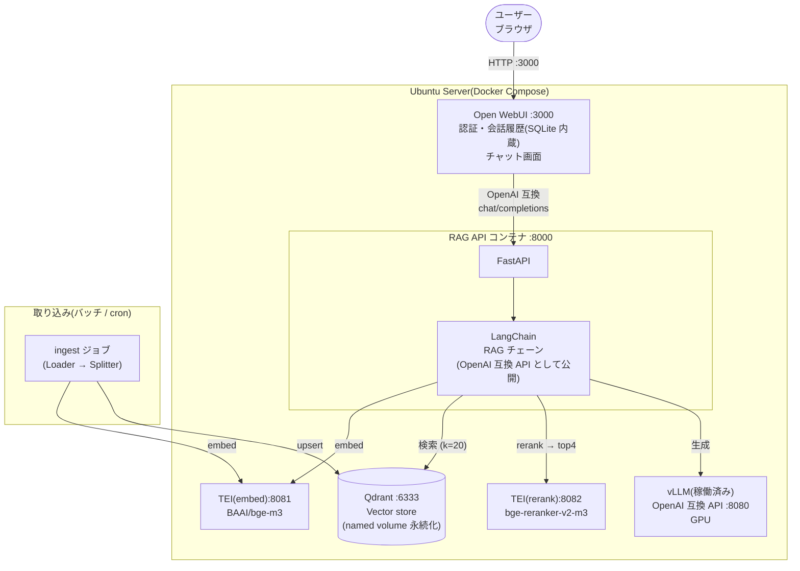

# 案2: Docker Compose 標準構成(部門利用向け・推奨)

各コンポーネントをコンテナに分離し、**Docker Compose で 1 台の Ubuntu Server 上に構築**する標準構成。
WebUI に Open WebUI(認証・会話履歴内蔵)、検索 DB に Qdrant、Embedding/Rerank は TEI(Text Embeddings Inference)専用コンテナに分離します。

## 構成図



## 特徴

| 観点 | 内容 |
|---|---|
| 長所 | 責務ごとにコンテナ分離され、個別に再起動・更新・スケール可能。Open WebUI によりログイン認証と会話履歴が最初から使える |
| 短所 | 案1 より構成要素が多い。GPU を vLLM と TEI で分け合う設計判断が必要(TEI は CPU 動作も可) |
| RAG API の位置づけ | LangChain 部分を **OpenAI 互換 API** として実装し、Open WebUI からは「1 つのモデル」に見せる(Open WebUI の Direct Connections で登録) |
| Embedding/Rerank | TEI コンテナに分離。API プロセスが軽くなり、取り込みバッチと問い合わせで同じ埋め込みサーバを共用できる |
| Qdrant | Rust 製で軽量・高速。メタデータフィルタ(部署・年度など)やスカラー量子化によるメモリ削減に対応 |

## docker-compose.yml(骨子)

```yaml
services:
  open-webui:
    image: ghcr.io/open-webui/open-webui:main
    ports: ["3000:8080"]
    volumes: ["open-webui-data:/app/backend/data"]
    environment:
      # RAG API を OpenAI 互換エンドポイントとして登録
      - OPENAI_API_BASE_URL=http://rag-api:8000/v1
      - OPENAI_API_KEY=dummy

  rag-api:
    build: ./rag-api          # FastAPI + LangChain
    ports: ["8000:8000"]
    environment:
      - VLLM_BASE_URL=http://host.docker.internal:8080/v1
      - QDRANT_URL=http://qdrant:6333
      - TEI_EMBED_URL=http://tei-embed:80
      - TEI_RERANK_URL=http://tei-rerank:80
    extra_hosts: ["host.docker.internal:host-gateway"]

  qdrant:
    image: qdrant/qdrant:latest
    ports: ["6333:6333"]
    volumes: ["qdrant-data:/qdrant/storage"]

  tei-embed:
    image: ghcr.io/huggingface/text-embeddings-inference:cpu-latest
    command: ["--model-id", "BAAI/bge-m3"]
    ports: ["8081:80"]
    volumes: ["hf-cache:/data"]

  tei-rerank:
    image: ghcr.io/huggingface/text-embeddings-inference:cpu-latest
    command: ["--model-id", "BAAI/bge-reranker-v2-m3"]
    ports: ["8082:80"]
    volumes: ["hf-cache:/data"]

volumes:
  open-webui-data:
  qdrant-data:
  hf-cache:
```

> GPU に余裕がある場合は TEI のイメージを GPU 版(例: `text-embeddings-inference:89-latest` 等、GPU 世代に応じたタグ)に替え、`deploy.resources.reservations.devices` で GPU を割り当てると取り込みが大幅に高速化します。vLLM 側と同居させる場合は vLLM の `--gpu-memory-utilization` を下げて VRAM を空けてください。

## RAG API 実装例(rag-api/main.py 抜粋)

```python
from fastapi import FastAPI
from langchain_openai import ChatOpenAI
from langchain_huggingface import HuggingFaceEndpointEmbeddings
from langchain_qdrant import QdrantVectorStore

llm = ChatOpenAI(base_url=VLLM_BASE_URL, api_key="dummy", model="your-model")
embeddings = HuggingFaceEndpointEmbeddings(model=TEI_EMBED_URL)  # TEI を利用
vectorstore = QdrantVectorStore.from_existing_collection(
    url=QDRANT_URL, collection_name="knowledge", embedding=embeddings)

retriever = vectorstore.as_retriever(
    search_type="mmr",                     # 冗長チャンクの排除
    search_kwargs={"k": 20, "fetch_k": 50})

app = FastAPI()

@app.post("/v1/chat/completions")        # OpenAI 互換で公開 → Open WebUI から接続
async def chat(req: ChatRequest):
    query = req.messages[-1].content
    docs = await retriever.ainvoke(query)
    docs = await rerank_tei(query, docs, top_n=4)   # TEI /rerank を呼ぶ
    answer = await llm.ainvoke(build_prompt(query, docs))
    return to_openai_response(answer, sources=docs)  # 出典もレスポンスに含める
```

## 運用ポイント

- **取り込み**: `docker compose run ingest`(または cron)で共有フォルダ・Wiki エクスポート等を定期取り込み。Qdrant はコレクションのエイリアス切替で「無停止の全再インデックス」が可能
- **バックアップ**: Qdrant のスナップショット API + Open WebUI のデータ volume をバックアップ
- **監視**: 各コンテナの `/health`(TEI・Qdrant は標準装備)を healthcheck に設定

## この案から次へ進む判断基準

- 固有名詞・型番のキーワード検索を強化したい、文書が数百万チャンク規模 → **案3**
