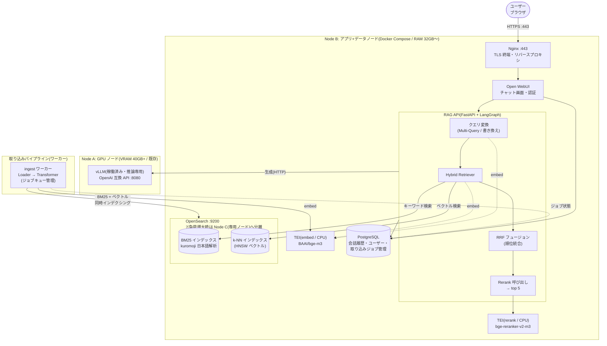
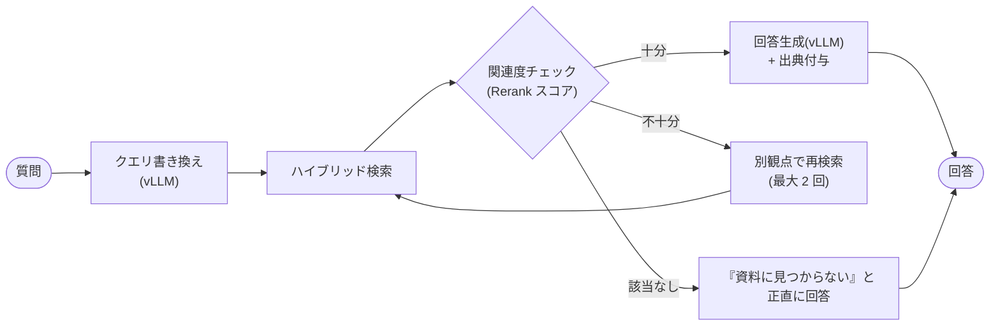

# 案3: ハイブリッド検索・本格構成(全社利用向け)

**BM25(キーワード検索)とベクトル検索を併用するハイブリッド検索**を核とした本格構成。
検索 DB に OpenSearch(kuromoji による日本語形態素解析 + k-NN を 1 基盤で両立)を採用し、
Nginx による TLS 終端、PostgreSQL による会話履歴永続化、LangGraph によるエージェント的な検索フローを備えます。
基本は Node A(GPU / vLLM)+ Node B(アプリ+データ)の 2 ノードで開始し、負荷に応じて **OpenSearch を Node C(検索 DB 専用ノード)に分離**する拡張パスを持ちます。

> **構築ファイル**: [deploy/plan3/](../deploy/plan3/)(compose + nginx conf + kuromoji 入り OpenSearch イメージ + LangGraph 実装)/ 手順: [deployment-guide.md](deployment-guide.md)。本書のコードは設計説明用の抜粋。

## 構成図



## 特徴

| 観点 | 内容 |
|---|---|
| 長所 | 型番・製品名・人名など**字面一致が重要なクエリに強い**(ベクトル検索単独の弱点を補完)。OpenSearch は全文検索・ベクトル・集計・監査ログを 1 基盤で担える |
| 短所 | OpenSearch は JVM ベースでメモリ要件が高い(最低 8GB、推奨 16GB〜)。運用ノウハウが必要。Node B のメモリが逼迫したら Node C(検索 DB 専用ノード)への分離を検討 |
| 日本語対応 | `analysis-kuromoji`(または `analysis-sudachi`)プラグインで形態素解析ベースの BM25 を構成。同じ本文を bi-gram でも持つマルチフィールド + 同義語辞書(synonym filter)で未知語・表記ゆれの取りこぼしを削減 |
| 順位統合 | BM25 とベクトルの結果を **RRF(Reciprocal Rank Fusion)** で統合(OpenSearch 2.19+ はネイティブ対応。LangChain 側の EnsembleRetriever でも実装可) |
| LangGraph | 「検索結果が不十分なら検索し直す」「質問を分解する」等のループ・分岐を持つ検索フローをグラフとして実装 |
| 代替 | OpenSearch の代わりに **Milvus**(BM25 内蔵の 2.5+)や **Qdrant + 疎ベクトル(bge-m3 の sparse 出力)** でも同アーキテクチャを実現可能 |

## ハイブリッド検索の実装例

### LangChain(EnsembleRetriever + RRF)

```python
from langchain_community.retrievers import BM25Retriever  # 小規模なら in-memory でも可
from langchain.retrievers import EnsembleRetriever

# OpenSearch を使う場合は OpenSearchVectorSearch(ベクトル)と
# OpenSearch の match クエリ(BM25)をそれぞれ Retriever 化して束ねる
hybrid = EnsembleRetriever(
    retrievers=[bm25_retriever, vector_retriever],
    weights=[0.4, 0.6],   # RRF で順位統合
)
docs = hybrid.invoke("XR-2040 のファームウェア更新手順")
```

### OpenSearch ネイティブ(hybrid query + search pipeline)

```json
PUT /_search/pipeline/rrf-pipeline
{
  "phase_results_processors": [
    { "score-ranker-processor": { "combination": { "technique": "rrf" } } }
  ]
}

GET /knowledge/_search?search_pipeline=rrf-pipeline
{
  "query": {
    "hybrid": {
      "queries": [
        { "match": { "text": "XR-2040 ファームウェア更新" } },
        { "knn": { "vector": { "vector": [0.12, ...], "k": 20 } } }
      ]
    }
  }
}
```

## LangGraph による検索フロー(概念)



回答不能時に「見つからない」と返す分岐を明示的に持つことで、ハルシネーション(それらしい捏造回答)を抑制します。

## 運用ポイント

- **メモリ設計**: OpenSearch の JVM ヒープはホストの 50% 以下・32GB 以下。HNSW インデックスはヒープ外メモリを使うため余裕を持たせる
- **ノード分割の拡張パス**: 全コンポーネントが HTTP で疎結合なため、Node B のメモリが逼迫したら OpenSearch(と PostgreSQL)を Node C に移すだけでよい(compose ファイルの分割と接続 URL の変更のみ。アプリのコード変更は不要)。GPU ノード(Node A)は常に推論専用を維持する
- **インデックス設計**: `knowledge-v1` のような versioned index + エイリアスで、埋め込みモデル変更時の全再インデックスを無停止で実施
- **セキュリティ**: Nginx で TLS 終端(Let's Encrypt / 社内 CA)。OpenSearch Security プラグインでインデックスレベルのアクセス制御
- **評価**: 検索品質は Ragas(OSS)等で Hit Rate / MRR / Faithfulness を定点観測し、チャンクサイズや重みの変更効果を計測する
