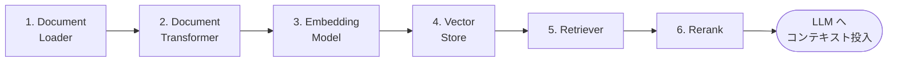
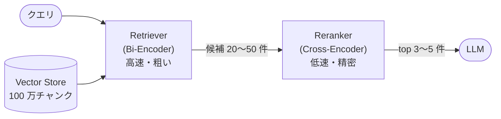

# RAG 精度向上のための構成要素解説

LangChain の RAG パイプラインを構成する 6 要素について、役割・実装例・精度向上のポイントを解説します。



> 精度の原則: **「Garbage in, garbage out」**。生成(LLM)側をいじる前に、1〜6 の検索品質を上げる方が効果が大きい。

---

## 1. Document Loader — 文書の読み込み

**役割:** PDF・Office・HTML・Markdown 等の原本を、LangChain の `Document` オブジェクト(本文 + メタデータ)に変換する入口。

```python
from langchain_community.document_loaders import (
    PyPDFLoader,            # PDF(ページ単位)
    Docx2txtLoader,         # Word
    UnstructuredHTMLLoader, # HTML
    DirectoryLoader,        # ディレクトリ一括
)
loader = DirectoryLoader("./docs", glob="**/*.pdf", loader_cls=PyPDFLoader)
docs = loader.load()   # → list[Document]  (.page_content と .metadata)
```

**精度向上のポイント**

- **抽出品質が全ての上限を決める。** 表・段組み・スキャン PDF はテキスト抽出が壊れやすい。複雑なレイアウトには `Unstructured` や `PyMuPDF4LLM`(Markdown 変換)、スキャン文書には OCR 前処理を検討
- **メタデータを必ず付与する**(ファイル名・部署・更新日・URL)。後段の Retriever のフィルタ検索と、回答への出典表示の両方に効く
- 表は「表のまま」埋め込むと検索に掛かりにくい。Markdown テーブル化、または表要約文の生成を検討

**日本語固有のポイント**

- **文字コード**: 古い社内文書には Shift_JIS(CP932)が残りがち。`TextLoader` は `autodetect_encoding=True` を指定し、CSV 等も encoding を明示して文字化けを防ぐ
- **PDF の日本語抽出**: 縦書き・CID フォント・外字で抽出が壊れやすい。pypdf で崩れる場合は pdfminer.six(MIT)や PyMuPDF4LLM(高品質だが AGPL-3.0 な点に注意)を試し、抽出結果を必ず目視サンプリングする
- **スキャン文書の OCR**: Tesseract(Apache-2.0)の日本語モデル `jpn`(縦書きは `jpn_vert`)。より高精度が必要なら PaddleOCR(Apache-2.0)の日本語モデル
- **Unicode 正規化(NFKC)+ neologdn**: 全角英数・半角カナ・波ダッシュ・長音記号などの表記ゆれを取り込み時に正規化して揃える(`unicodedata.normalize("NFKC", text)` + neologdn)。埋め込みと BM25 の両方の一致率に効く

## 2. Document Transformer — チャンク分割・整形

**役割:** 長文をベクトル検索に適した「チャンク」に分割し、不要要素(ヘッダ・フッタ・ナビゲーション)を除去する。**RAG 精度に最も影響する工程の一つ。**

```python
from langchain_text_splitters import (
    RecursiveCharacterTextSplitter,
    MarkdownHeaderTextSplitter,
)

# 見出し構造を保持した 2 段階分割(推奨)
md_splitter = MarkdownHeaderTextSplitter(
    headers_to_split_on=[("#", "h1"), ("##", "h2"), ("###", "h3")])
sections = md_splitter.split_text(markdown_text)   # 見出しは metadata に入る

splitter = RecursiveCharacterTextSplitter(
    chunk_size=800,        # 日本語は 400〜1000 文字程度から調整
    chunk_overlap=100,     # 文脈の分断を緩和(10〜15% 目安)
    separators=["\n\n", "\n", "。", "、", " ", ""],   # 日本語用に句読点を追加
)
chunks = splitter.split_documents(sections)
```

**精度向上のポイント**

- **意味の境界で切る。** 文字数だけの機械分割より、見出し・段落構造を尊重した分割(`MarkdownHeaderTextSplitter` → `RecursiveCharacterTextSplitter` の 2 段構え)が有効
- **日本語はセパレータ調整が必須。** デフォルトは英語向けなので `"。"` などを追加する
- **チャンクに文脈を焼き込む。**「文書タイトル > 章 > 節」をチャンク先頭に付記すると、単独チャンクでも意味が通り検索精度が上がる
- チャンクサイズはトレードオフ(小さい=検索精度↑・文脈量↓、大きい=逆)。評価セットで計測して決める。検索は小チャンク・LLM には親チャンクを渡す **Parent Document / Small-to-Big** 戦略も有効

**日本語固有のポイント**

- **chunk_size は「文字数」、モデル上限は「トークン数」。** 日本語は 1 文字が 1〜2 トークンに割れるため、800 文字のチャンクは multilingual-e5 系の上限(512 トークン)を超え、**末尾が黙って切り捨てられる**ことがある。`RecursiveCharacterTextSplitter.from_huggingface_tokenizer()` で埋め込みモデルのトークナイザ基準の分割にするか、8192 トークン対応の bge-m3 を選ぶ
- **文境界の分割精度**: 「。」区切りだけでは括弧・引用内の句点や箇条書きで誤分割する。厳密にやる場合は日本語文境界解析の bunkai(Apache-2.0)や GiNZA(MIT)で文分割してからチャンクに束ねる
- **正規化は分割前に一度だけ**: NFKC / neologdn は Loader 直後に掛ける(分割後に掛けるとチャンク間で正規化状態が食い違う事故のもと)

## 3. Embedding Model — ベクトル化

**役割:** テキストを意味空間上のベクトルに変換する。**検索の「言語理解力」はここで決まる**ため、ベクトル DB の選定よりモデルの選定が重要。

```python
# 案1: プロセス内(sentence-transformers)
from langchain_huggingface import HuggingFaceEmbeddings
embeddings = HuggingFaceEmbeddings(
    model_name="intfloat/multilingual-e5-large",
    encode_kwargs={"normalize_embeddings": True})

# 案2/3: TEI サーバ経由(取り込みと問い合わせでサーバを共用)
from langchain_huggingface import HuggingFaceEndpointEmbeddings
embeddings = HuggingFaceEndpointEmbeddings(model="http://tei-embed:80")
```

**日本語に強い代表モデル(いずれも Hugging Face から無償取得)**

| モデル | 次元 | 特徴 |
|---|---|---|
| `intfloat/multilingual-e5-large` | 1024 | 定番。`query:` / `passage:` プレフィックスが必要な点に注意 |
| `BAAI/bge-m3` | 1024 | 密+疎(BM25 的)+マルチベクトルを 1 モデルで出力。ハイブリッド検索と好相性。8192 トークン対応 |
| `cl-nagoya/ruri-v3` 系 | 〜1024 | 日本語特化。日本語ベンチマーク(JMTEB)上位 |
| `pkshatech/GLuCoSE-base-ja-v2` | 768 | 日本語特化・軽量。CPU でも高速で JMTEB 検索タスク上位 |

**精度向上のポイント**

- **モデル指定のプレフィックス・指示文を守る**(e5 系の `query:`/`passage:` 等)。忘れると精度が大きく落ちる
- **埋め込みモデルを変えたら全チャンク再インデックスが必要。** ベクトル空間に互換性はない。versioned collection + エイリアス切替で無停止移行する
- 選定は MTEB / JMTEB のリーダーボードを参考に、**自分のドメインの評価セットで最終確認**する

**日本語固有のポイント**

- 多言語モデル(e5 / bge-m3)でも日本語は十分実用だが、**日本語特化モデル(ruri / GLuCoSE 系)が JMTEB の Retrieval タスクでは上回ることが多い**。JMTEB(日本語埋め込みベンチマーク)の Retrieval スコアを第一の参考にする
- e5 系の 512 トークン上限 × 日本語のトークン効率の悪さの組み合わせに注意(§2 参照)。**チャンクサイズとモデルはセットで決める**

## 4. Vector Store — 検索 DB

**役割:** チャンクのベクトルとメタデータを保存し、近傍検索(ANN)を提供する。

```python
from langchain_qdrant import QdrantVectorStore

vectorstore = QdrantVectorStore.from_documents(
    chunks, embeddings,
    url="http://qdrant:6333", collection_name="knowledge")
```

**OSS 選択肢の比較**

| 製品 | 形態 | 向くケース |
|---|---|---|
| Chroma | 組み込み/サーバ | PoC・小規模。pip だけで動く(案1/1b) |
| Qdrant | サーバ(Rust) | 中規模の本命。軽量・高速・フィルタ・量子化(案2) |
| pgvector | PostgreSQL 拡張 | 既に PostgreSQL がある場合。RDB と一元管理 |
| Milvus | サーバ/分散 | 大規模。GPU インデックス・BM25 内蔵(2.5+) |
| OpenSearch | サーバ(JVM) | 全文検索(kuromoji)とベクトルの統合=ハイブリッド(案3) |
| FAISS | ライブラリ | サーバ不要の読み取り専用インデックス配布など |

**精度向上のポイント**

- 精度への寄与は Embedding・チャンク分割の方が大きい。DB 選定は**運用要件(規模・フィルタ・ハイブリッド対応・バックアップ)**で決める
- HNSW のパラメータ(`ef_search` 等)は再現率と速度のトレードオフ。デフォルトで足りない大規模時のみ調整
- **メタデータフィルタを設計に含める**(部署・年度・公開範囲)。検索対象を絞るだけで体感精度が大きく上がる

**日本語固有のポイント**

- **PostgreSQL 派なら PGroonga**(PostgreSQL License): 日本語全文検索拡張。pgvector と組み合わせると **PostgreSQL 1 つでベクトル + 日本語全文のハイブリッド検索が完結**する(OpenSearch を建てない軽量な代替案)
- **OpenSearch の日本語アナライザ**: 標準は `analysis-kuromoji`。辞書の更新頻度・分割モード(A/B/C)の柔軟さでは `analysis-sudachi`(Apache-2.0)も有力
- **形態素解析 + bi-gram のマルチフィールド**: 形態素解析は未知語(新製品名・型番・社内略語)に弱い。同じ本文を bi-gram(N-gram)でもインデックスし、両フィールドを OR 検索すると取りこぼしが大きく減る
- **同義語辞書(synonym filter)**: 「サーバ/サーバー」「ログイン/サインイン」などの表記ゆれ・言い換えを検索時に吸収する。Sudachi 同義語辞書(Apache-2.0)が利用できる

## 5. Retriever — 検索戦略

**役割:** クエリを受けて関連チャンクを取得する「戦略」の抽象。単純な類似度検索から、クエリ変換・複数検索の統合まで幅広い。

```python
# 基本: 類似度検索
retriever = vectorstore.as_retriever(search_kwargs={"k": 20})

# MMR: 似すぎるチャンクを避けて多様性を確保
retriever = vectorstore.as_retriever(
    search_type="mmr", search_kwargs={"k": 20, "fetch_k": 50})

# Multi-Query: LLM で質問を複数観点に言い換えて検索(表現の乖離を吸収)
from langchain.retrievers.multi_query import MultiQueryRetriever
retriever = MultiQueryRetriever.from_llm(retriever=retriever, llm=llm)

# Hybrid: BM25 + ベクトルを RRF で統合(案3)
from langchain.retrievers import EnsembleRetriever
retriever = EnsembleRetriever(
    retrievers=[bm25_retriever, vector_retriever], weights=[0.4, 0.6])
```

### BM25(Okapi BM25)の実装選択肢

BM25 は製品ではなく**スコアリングアルゴリズム**(Okapi BM25)であり、どのレイヤーで持つかを規模と運用要件で選べる。

| 実装 | 形態 | 規模目安 | 向くケース |
|---|---|---|---|
| rank_bm25(LangChain `BM25Retriever`) | in-memory ライブラリ | 〜数万チャンク | **案1/案2 のままサーバ追加なしでハイブリッド化を試す**最短ルート |
| OpenSearch / Elasticsearch | 検索サーバ(Lucene の BM25) | 数百万チャンク〜 | 案3。kuromoji 日本語解析・永続化・レプリカ等の運用機能込み |
| Milvus 2.5+ 内蔵 BM25 / Qdrant 疎ベクトル | Vector store 内蔵 | 中〜大規模 | 検索基盤を増やさず 1 つの DB でハイブリッドを完結させたい場合 |

**`BM25Retriever` を日本語で使う場合は形態素解析が必須。** デフォルトのトークナイズは空白区切り(`str.split`)のため、分かち書きされない日本語ではほぼ機能しない。SudachiPy 等を `preprocess_func` に渡す:

```python
from langchain_community.retrievers import BM25Retriever
from sudachipy import dictionary, tokenizer as sudachi_tokenizer

_tok = dictionary.Dictionary().create()
_mode = sudachi_tokenizer.Tokenizer.SplitMode.C

def tokenize_ja(text: str) -> list[str]:
    return [m.surface() for m in _tok.tokenize(text, _mode)]

bm25_retriever = BM25Retriever.from_documents(
    chunks, preprocess_func=tokenize_ja, k=20)
```

注意点: rank_bm25 は **in-memory** で、インデックスは永続化されず起動時に全チャンクから再構築される。チャンク数が数十万を超える、または増分更新・レプリカといった運用機能が必要になった時点で案3(OpenSearch)へ移行する。

**精度向上のポイント**

- **k は「Rerank 前提で広めに」**(20〜50)。Retriever 単独で絞り込もうとしない
- **質問と文書の表現の乖離**が失敗の主因。Multi-Query や HyDE(仮想回答文で検索)で吸収する
- 型番・固有名詞・略語が多いドメインでは **BM25 併用(ハイブリッド)** がベクトル単独の弱点を補う
- 会話型 UI では「その手順の 3 番目は?」のような文脈依存クエリを、会話履歴を使って**独立した質問に書き換えてから**検索する(history-aware retriever)

**日本語固有のポイント**

- **SudachiPy の分割モード選択**: C(長単位)は「東京国際空港」を 1 語に保ち固有名詞クエリに強いが、A(短単位)の方が部分一致の再現率は高い。BM25 用途では A/B を基本とし、`surface()` の代わりに **`normalized_form()`** を使うと「打ち込む/打込む」のような表記ゆれも吸収できる
- **品詞フィルタ**: 助詞・助動詞・記号をトークンから除外すると、BM25 のスコアが機能語のノイズに埋もれにくくなる(`m.part_of_speech()[0]` で判定して除外)
- **Multi-Query のプロンプトは日本語で書く**: 言い換え生成の指示に「漢語⇔和語(例: 更新⇔アップデート)」「略語⇔正式名称」の言い換えを明示的に要求すると、日本語特有の表現の乖離を拾いやすい

## 6. Rerank — 再順位付け

**役割:** Retriever が取得した候補を、クエリとチャンクを**ペアで読む Cross-Encoder** で採点し直し、真に関連する上位数件だけを LLM に渡す。

ベクトル検索(Bi-Encoder)はクエリと文書を別々にベクトル化するため精度に限界がある。Cross-Encoder は両方を同時に読むため高精度だが遅い。そこで **「Bi-Encoder で広く粗く → Cross-Encoder で狭く精密に」** の 2 段構えにする。



```python
# プロセス内 CrossEncoder(案1)
from langchain.retrievers import ContextualCompressionRetriever
from langchain.retrievers.document_compressors import CrossEncoderReranker
from langchain_community.cross_encoders import HuggingFaceCrossEncoder

reranker = CrossEncoderReranker(
    model=HuggingFaceCrossEncoder(model_name="BAAI/bge-reranker-v2-m3"),
    top_n=4)
retriever = ContextualCompressionRetriever(
    base_compressor=reranker,
    base_retriever=vectorstore.as_retriever(search_kwargs={"k": 20}))

# TEI の /rerank エンドポイント(案2/3)— HTTP で呼び出し
# POST http://tei-rerank:80/rerank {"query": "...", "texts": ["...", ...]}
```

**精度向上のポイント**

- **導入効果が最も大きい単独施策。** ベクトル検索で 10 位以下に沈んでいた正解チャンクを上位に引き上げられる
- LLM に渡す件数を絞れるため、**プロンプトが短くなり生成品質も向上**する(コンテキスト中央の情報が無視される "lost in the middle" の緩和)
- レイテンシ増(候補 20 件で数十〜数百 ms)は top_k・候補数・GPU 配置で調整
- Rerank スコアに**しきい値**を設け、全候補が低スコアなら「資料に該当なし」と回答させるとハルシネーション抑制になる

**日本語固有のポイント**

- 多言語では `bge-reranker-v2-m3` が定番だが、日本語特化の `hotchpotch/japanese-reranker-cross-encoder-large-v1`(MIT)や `cl-nagoya/ruri-reranker`(Apache-2.0)が**日本語ベンチマークでは上回ることが多い**。CPU 運用なら小型の日本語特化モデルの方が速度・精度のバランスが良い場合もある
- 日本語のリランカー・検索の評価には **JQaRA / JaCWIR**(日本語検索評価データセット)が公開されており、モデル選定の比較軸に使える
- リランカーにも最大トークン長(512 前後が多い)がある。**クエリ + チャンクが上限を超えると後半が評価されない**ため、チャンクサイズ設計ではリランカーの上限も考慮する(§2 のトークン数の話と同根)

---

## まとめ — チューニングの優先順位

| 優先度 | 施策 | 対象要素 |
|---|---|---|
| ★★★ | Reranker 導入(広く取って絞る) | Retriever + Rerank |
| ★★★ | 見出し構造を保つ分割・日本語セパレータ・文脈付記 | Transformer |
| ★★☆ | 日本語に強い埋め込みモデル選定(+プレフィックス遵守) | Embedding |
| ★★☆ | ハイブリッド検索(BM25 併用) | Vector store + Retriever |
| ★★☆ | クエリ変換(Multi-Query / 会話履歴を踏まえた書き換え) | Retriever |
| ★★☆ | 日本語処理の作り込み(NFKC/neologdn 正規化・トークン上限とチャンクの整合・形態素解析 BM25・同義語辞書) | 全要素(各節の「日本語固有のポイント」参照) |
| ★☆☆ | 抽出品質改善(表・OCR)・メタデータフィルタ | Loader / Vector store |

改善は必ず **評価セット(想定質問と正解文書のペア 30〜50 件)** を作って Hit Rate / MRR で計測しながら進めてください。感覚ベースのチューニングは往々にして退化を見逃します(Ragas 等の OSS 評価ツールが利用可能)。モデル選定の一般比較には日本語公開ベンチマーク — **JMTEB**(埋め込み)、**JQaRA / JaCWIR**(検索・リランク)— も参考になりますが、最終判断は自ドメインの評価セットで行ってください。
