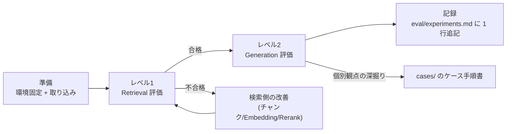

# test/ — RAG 精度評価の実行手順書

[docs/evaluation-spec.md](../docs/evaluation-spec.md)(テスト仕様書)を実際に実行する際の手順書とサンプルスクリプト群です。

## ディレクトリ構成

| パス | 内容 |
|---|---|
| [level1/procedure.md](level1/procedure.md) | **レベル1: Retrieval 評価**の実行手順(Hit Rate / Evidence Recall / MRR / nDCG。LLM 不要・決定的) |
| [level1/run_level1.py](level1/run_level1.py) | レベル1 実行スクリプト(案2 構成向けサンプル) |
| [level2/procedure.md](level2/procedure.md) | **レベル2: Generation 評価**の実行手順(Ragas / 該当なし正答率) |
| [level2/run_level2.py](level2/run_level2.py) | レベル2 実行スクリプト(案2 構成向けサンプル) |
| [cases/TEMPLATE.md](cases/TEMPLATE.md) | ケース手順書のテンプレート(TC02〜TC06 / TC08 / TC10 はこれを複製して作成) |
| [cases/TC01_single_fact.md](cases/TC01_single_fact.md) | ケース手順書サンプル: 単純事実 |
| [cases/TC07_unanswerable.md](cases/TC07_unanswerable.md) | ケース手順書サンプル: 該当なし(捏造検出) |
| [cases/TC09_conversational.md](cases/TC09_conversational.md) | ケース手順書サンプル: 会話文脈依存 |

## テスト実行の全体フロー

1. **準備**: 対象の案(1〜3)を構築し、評価用コーパスを取り込む([docs/deployment-guide.md](../docs/deployment-guide.md))。構成パラメータを記録して固定する(仕様書 §5.1)
2. **レベル1**([level1/procedure.md](level1/procedure.md)): 全ケースの検索指標を機械判定。**不合格ならここで止めて検索側を改善**(生成評価に進まない)
3. **レベル2**([level2/procedure.md](level2/procedure.md)): End-to-End の生成品質を LLM-as-a-Judge で採点
4. **記録**: 実験管理表に構成とスコアを 1 行追記(仕様書 §7)。カテゴリ別スコアが低い観点は `cases/` の該当手順書で個別に深掘りする

## 共通の前提

- ゴールデンデータセット: [eval/golden_dataset.sample.jsonl](../eval/golden_dataset.sample.jsonl) の形式(仕様書 §3.1)。実運用では自ドメイン版を `eval/golden_dataset.jsonl` として作成し、環境変数 `GOLDEN_PATH` で指定する
- サンプルスクリプトは **案2(Qdrant + TEI)構成の Node B 上での実行**を前提とする。案1(Chroma)/案3(OpenSearch)への読み替えは各手順書末尾の補足を参照
- スクリプトは Node B の `127.0.0.1` に公開済みの rag-api(8000)を使い、レベル2の judge 埋め込みだけ TEI(8081)を使う。Qdrant を評価コードから直接呼ばないため、**追加のポート公開は不要**
- 判定に迷う結果は「不合格側」に倒して記録する(甘い判定は改善の機会を潰す)
